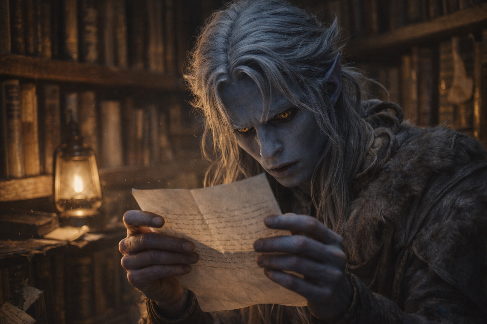

## Capítulo 4 | Parte 3
--- 

Dos días después, Drusniel volvió al índice de correspondencia. Las páginas rígidas le raspaban las yemas de los dedos.

La nota de investigación le había enseñado a seguir las marcas de los estantes de Zaelar.

Encontró una referencia junto a la fecha de su prueba. La carta no estaba en el archivo actual, pero su antigua marca de estante seguía en el margen.

Lo condujo a un volumen de teoría elemental. Bajo el revestimiento suelto de la contracubierta había una hoja doblada.

El papel era más nuevo que el libro. La letra era de Zaelar.

*El candidato progresa según lo anticipado. La intervención en la prueba produjo el resultado esperado. Protocolo de canal comprometido estable. La aceleración sigue siendo viable.*

Drusniel la leyó dos veces.

*La intervención en la prueba produjo el resultado esperado.*

Copió la carta antes de devolver el volumen a su estante. Esta vez dejó el original sobre la mesa.

Zaelar regresó una hora después, llevando dos tazas de té.

—Has sido productivo. —Dejó una taza en la mesa de lectura—. ¿Encontraste algo interesante?

—Lo suficiente. —Drusniel no tocó el té y deslizó la carta por la mesa.

Los ojos de Zaelar fueron al papel.

—¿Dónde encontraste eso?

—En el índice.

—La intervención en la prueba produjo el resultado esperado. —Drusniel mantuvo la voz nivelada—. Tus palabras.

Zaelar se sentó. —Sí. Una intervención. Tenías razón: te quitaron algo.

—¿Quién?

—La carta no nombra a nadie. —Puso un dedo junto a la siguiente línea—. Registra lo que ocurrió después.

—Protocolo de canal comprometido.

—El contacto en el que te has estado apoyando está comprometido.

—Y esperaste a que encontrara esto para decírmelo.

—Ahora lo tienes. Guárdalo.

Drusniel dobló la carta una vez.

—¿Por qué alguien me manipularía?

—Hay muy pocas personas con tus afinidades. Cualquiera que las necesitara tendría motivos para interesarse por ti.

—Podría irme —dijo—. Dejar de venir aquí. Regresar con mi familia y olvidar que algo de esto pasó.

—Podrías. —La expresión de Zaelar no cambió—. El poder permanecería. Tendrías que descubrir sus límites por tu cuenta, sin guía. Y quienquiera que saboteó tu prueba todavía estaría ahí fuera, todavía trabajando en cualquier plan que te convirtió en su objetivo.

—Tú incluido.

Zaelar dejó la carta donde estaba.

—No te impediré marcharte. Sabes dónde está la puerta.

Drusniel miró hacia la escalera. En casa había logrado desviar la corriente de una lámpara sin ayuda de Zaelar. Más allá de eso, apenas conseguía provocarse dolor de cabeza.

Dobló el original alrededor de su copia, ocultando la segunda hoja.

—Terminaré la lección. Y me llevaré a casa las notas del próximo ejercicio.

Zaelar sacó un cuaderno de debajo de las traducciones.

—Aquí encontrarás el método. Compáralo con lo que te enseñe.

---

Esa noche, la presencia regresó.

El contacto llegó mientras escondía sus notas bajo el revestimiento suelto de un cajón. Lo cerró de un empujón. Aquel breve esfuerzo bastó para devolverle el dolor de cabeza del día.

*Drus. Estás preocupado.*

*¿Cuánto sabe Zaelar de esta conexión?*

*Ha estado estudiando lo que te pasó.*

*Encontré una carta sobre mi prueba.* Drusniel mantuvo la mano sobre el cajón cerrado. *Mencionaba sabotaje. Protocolos de contacto mental.*

*Entonces ya sabes por qué los mensajes pueden no sentirse siempre igual.*

*¿Lo sabías antes de que fuera a verlo?*

*No confíes en él porque yo lo diga. Comprueba lo que te enseña.*

*Estoy cansado*, envió. *Necesito descansar.*

*Descansa, entonces. Ya has hecho bastante por hoy.*

La calidez se retiró.

Mantuvo la atención en la habitación vacía hasta asegurarse de que el contacto había terminado. Solo entonces volvió a abrir el cajón.

Le había hablado a la voz de la carta. No había mencionado la copia.

---

**Fin de Capítulo 4.3 —> 4.4: [Conocimiento Prohibido: La Tierra Distante](/conocimiento-prohibido-la-tierra-distante/)**
