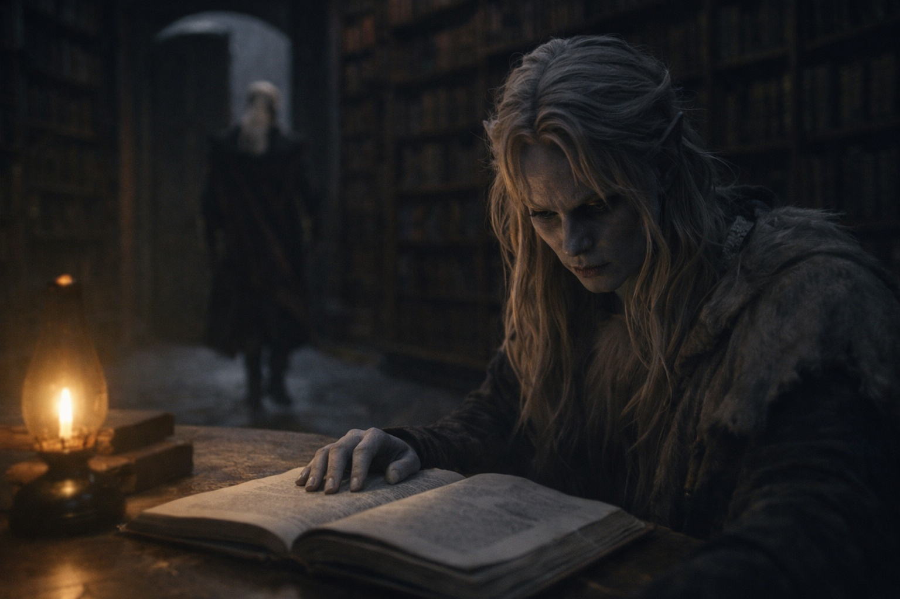

## Capítulo 4 | Parte 1
--- 

La biblioteca olía a polvo y algo más antiguo: aceites de conservación, tratamientos de hongos, el aliento acumulado de siglos prensado entre cubiertas de cuero.

Drusniel pasó los dedos por lomos que no podía leer. Tres meses de entrenamiento, y Zaelar finalmente lo había traído aquí: una cámara circular en el corazón de la torre, cubierta del suelo al techo con textos que antecedían cualquier cosa en los archivos de Umbra'kor.

—Estos son anteriores a la llegada de Venemora. —Zaelar permanecía junto a una mesa de lectura, ordenando relojes de arena con la precisión metódica que traía a todo—. Antes de que tu pueblo olvidara lo que podían ser.

—¿Olvidara?

—Venemora trajo bendición divina. Estructura. Orden. —Giró un reloj de arena, observando la arena comenzar a caer—. También trajo estrechamiento. Antes de ella, los drow practicaban magia elemental libremente. Aire, agua, fuego, tierra: todos los caminos abiertos. Después de su llegada, solo su bendición importaba. Todo lo demás se convirtió en herejía.

Drusniel sacó un volumen del estante más cercano. La encuadernación crujió bajo su toque, páginas quebradizas por la edad. Símbolos cubrían los márgenes: algunos vagamente familiares, la mayoría completamente ajenos.

—No puedo leer esto.

—No. La escritura antigua murió con las viejas costumbres. —Zaelar cruzó hacia él y tomó el libro con gentileza—. Pero he pasado décadas traduciendo lo que importa. El conocimiento esencial. —Señaló hacia una mesa lateral apilada con páginas sueltas—. Mis notas. Todo lo que he aprendido sobre la afinidad elemental entre los drow.

Drusniel se movió hacia la mesa. Los papeles estaban organizados con precisión obsesiva: diagramas, anotaciones, mediciones y líneas temporales. Algunos llevaban la letra apretada de Zaelar. Otros parecían más antiguos, copiados de fuentes que Drusniel no podía identificar.

—El último con tu afinidad particular —dijo Zaelar en voz baja— se llamaba Velryn. Hace tres siglos. Aire y agua ambos, como tú.

—¿Qué le pasó?

La pausa de Zaelar duró un instante de más. —Eso es... complicado. Logró grandes cosas. Cambió la forma de la guerra entre la superficie y el subterráneo. Los registros describen habilidades que la mayoría de los magos considerarían imposibles.

—¿Y luego?

—Luego desapareció. —Dejó el libro viejo a un lado—. Las historias no coinciden en si murió o simplemente... se fue. Su historia está incompleta.

Drusniel archivó eso. Las evasivas de Zaelar siempre contenían verdad y omisión en medida cuidadosa. La habilidad estaba en aprender cuál era cuál.

Un nombre captó su atención.

Su propio nombre.

*Drusniel Thel'varin—potencial elemental confirmado—aire dominante, agua secundario—línea temporal de prueba viable—resultado proyectado: fracaso probable (patrón sugiere recuperable)*

Fechado tres meses antes de las Pruebas del Ocaso.

Su garganta se secó. —¿Qué es esto?

La atención de Zaelar se desplazó hacia la página en las manos de Drusniel. Su expresión no cambió, pero su quietud sí. No culpa. Cálculo, rápidamente enmascarado.

—Mis notas de investigación. Te dije que he estado observando candidatos prometedores durante años.

—Sabías de mí. —La voz de Drusniel salió más plana de lo que pretendía—. Antes de la prueba. Sabías que fallaría.

—Sospechaba que podrías fallar. La pureza elemental es demasiado fuerte para que la bendición de Venemora la reconozca; lo he visto antes. —Zaelar se acercó, su tono paciente—. Iba a acercarme a ti después, sin importar el resultado. Ofrecer entrenamiento. Ayudarte a entender lo que realmente eres.

—Resultado proyectado. —Drusniel levantó la página—. Eso no es sospecha. Es predicción.

—He estudiado esto lo suficiente como para reconocer patrones. —Las manos de Zaelar se plegaron detrás de su espalda—. El resultado que esperaba llegó a pasar. Eso no significa que lo causé; solo que ciertas afinidades siguen trayectorias predecibles.

La explicación tenía sentido. Encajaba con los hechos que Drusniel ya conocía. Y sin embargo...

*Resultado proyectado: fracaso probable.*

No fracaso posible. *Probable.* Como si el resultado hubiera sido calculado de antemano, no cierto, quizás, pero lo suficientemente cercano.

—Eres el primero en generaciones con esta combinación —continuó Zaelar, su voz suavizándose—. ¿Entiendes cuán valioso te hace eso? No para el sistema de Venemora. No para ancianos que miden el valor por sus estándares estrechos. Para cualquiera que entienda en qué puede convertirse verdaderamente la magia elemental.

Valioso. La palabra se asentó extrañamente en el pecho de Drusniel. Halago y advertencia, trenzados juntos.

—Sigue estudiando. —Zaelar señaló hacia las pilas—. Tengo preparaciones que hacer para la lección de mañana. Te has ganado acceso a esta habitación, Drusniel. Úsalo.

Se fue. La puerta se cerró con un suave clic.

Drusniel permaneció solo entre los textos antiguos, mirando su propio nombre en la letra de Zaelar.

*Resultado proyectado: fracaso probable.*

El poder era real. Había inclinado llamas de vela, sentido el aire moverse a su sugerencia. Fueran cuales fueran los motivos de Zaelar, la magia no era una mentira.

Pero la nota antecedía todo. Antes de la prueba. Antes de la voz. Antes de que Drusniel hubiera tomado ninguna decisión en absoluto.

Guardó la página en su manga y continuó leyendo.

---

**Fin de Capítulo 4.1 — continúa en Capítulo 4.2: [Conocimiento Prohibido: El Poder Creciente](/conocimiento-prohibido-el-poder-creciente/)**