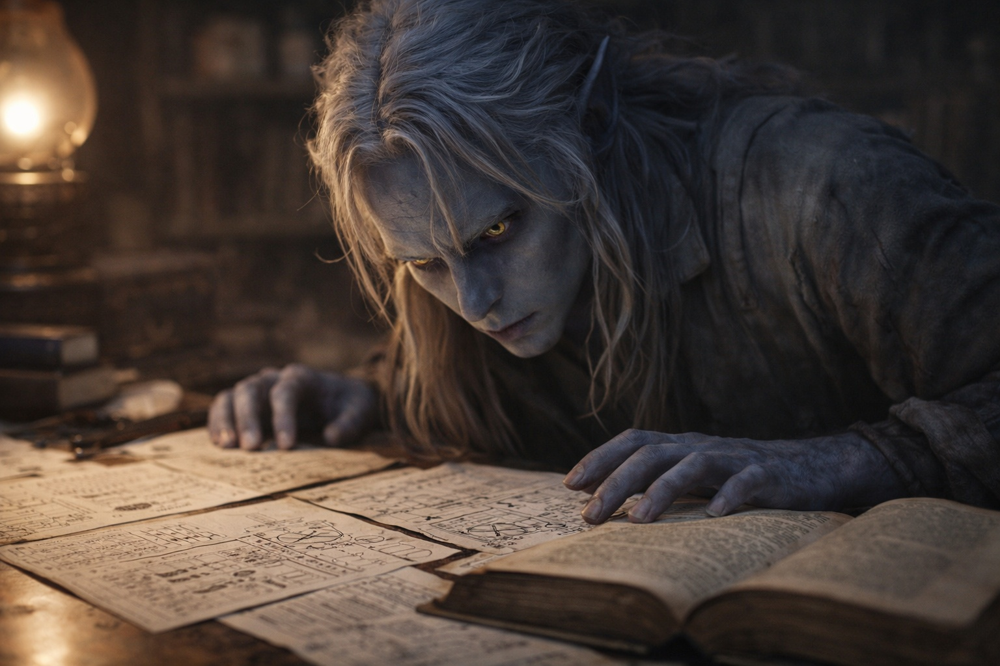

## Capítulo 4 | Parte 2
--- 

El aceite de conservación manchaba la tela bajo los libros más antiguos de la biblioteca. Drusniel se limpió el pulgar grasiento en la manga antes de tocar el siguiente lomo.

Drusniel pasó los dedos por lomos que no podía leer. Cinco meses de entrenamiento, y Zaelar finalmente lo había traído aquí: una cámara circular en el corazón de la torre, cubierta del suelo al techo con textos que antecedían cualquier cosa en los archivos de Umbra'kor.

—Estos son anteriores a la llegada de Venemora. —Zaelar permanecía junto a una mesa de lectura, ordenando relojes de arena con la precisión metódica que traía a todo—. Antes de que tu pueblo olvidara lo que podían ser.

—¿Olvidara?

—Hubo un tiempo en que un drow podía estudiar los elementos sin responder ante sus sacerdotes. —Zaelar giró un reloj de arena—. Ahora tienes que venir aquí a escondidas.

Drusniel sacó un volumen del estante más cercano. La encuadernación crujió bajo su toque, páginas quebradizas por la edad. Símbolos cubrían los márgenes: algunos vagamente familiares, la mayoría completamente ajenos.

—No puedo leer esto.

—Empieza por mis traducciones. —Zaelar tomó el volumen por la encuadernación y lo dejó sobre un soporte—. Los originales te llevarán más tiempo. Podrás compararlos a medida que aprendas la escritura.

Drusniel se acercó a la mesa. Los papeles estaban organizados con precisión obsesiva: diagramas, anotaciones, mediciones y líneas temporales. Cada traducción llevaba un pequeño número de referencia en la esquina superior.

Cuarenta y seis. Cuarenta y siete. Cuarenta y nueve.

Volvió a comprobarlo. Faltaba el cuarenta y ocho.

Drusniel no dijo nada.

—La última drow que encontré con tu combinación fue una mujer llamada Velryn. Hace tres siglos.

—¿Qué le pasó?

—Luchó en la guerra entre la superficie y el subsuelo. Estos relatos describen lo que podía hacer.

—¿Y luego?

—Luego desapareció. —Dejó el libro viejo a un lado—. Las historias no coinciden en si murió o simplemente... se fue. Su historia está incompleta.

Drusniel pasó la página en busca de una fecha.

Cuando Zaelar cruzó la habitación para devolver el volumen antiguo, Drusniel revisó el índice al borde de la mesa. La referencia cuarenta y ocho había sido tachada una vez, con tan poca fuerza que la marca del estante seguía visible.

La memorizó.

Más tarde, mientras Zaelar buscaba otra traducción en los estantes superiores, Drusniel siguió la marca hasta una fila de teoría elemental. El cuarenta y ocho estaba doblado dentro de la contracubierta de un volumen archivado bajo un símbolo obsoleto.

Lo abrió.

Su propio nombre.

*Drusniel Thel'varin. Potencial elemental confirmado: aire dominante, agua secundaria. Fecha de la prueba adecuada. Resultado previsto: conexión fallida; formación elemental aún viable.*

Fechado tres meses antes de las Pruebas del Ocaso.

Su garganta se secó. —¿Qué es esto?

Zaelar apretó los labios. Alargó la mano hacia la página, pero se detuvo antes de tomarla.

—Mis notas de investigación. Te dije que me interesaban los candidatos.

—Sabías de mí. —La voz de Drusniel salió más plana de lo que pretendía—. Antes de la prueba. Sabías que fallaría.

—Esperaba ese resultado. También sabía que seguirías teniendo algo que la prueba no había medido.

—Y me dejaste entrar sin advertirme.

—¿Habrías renunciado a tu plaza porque te lo pidiera un exiliado? —Zaelar bajó la mano—. Querías la prueba. Ahora quieres lo que viene después.

Drusniel volvió a mirar la fecha.

Habría ido de todos modos. Eso no explicaba por qué Zaelar había escrito *adecuada* junto a la fecha.

—Tu afinidad sobrevivió —dijo Zaelar—. Eso es lo que puedo enseñarte a usar.

—Sigue estudiando. —Zaelar señaló hacia las pilas—. Tengo preparaciones que hacer para la lección de mañana. Te has ganado acceso a esta habitación, Drusniel. Úsalo.

Se fue. La puerta se cerró con un suave clic.

Drusniel permaneció solo entre los textos antiguos, mirando su propio nombre en la letra de Zaelar.

Copió la nota en un papel suyo, con la fecha y el número de referencia, y devolvió el original a su sitio. Después buscó el índice de correspondencia.

---

**Fin de Capítulo 4.2 —> 4.3: [Conocimiento Prohibido: Las Señales de Advertencia](/conocimiento-prohibido-las-senales-de-advertencia/)**
