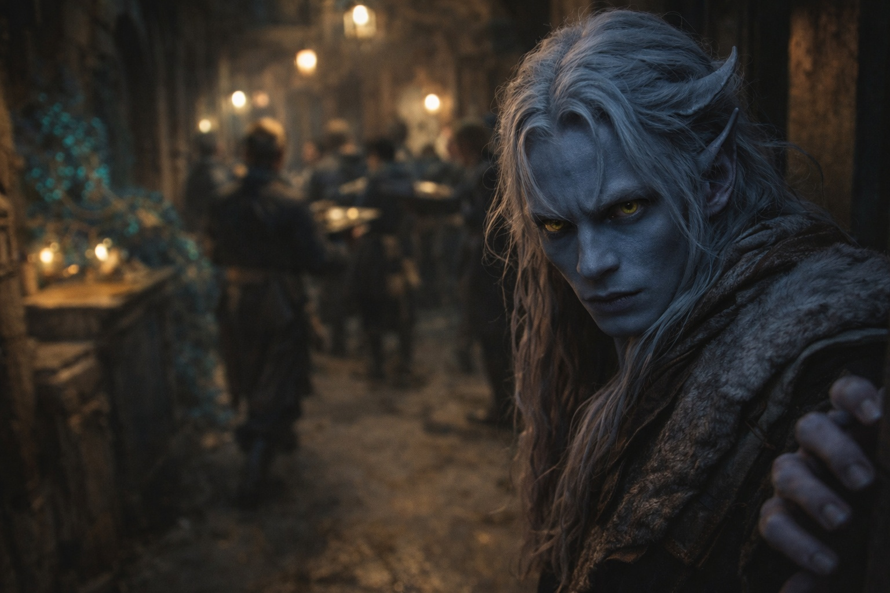
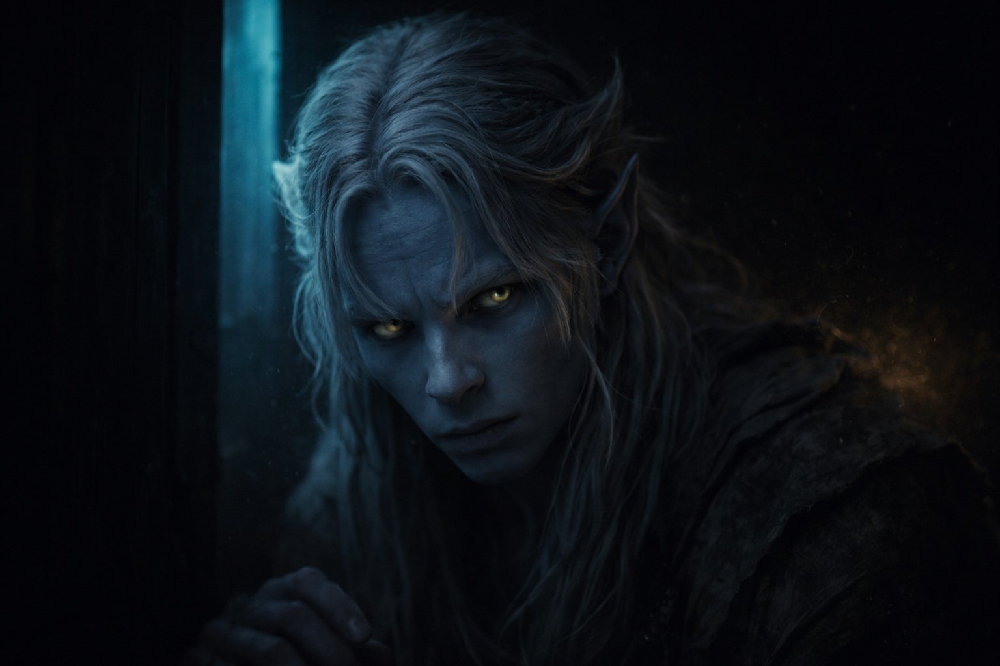
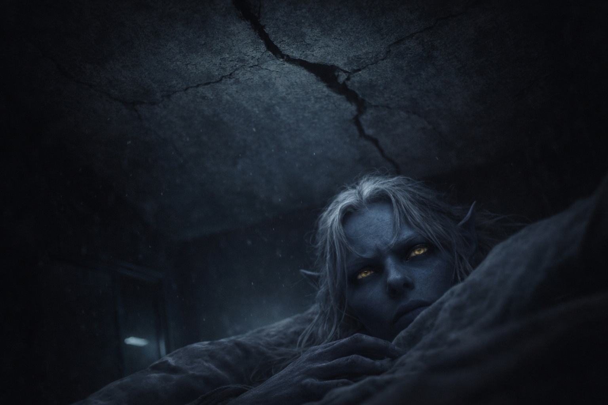

## Capítulo 3 | Parte 5
--- 

El recinto estaba en caos cuando Drusniel llegó.

Cuando llegó al recinto, las lámparas de la tarde ya estaban encendidas. Los sirvientes pasaban con agua y vendas dobladas. La voz de su padre llegaba desde el estudio.

Encontró a su madre en el salón principal, dirigiendo sirvientes con gestos rápidos.

—Has vuelto. —Lo sujetó de la manga—. ¿Dónde has estado?

—Caminando. ¿Qué ha pasado?

—Luego. —Le agarró el brazo y lo guio hacia los aposentos familiares—. Tu padre necesita hablar contigo. Con los dos: ¿dónde está Shyntara?

—No...

Shyntara apareció al final del corredor, moviéndose con la eficiencia rápida de alguien que ya había evaluado cualquier amenaza que hubiera llegado. —Estoy aquí. ¿Qué es?

La mandíbula de su madre se tensó. —El estudio. Ahora. Los dos.

---

Su padre estaba inclinado sobre un mapa en el estudio. Una lámpara humeaba junto a su codo; no había recortado la mecha.

Los ojos de su padre volvían una y otra vez a la puerta. Esperó a que cayera el pestillo antes de hablar.

—Cierren la puerta —dijo.

Shyntara lo hizo. El clic resonó en la habitación estrecha.

—Ha habido un incidente. —La voz de su padre era plana, deliberadamente neutral—. Contactos en los distritos exteriores fueron atacados anoche. Tres muertos. El resto disperso.

—¿Qué contactos? —preguntó Shyntara.

—Informantes. Personas que nos mantenían al tanto de los movimientos de la casa enemiga. —Encontró su mirada—. Estamos ciegos ahora. Sea lo que sea que estén planeando, no lo veremos venir.

*La posición de tu familia puede ser más frágil de lo que parece.*

—¿Qué hacemos? —preguntó Drusniel.

Su padre levantó la vista del mapa.

—Nos mantenemos vigilantes. No confiamos en nadie fuera de estos muros. —Su mirada se endureció—. Y *no* salimos del recinto solos. ¿Entendido?

—Entendido —dijo.

Su padre repartió las guardias restantes. Drusniel escuchó hasta que vaciló la lámpara junto al mapa. Se descubrió preguntándose si también podría inclinar aquella llama.

Cuando su padre finalmente los despidió, Drusniel se retiró a su habitación y cerró la puerta.

---

Esa noche, la presencia regresó.

El contacto reavivó el dolor detrás de sus ojos. Se volvió boca arriba y respondió.

*Drus. ¿Cómo fue?*

Respondió a la presencia. *Lo encontré. A Zaelar. Me examinó.*

*¿Y?*

*Aire y agua. Dice que puedo trabajar con ambos.* Drusniel vaciló. *Me enseñó a mover una llama.*

*¿Lo ves? Había más en ti de lo que midieron.*

*Se ha ofrecido a enseñarme más.*

*Eso es maravilloso.* La presencia irradiaba aprobación. *Estoy tan orgulloso de ti. Esto es exactamente lo que necesitabas.*

*¿No vas a preguntar cómo fue el entrenamiento?*

Una pausa. Más larga de lo que debería haber sido.

*Cuéntamelo todo*, dijo la voz finalmente. *Quiero escuchar todo.*

Annariel habría preguntado qué se sentía antes de que Drusniel terminara la primera frase.

*Rompí algo en el segundo intento.*

*Eso suena frustrante.*

*Lo fue*, concordó Drusniel. No elaboró.

*Mejorarás con la práctica. Sigue.*

*Necesito descansar.*

*Claro. Me alegro de que lo encontraras, Drus.*

La presencia se retiró.

Solo en su habitación, escuchó pasar la nueva patrulla bajo la ventana.

Había querido describir la llama, cómo se había mantenido inclinada en el aire. La voz no había preguntado. Ahora se alegraba de no habérselo contado todo.

Volvería a la torre. Antes de la lección pediría que alejaran la vela de la rejilla de Zaelar.

Si también podía hacerlo allí, al menos eso sería suyo.

---

**Fin de Capítulo 3.5 —> 4.1: [Conocimiento Prohibido: El Poder Creciente](/conocimiento-prohibido-el-poder-creciente/)**
