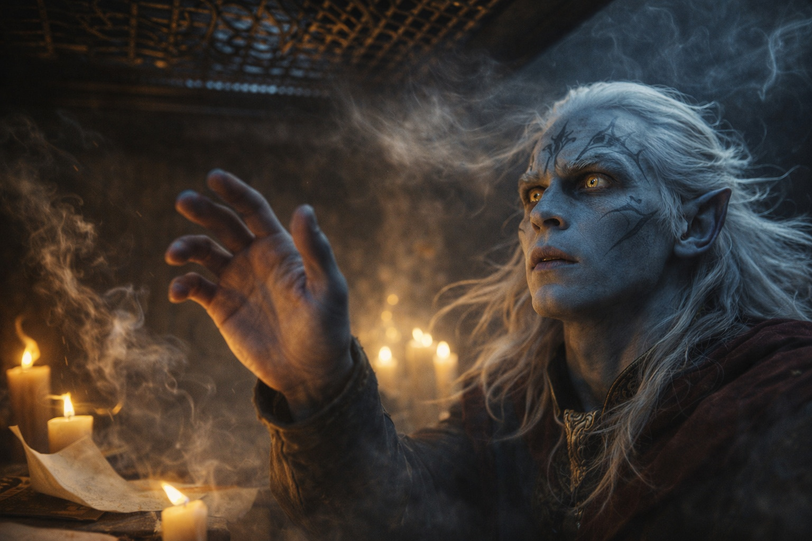
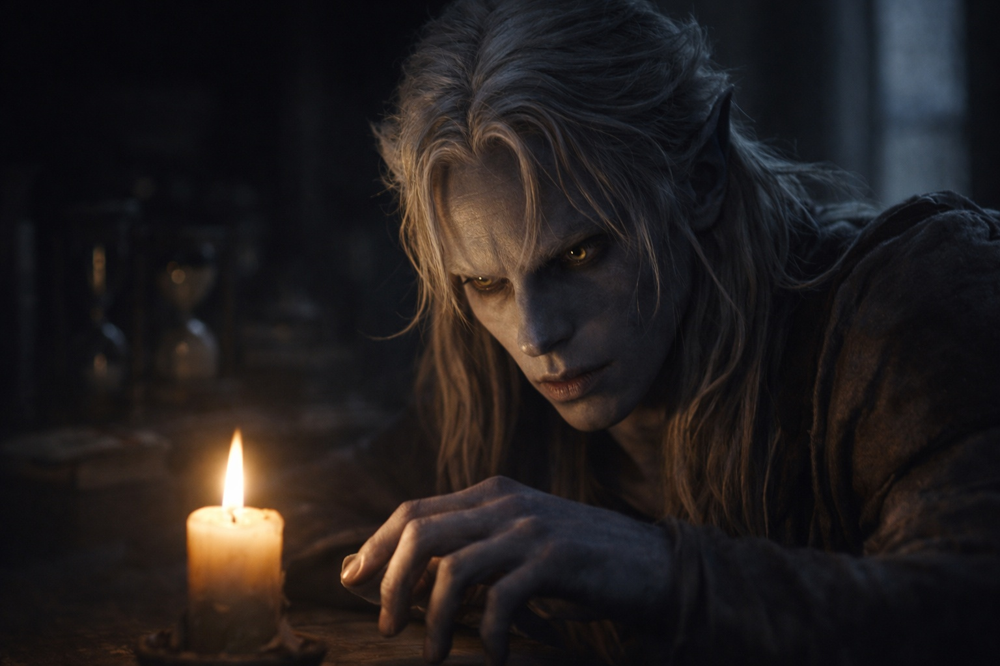

## Capítulo 3 | Parte 2
--- 

Los dedos de Zaelar se cerraron alrededor de la muñeca de Drusniel. Fríos, secos, más fuertes de lo que aparentaban.

—Cierra los ojos —dijo Zaelar—. Respira despacio. Esta vez deja que sea yo quien busque.

Drusniel cerró los ojos, pero mantuvo la mano libre sobre el brazo de la silla. Si Zaelar apretaba más, tendría dónde apoyarse para soltarse.

—Interesante.

Los ojos de Drusniel se abrieron de golpe. —¿Qué? ¿Qué ves?

Zaelar observó la hendidura en la base del pulgar de Drusniel. Mantuvo la otra mano suspendida encima. Un dolor leve ascendió por el brazo de Drusniel hacia el codo.

—No te muevas.

—Dime qué estás buscando.

—Si te apartas, tendré que empezar de nuevo.

Se quedó quieto. Una vela vaciló detrás de Zaelar, que tomó aire con más profundidad antes de aflojar la presión sobre su muñeca.

Entonces, lentamente, el mago de la superficie sonrió.

—Extraordinario —murmuró—. Verdaderamente extraordinario.

—¿Qué? ¿Qué es?

Zaelar lo soltó y se frotó los dedos antes de tomar su té.

—Cuando practicabas antes de la prueba —preguntó Zaelar—, ¿qué sentías?

—Sentía... —Drusniel buscó palabras—. Presión. Como si algo estuviera casi ahí, justo fuera de alcance. Nunca pudimos tocarlo del todo.

—¿Y durante la prueba? ¿Antes del vacío?

—La misma presión, pero tan cerca que podía tocarla. —Se le cerró la garganta—. Luego desapareció.

Zaelar dejó la taza. —El templo te pide que busques a Venemora. Dejemos eso a un lado por un momento.

—No entiendo.

—Tienes un don, Drusniel. —Zaelar apoyó la taza en la rodilla—. Un don raro. Quizá el más raro que he encontrado en doscientos años de estudio. Tienes afinidad elemental. Aire y agua. Fuerte en ambos.

—Eso es imposible —dijo Drusniel—. Los drow no...

—Los drow no enseñan magia elemental en el templo. Eso no significa que sean incapaces de practicarla.

A Drusniel se le habían enfriado las manos. —¿Por eso fallé?

—La prueba mide tu conexión con Venemora. —Zaelar se inclinó hacia él—. Viniste a preguntar si podías hacer magia. Puedes.

Drusniel llevaba días intentando alcanzar algo y no encontraba nada. Cada fallo le hacía más difícil empezar el siguiente intento. Si Zaelar tenía razón, había estado buscando lo que no era. Quería probar ahora, antes de que el mago dijera algo que volviera a hacerlo imposible.

—Eso no explica lo que pasó.

—No. Pero significa que, fuera lo que fuese lo que te quitaron, no fue todo.

Drusniel se frotó la muñeca que Zaelar le había sujetado. Aire y agua. Se había imaginado regresando de la prueba con una bendición, obligando a su padre a levantar la vista de la mesa y reconocerla. No había imaginado aprender una magia que tendría que ocultar. Aun así, quería preguntar cuándo podría usarla, y le molestó desearlo.

—Aire y agua —repitió lentamente—. ¿Qué significa eso? ¿Qué puedo hacer realmente?

—Deja que te lo muestre. —Zaelar se levantó.

Se detuvo bajo una rejilla de hierro del techo. Una corriente le movía el cabello sobre la frente.

—Mira. —Zaelar alzó una mano hacia la rejilla—. El aire ya está bajando. Solo necesito cambiar su dirección.

Curvó los dedos. La corriente cambió, y tuvo que recuperar el aliento antes de volver a hablar.

El aire fresco golpeó el rostro de Drusniel. En la mesa de al lado se apagó una vela, dejando un hilo de humo que se alejaba de la rejilla.

—Lo has hecho tú —murmuró Drusniel.

—Lo he desviado. —Zaelar bajó la mano—. Necesitas aire con el que trabajar. Cerca del cuerpo puedes moldearlo con precisión. Más lejos necesitas una corriente cuyo recorrido puedas aprovechar.

Drusniel se levantó. —¿Puedo probar?

—Todavía no. —Zaelar alzó una mano—. Primero, necesitas entender con qué estás trabajando. Siéntate.

Drusniel se sentó en el borde de la silla.

—Llevas mucho tiempo esforzándote por alcanzar algo que se te escapaba. Esto será distinto. Date tiempo para aprenderlo.

—¿Cuánto tiempo?

—Lo averiguaremos mientras trabajamos. —Zaelar puso una vela entre ambos—. La llama te mostrará si has movido el aire. No tendrás que fiarte de mi palabra.

—Puedo intentarlo —dijo.

—Y para cuando duela. —Zaelar acercó un poco la vela—. El esfuerzo puede dejarte sin aliento. Si te empieza a doler la cabeza, dímelo.

Drusniel se inclinó para estudiar la llama.

Había pasado años aprendiendo dónde colocar los pies y cómo sujetar una hoja. Shyntara veía cada error antes de que él supiera que lo había cometido. La vela le ofrecía algo que podía observar por sí mismo. Acercó la silla.

—¿Cuándo podemos empezar? —preguntó.

—Ya lo hemos hecho.

---

**Fin de Capítulo 3.2 —> 3.3: [El Mago de Superficie: La Primera Lección](/el-mago-de-superficie-la-primera-leccion/)**
