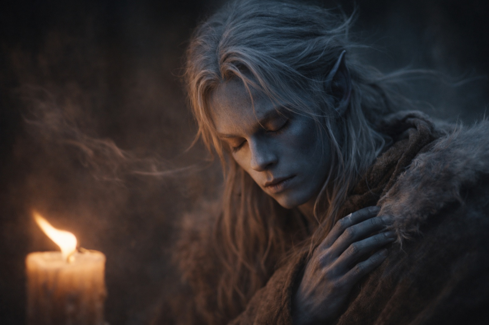

## Capítulo 3 | Parte 3
--- 

La vela ardía. Drusniel la miraba fijamente hasta que le lagrimeaban los ojos.

—Deja de fulminarla con la mirada —dijo Zaelar desde el otro lado de la habitación—. No estás intentando intimidar la llama. Estás intentando sentir el aire a su alrededor.

—Lo estoy intentando.

—Te estás esforzando demasiado. Hay una diferencia.

Tras una hora de ejercicios de respiración, a Drusniel le dolían los hombros. Los bajó y volvió a intentarlo. La vela seguía agitándose con la corriente de la rejilla del techo.

Empezaba a pensar que esto era un error.

—Cierra los ojos —dijo Zaelar.

—Eso no funcionó las últimas tres veces.

—Ciérralos de todas formas.

Cerró los ojos. El olor a cera fundida era más intenso junto a la llama; el aire de la rejilla le enfriaba un lado del rostro.

—Antes sentiste la corriente en la cara —dijo Zaelar—. Empieza por ahí. Síguela hasta la rejilla.

Sentía aquel frescor desde que había entrado y no le había prestado atención. Siempre había aire contra su rostro. Lo difícil era seguirlo el tiempo suficiente para notar adónde iba, sin decidir de antemano adónde debía ir.

El aire se movía. Desde arriba, a través de la rejilla, bajando a la habitación. Se expandía mientras descendía, enfriándose en el camino. Algo de él alcanzaba la llama de la vela, haciéndola danzar. Algo de él rozaba el rostro de Drusniel y continuaba hacia la puerta.

Podía seguir el frescor más allá de su piel. Con los ojos cerrados encontró el borde donde la corriente se extendía por la habitación y lo perdía cada vez que intentaba retener la forma entera. El esfuerzo le tensó la frente. Volvió a la parte que le rozaba la mejilla.

—Ahí. Ahora intenta desviar el borde hacia la vela.

Drusniel extendió su percepción.

Encontró la parte de la corriente que le rozaba la mejilla.

Y empujó.

La llama se inclinó a la izquierda. Perdió la corriente al tomar aire, sorprendido.

Los ojos de Drusniel se abrieron de golpe. —Lo sentí.

—La has movido. —Zaelar señaló la vela con la cabeza—. Bastaba con un poco.

Vio cómo la llama se enderezaba y sonrió a pesar del dolor.

—Otra vez —dijo—. Quiero hacerlo otra vez.

—Despacio. Siente la corriente primero. No...

Drusniel ya lo estaba intentando. Apenas había movido la llama; quería inclinarla lo suficiente para no poder confundir el resultado con una corriente cualquiera. Esta vez agarró el aire entero y empujó antes de que Zaelar terminara de hablar.

El aire se dispersó.

Tres relojes de arena cayeron del estante más cercano. La llama de la vela vaciló salvajemente, lanzando sombras por las paredes. Papeles volaron de una pila en el escritorio de Zaelar. Algo de vidrio se estrelló contra el suelo.

El pecho de Drusniel jadeaba. Su cabeza palpitaba. No se había movido, pero su cuerpo se sentía como si hubiera corrido subiendo un tramo de escaleras.

—Eso —dijo Zaelar con calma— es lo que pasa cuando ordenas en lugar de sugerir.

—No intentaba romper nada.

—Tu ira la dispersó. —Zaelar se arrodilló a recoger los relojes caídos.

Drusniel se llevó una mano a la sien. El dolor se concentraba detrás del ojo derecho, como un clavo. —Estaba emocionado, no enfadado.

—Querías más antes de haber terminado el primer movimiento. —Zaelar examinó un reloj en busca de grietas—. El aire siguió todas las direcciones hacia las que tiraste.

—Entonces necesito una corriente más pequeña.

—Precisamente.

Apoyó una mano en la mesa hasta que dejó de temblarle. Había arena entre los fragmentos de vidrio, junto a su bota. No sabía qué reloj se había roto. Zaelar no le había pedido que lo pagara, pero Drusniel ya calculaba cuántas monedas podría llevar al día siguiente.

—¿Puedo intentarlo de nuevo?

Zaelar lo contempló por un largo momento. Luego, lentamente, asintió.

—Una vez más. —Zaelar enderezó la vela—. Usa el borde que ya pasa junto a la llama. Deja el resto.

Drusniel cerró los ojos. Respiró. Dejó que la desesperación se asentara en algo más tranquilo.

Siguió la corriente desde la rejilla hasta encontrar el borde que se curvaba hacia la vela. Esta vez guio solo esa parte.

*Por aquí. Solo un poco.*

La llama se inclinó y se mantuvo así.

Drusniel abrió los ojos. La vela se inclinaba fuertemente hacia la izquierda, su llama estirada casi horizontal, apuntando directamente a Zaelar al otro lado de la habitación.

—Mejor —dijo Zaelar—. Ahora suéltalo.

Drusniel liberó su agarre sobre la corriente. La llama se enderezó de golpe, reanudó su danza normal. Su respiración llegaba más rápida de lo que debería, y el dolor de cabeza todavía pulsaba detrás de su ojo, pero el agotamiento era menos severo esta vez. Más manejable.

—Basta. —Zaelar miró por la ventana—. Deja que se te pase el dolor antes de volver a intentarlo.

—¿Y si no espero?

—Puede que sangres. Si sigues, puedes hacerte un daño duradero. —Se apartó de la ventana—. Aprenderás más deprisa si puedes mantenerte de pie durante la próxima lección.

Drusniel esperó a que se le calmara la respiración. Seguía mirando la llama y recordando cómo se había mantenido donde él quería.

—Quiero seguir practicando —dijo.

—Mañana. —La voz de Zaelar no admitía discusión—. Tu cuerpo necesita descanso. También tu mente. Regresa al amanecer, y continuaremos.

Drusniel miró hacia la ventana. Llevaba horas allí. Su padre le había dicho que se quedara cerca de casa.

—Debería irme —dijo Drusniel.

—En un momento. —Zaelar se acercó a una estantería.

Drusniel se levantó y tuvo que sujetarse al respaldo hasta que la habitación dejó de oscilar.

---

**Fin de Capítulo 3.3 —> 3.4: [El Mago de Superficie: La Mención de Wyrmreach](/el-mago-de-superficie-la-mencion-de-wyrmreach/)**
