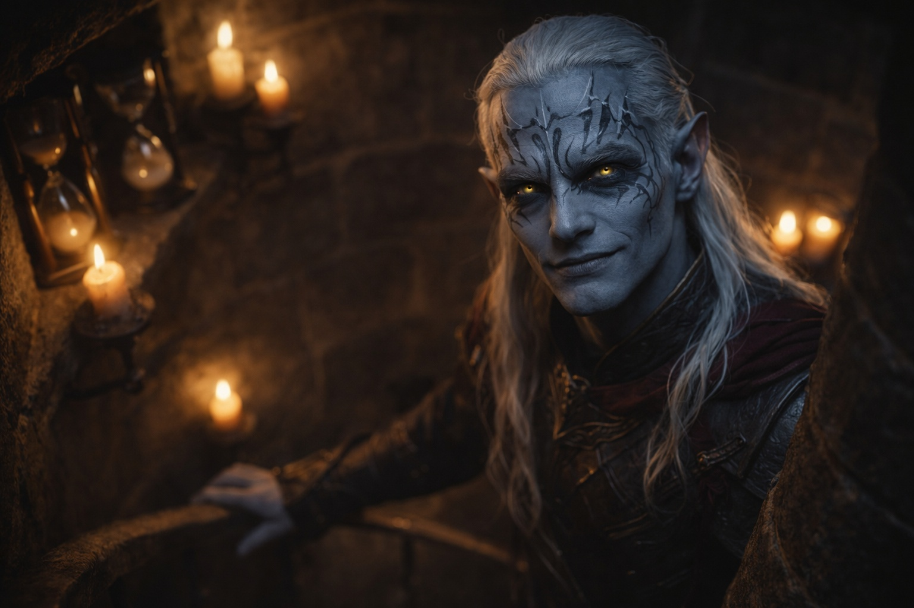
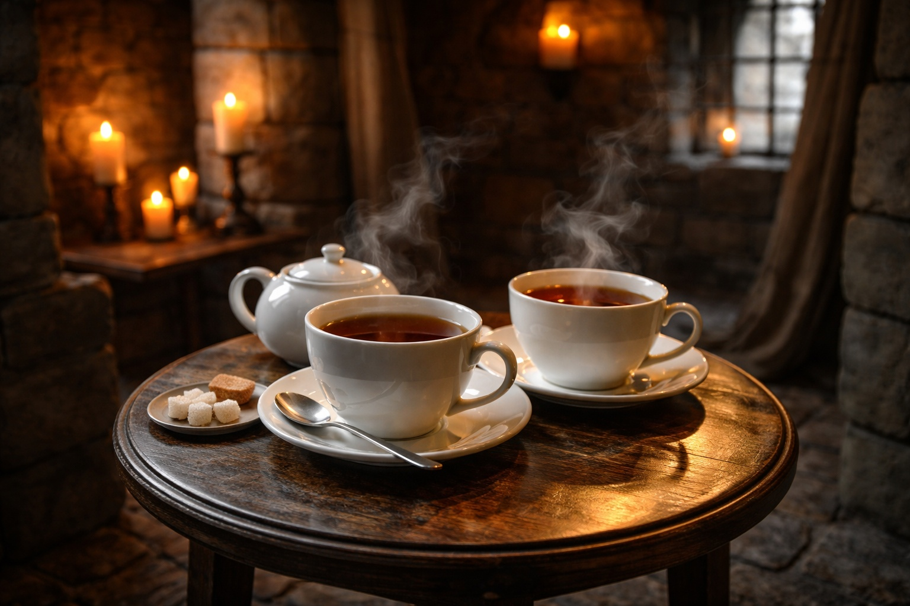
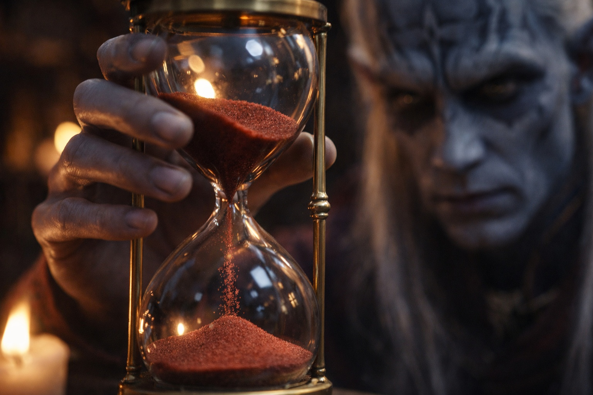

## Capítulo 3 | Parte 1
--- 

La torre era más vieja de lo que había parecido desde la ladera.

La lluvia había ahuecado el peldaño. Drusniel se agarró a la jamba cuando resbaló la suela mojada. La torre se alzaba cuatro pisos sobre él, con las ventanas oscuras y la puerta abierta.

Intentó seguir una fractura en la piedra. Un parche de mortero más reciente la interrumpía, y no encontró dónde continuaba.

Había tardado dos horas desde la cresta. Se había detenido ante ruidos desconocidos, perdido la torre tras una elevación y tenido que retroceder. Un pájaro cantó sobre su cabeza. Se agachó antes de poder evitarlo.

Pero la torre se sentía diferente. Contenida. Casi familiar.

Drusniel entró.

El vestíbulo estaba iluminado por velas en soportes de hierro. Sus ojos se adaptaron enseguida. Los libros cubrían las paredes, con títulos en escrituras que no reconocía, y el olor penetrante de un frasco destapado le irritó la garganta. Buscó a alguien más en el vestíbulo antes de apartarse de la puerta.

Y en todas partes, relojes de arena.

Había relojes en los estantes, las mesas y los alféizares. Algunos eran tan pequeños como su pulgar; otros tenían el tamaño de un puño. La arena roja caía junto a la blanca, cada hilo hacia una abertura de distinto tamaño. Comparó los dos más cercanos. Los habían girado en momentos distintos: uno estaba casi vacío y el otro apenas había empezado.

—El camino no te ha resultado fácil.

Drusniel giró hacia la voz.

Un drow esperaba en lo alto de una escalera de caracol. Alto y enjuto, con el pelo blanco por debajo de los hombros, vestía una túnica oscura y sencilla. Sus ojos recogían la luz de las velas mientras bajaba, pasando del violeta al plateado.

—Soy Zaelar. —Habló como si hubieran concertado una cita—. Y tú debes ser Drusniel.

Drusniel se quedó mirando al mago. No se había presentado. Ni siquiera había hablado.

—¿Cómo sabes mi nombre?

Zaelar llegó al pie de la escalera. —Me interesan las pruebas. Tu nombre figuraba en el registro.

Había dos tazas junto a una tetera humeante. Drusniel las miró y después miró a Zaelar.

—Me estabas esperando —dijo Drusniel lentamente.

—Pensé que podrías venir. —Zaelar señaló la mesa—. Siéntate, si quieres. Desde aquí puedes ver la puerta.

Drusniel se sentó.

Zaelar sirvió el té. —Bébelo despacio. Las hierbas de la superficie pueden resultar amargas al principio.

—Estoy bien.

—Entonces podemos empezar por lo que te ha traído aquí. —Zaelar ocupó la otra silla.

Drusniel se calentó las manos con la taza sin beber.

—Tu prueba terminó sin conexión —dijo Zaelar—. ¿Te pareció un fallo corriente?

—No. —Drusniel apretó la taza entre las manos—. Había algo. Luego dejó de estar.

—Una interrupción. —Zaelar asintió—. Hay formas de cortar una conexión. El fallo no siempre empieza en el candidato.

Esas eran las palabras que Drusniel llevaba esperando desde la prueba. Se dio cuenta de que se inclinaba hacia delante y se detuvo. El mago aún no lo había examinado. Ni siquiera había terminado de preguntarle qué había pasado.

—¿Puedes averiguar si eso me pasó a mí?

—Puedo examinar lo que queda. Sería un comienzo.

Los últimos granos cayeron en un reloj de arena roja del estante más cercano.

Entonces Zaelar se estiró y lo volteó. La arena comenzó a caer de nuevo.

—Lo mides todo —dijo Drusniel.

—Experimentos —dijo Zaelar—. Algunos tardan más que otros. —Dejó el reloj a su alcance—. Pero primero necesito comprender qué eres.

—¿Qué soy?

—Qué tipo de magia vive dentro de ti. —Zaelar extendió su mano, palma arriba—. ¿Me permites?

Drusniel miró la puerta abierta. Podía retirar la mano si el mago le hacía daño. Era una precaución escasa frente a alguien que sabía lo suficiente para cortar una bendición; lo sabía. Apartó el té de todos modos. No había recorrido todo aquel camino para marcharse sin averiguar si quedaba algo.

Drusniel se estiró y colocó su mano en la palma de Zaelar.

---

**Fin de Capítulo 3.1 —> 3.2: [El Mago de Superficie: La Evaluación](/el-mago-de-superficie-la-evaluacion/)**
