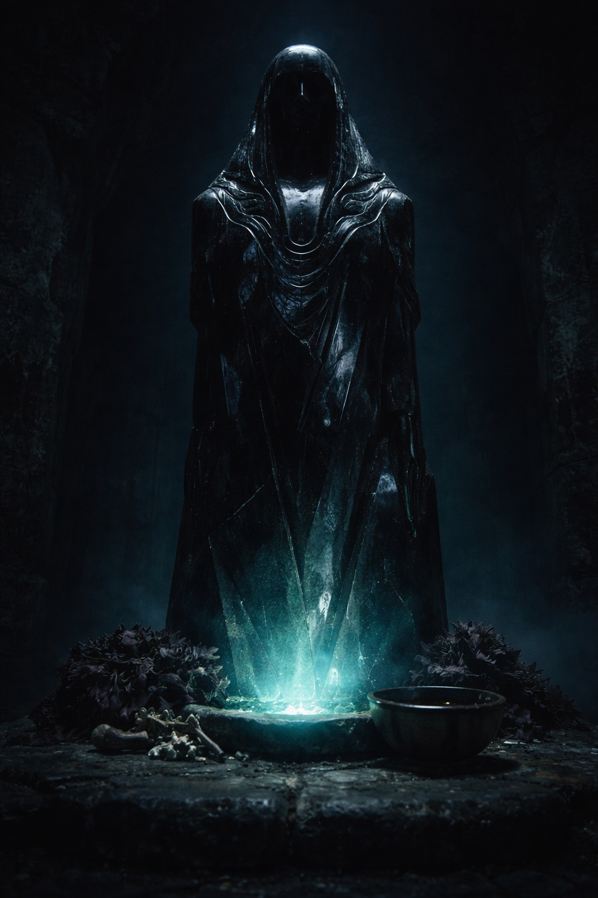
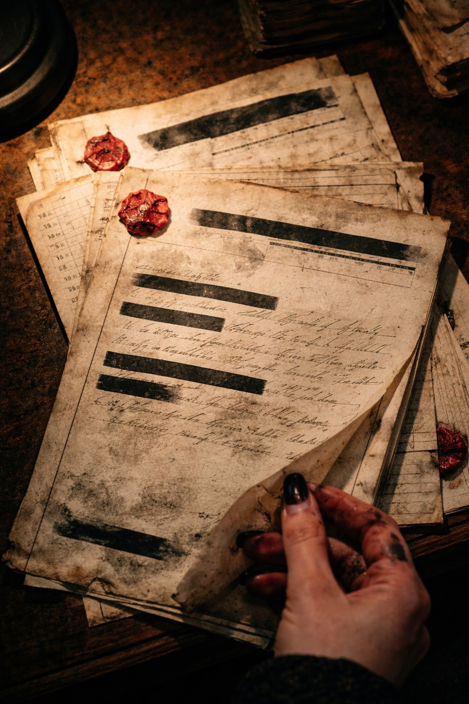

## Lore | La Umbra

---

La mano de la iniciada temblaba mientras copiaba el pasaje.

Sylaera llevaba seis semanas transcribiendo registros del templo. La mayor parte del trabajo era tedioso: cifras de censos, recuentos de tributos, la interminable documentación de deudas entre casas. Pero este texto era diferente. Este texto era antiguo.

*La transición de la superficie a las profundidades ocurrió gradualmente. Algunos registros sugieren que pasaron siglos entre el primer descenso y el abandono definitivo del mundo superior. Otras fuentes afirman que el cambio fue rápido: una sola generación, una sola elección, una puerta que se cerró y nunca volvió a abrirse.*

Se detuvo. Las anotaciones marginales del manuscrito original contenían notas de al menos tres manos diferentes, su tinta desvaída en distintos tonos de marrón.

*Esto contradice el relato del Templo. —M.V.*

*El relato del Templo es doctrina. La contradicción es herejía. —sin firmar*

*Entonces explica los artefactos de superficie en los archivos de Deepreach. —M.V.*

La respuesta a esa última nota había sido tachada. Deliberadamente, al parecer. El papel estaba rasgado donde alguien había presionado demasiado fuerte.

---

> *"En la oscuridad, encontramos poder. En el aislamiento, encontramos fuerza. En Venemora, encontramos propósito."*

El proverbio colgaba sobre la cámara de transcripción en letras de cristal fosforescente. Sylaera lo había leído mil veces. Lo había creído, una vez, antes de empezar a leer los textos fuente que supuestamente el proverbio resumía.

Los textos fuente no coincidían entre sí. Apenas coincidían consigo mismos.

Algunos describían a Venemora como una diosa encontrada en las profundidades. Otros hablaban de ella como algo que los drow trajeron consigo desde la superficie: una fe que se adaptó a la oscuridad en lugar de originarse en ella. Una tercera tradición, preservada solo en fragmentos, sugería que Venemora no era ni diosa ni fe, sino algo más inquietante: una presencia que había estado esperando en las cavernas mucho antes de que el primer drow descendiera.

El templo enseñaba la primera versión. Las demás estaban archivadas en los archivos restringidos, accesibles solo para sacerdotisas superiores y sus escribas designadas.

Sylaera era una escriba designada. Ya no estaba segura de si eso era un privilegio o un castigo.

---

> *"En el juego de las casas, asciendes o caes. No hay término medio."*

Las palabras de la matriarca eran acertadas, al menos. Eso Sylaera lo había visto de primera mano. Tres casas habían caído en la última década. Sus miembros absorbidos, dispersados o simplemente desaparecidos. Los registros los catalogaban como *disueltas por consentimiento mutuo*. La realidad, sospechaba, era más sucia.

Pero las casas no eran su preocupación. La Grieta sí.

Los informes de patrulla habían llegado a su escritorio por accidente: archivados erróneamente entre correspondencia del templo, dirigidos a una sacerdotisa que había muerto dos meses antes. Sylaera debería haberlos enviado a la autoridad correspondiente. En cambio, los leyó.

*Patrulla Siete reporta emanaciones inusuales desde el límite oriental. El patrón no coincide con observaciones previas. Se recomienda aumentar la vigilancia.*

*Patrulla Siete perdió contacto en el día cuarenta y tres. El equipo de recuperación encontró el equipo intacto. No se recuperaron cuerpos. No hay señales de combate. Se recomienda investigación.*

*Investigación pospuesta por asignación de recursos. Patrulla Siete catalogada como desaparecida, presuntamente perdida por riesgo ambiental.*

Tres informes. Con tres meses de diferencia. El patrón le resultaba familiar: había visto secuencias similares en los registros más antiguos. Patrullas que encontraban algo inusual cerca de la Grieta. Equipos de seguimiento que no hallaban nada. Reasignaciones silenciosas de personal. Preguntas que dejaban de hacerse.

---

Sylaera completó su transcripción y archivó el texto original de vuelta en el archivo restringido. Sus manos ya no temblaban. Uno se acostumbraba al conocimiento incómodo, estaba aprendiendo. Lo archivabas en una parte de tu mente que no interfería con el funcionamiento diario.

La Grieta era estable. El templo aseguraba a todos que era estable. Los drow la habían custodiado durante siglos. La custodiarían durante siglos más.

Pero los informes de patrulla seguían llegando. Y el archivo restringido seguía creciendo. Y en algún lugar en las profundidades, más allá de las últimas cavernas donde cualquier drow viajaba por voluntad propia, algo continuaba cambiando de maneras que los registros oficiales se negaban a describir.

> *"Las Hojas Sombrías se mueven sin ser vistas, golpean sin ser oídas, y no dejan más rastro que los cuerpos de sus enemigos."*

Un dicho reconfortante. Sylaera se preguntaba, a veces, si las propias Hojas Sombrías lo creían. Si alguien que realmente hubiera estado al borde de la Grieta seguía creyendo en victorias limpias o partidas sin rastro.

Volvió a su trabajo asignado. Cifras de censos. Recuentos de tributos. La interminable documentación de deudas.

Las campanas del templo marcaron la hora vespertina. En la cámara de transcripción, las letras fosforescentes continuaban brillando: *En la oscuridad, encontramos poder.*

Sylaera copió las palabras una vez más, y se preguntó qué más habían encontrado.

**Fin del Lore 2 — continúa en Prólogo 1: [La Llamada a Zuraldi](/la-llamada-a-zuraldi/)**
