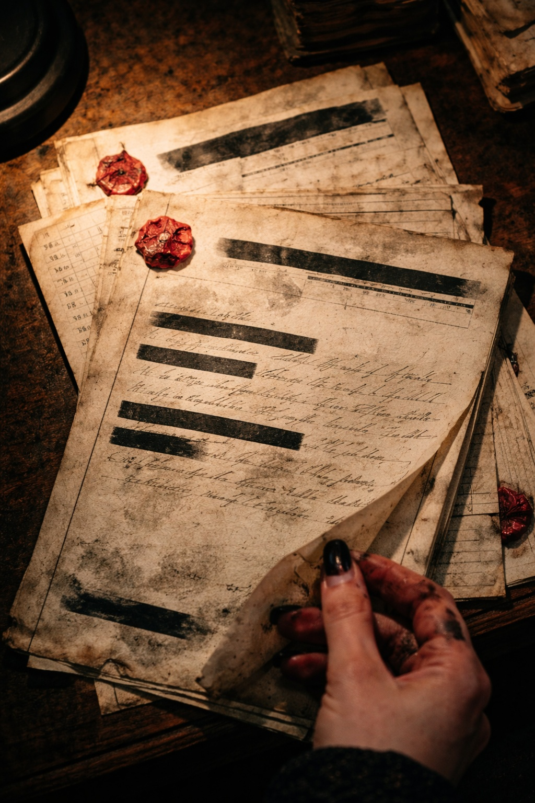

## Lore | La Umbra

---

La mano de la iniciada temblaba mientras copiaba el pasaje.

Sylaera llevaba seis semanas copiando censos y deudas entre casas. Aquel manuscrito dejaba escamas pardas sobre el paño bajo su mano. Frenó la pluma para seguir la letra apretada.

*Algunos registros sitúan siglos entre el primer descenso y el abandono definitivo de la superficie. Otros describen una partida en una sola generación. Las fechas no coinciden con los registros de casas citados por ninguna de las dos versiones.*

Se detuvo. Las anotaciones marginales del manuscrito original contenían notas de al menos tres manos diferentes, su tinta desvaída en distintos tonos de marrón.

*Esto contradice el relato del Templo. (M.V.)*

*El relato del Templo es doctrina. La contradicción es herejía. (sin firmar)*

*Entonces explica los artefactos de superficie en los archivos de Deepreach. (M.V.)*

La respuesta a esa última nota había sido tachada. Deliberadamente, al parecer. El papel estaba rasgado donde alguien había presionado demasiado fuerte.

---

> *«En la oscuridad encontramos poder. Venemora le dio propósito.»*

El proverbio colgaba sobre la cámara de transcripción en letras de cristal pálido. Sylaera lo había copiado al comienzo de cada lección. Ahora buscaba sus palabras en el manuscrito y no las encontraba.

Los textos fuente no coincidían entre sí. Apenas coincidían consigo mismos.

Algunos describían a Venemora como una diosa encontrada en las profundidades. Otros hablaban de ella como algo que los drow trajeron consigo desde la superficie: una fe que se adaptó a la oscuridad en lugar de originarse en ella. Una tercera tradición, preservada solo en fragmentos, sugería que Venemora no era ni diosa ni fe, sino una presencia que había estado esperando en las cavernas mucho antes de que el primer drow descendiera.

El templo enseñaba la primera versión. Las demás se guardaban en los archivos restringidos, accesibles solo para sacerdotisas superiores y sus escribas designadas.

Sylaera era una escriba designada. Ya no estaba segura de si eso era un privilegio o un castigo.

---

> *"En el juego de las casas, asciendes o caes. No hay término medio."*

Tres casas habían desaparecido del censo en la última década. Sylaera había copiado los traslados de sus miembros supervivientes a otras casas. Donde faltaba un traslado, el registro dejaba un hueco bajo las palabras *disuelta por consentimiento mutuo*.

Pero las casas no eran su preocupación. La Grieta sí.

Los informes de patrulla habían llegado a su escritorio por accidente: archivados erróneamente entre correspondencia del templo, dirigidos a una sacerdotisa que había muerto dos meses antes. Sylaera debería haberlos enviado a la autoridad correspondiente. En cambio, los leyó.

*Patrulla Siete reporta emanaciones inusuales desde el límite oriental. El patrón no coincide con observaciones previas. Se recomienda aumentar la vigilancia.*

*Patrulla Siete perdió contacto en el día cuarenta y tres. La partida de recuperación encontró el equipo intacto. No se recuperaron cuerpos. No hay señales de combate. Se recomienda investigación.*

*Investigación pospuesta por asignación de recursos. Patrulla Siete catalogada como desaparecida, presuntamente perdida por riesgo ambiental.*

Tres informes, cada uno archivado tres meses después del anterior. Sylaera cotejó las fechas con el expediente de una patrulla más antigua. También terminaba con una investigación pospuesta. No encontró el testimonio del equipo de recuperación en ninguno de los legajos.

---

Sylaera terminó la transcripción y devolvió el original a su estante. La mano ya no le temblaba, aunque comprobó dos veces el número antes de soltar el manuscrito.

La circular del templo calificaba la Grieta de estable. Citaba siglos de vigilancia drow y renovaba las mismas garantías para el año siguiente.

Había copiado esa garantía junto a una solicitud de otra patrulla. La solicitud nombraba el mismo límite del que no había regresado la Patrulla Siete.

> *«Ningún enemigo oye partir a una Hoja Sombría.»*

El dicho aparecía en un registro de instrucción debajo del expediente de la patrulla. Sylaera dejó una tira de papel donde debería haber estado el testimonio del equipo de recuperación.

Acercó la siguiente hoja del censo. Habían escrito un nombre en la columna equivocada; lo raspó y volvió a copiarlo.

Las campanas del templo marcaron la hora vespertina. En la cámara de transcripción, las letras fosforescentes continuaban brillando: *En la oscuridad, encontramos poder.*

Había llegado al total de la tarde cuando advirtió que la solicitud de patrulla seguía dirigida a la sacerdotisa muerta.

**Fin del Lore 2 — continúa en Prólogo 1: [La Llamada a Zuraldi](/la-llamada-a-zuraldi/)**
