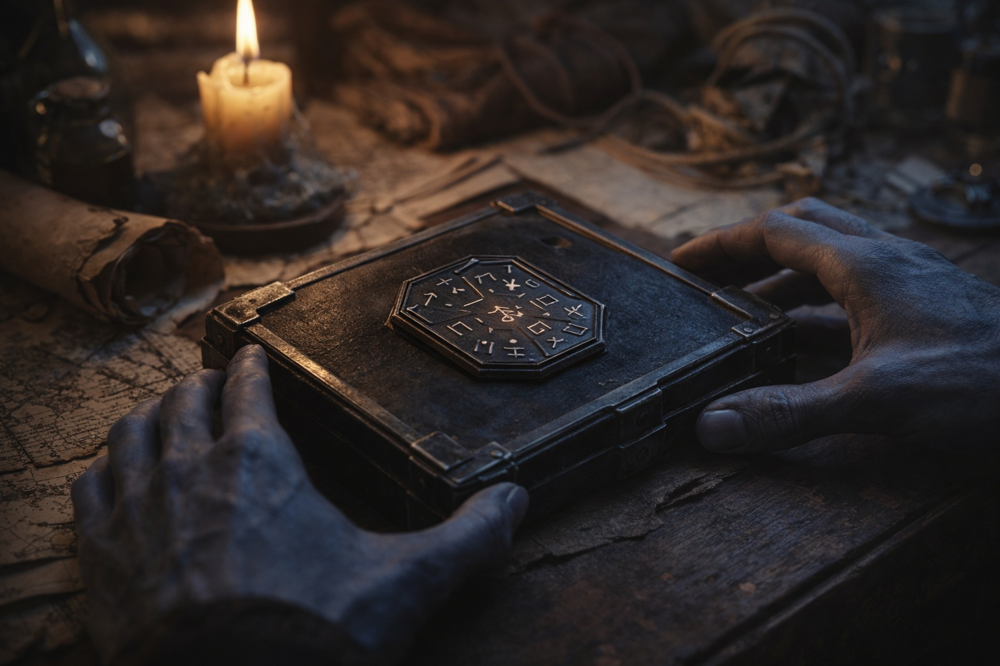
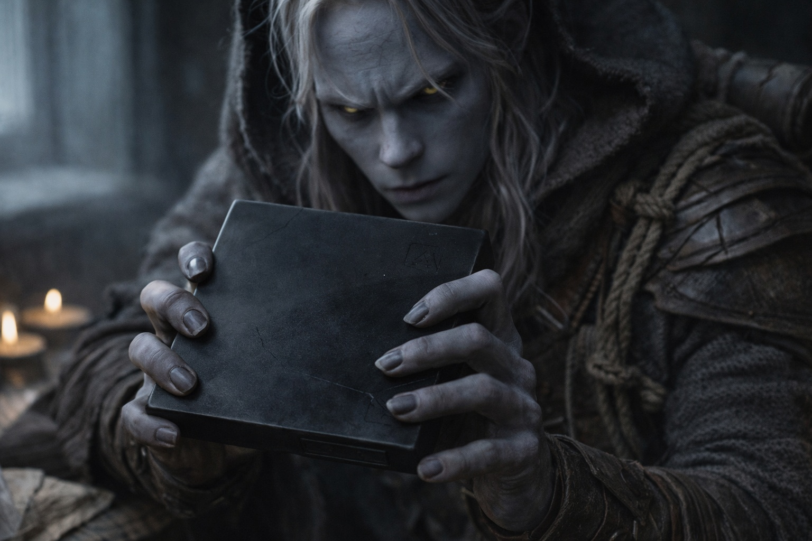

## Capítulo 7 | Parte 3
--- 

Drusniel despertó con luz gris detrás de las contraventanas cerradas.

Durante una respiración esperó oír la voz de su madre desde abajo.

Entonces recordó.

Se vistió con la ropa de superficie que Zaelar había dejado y bajó.

La placa de metal esperaba en el centro de la mesa.

Era más pequeña que su palma, geométrica, cubierta de símbolos que cambiaban cuando intentaba mantenerlos enfocados. Metal oscuro. Tibio al tacto.

—¿Qué es?

—Una herramienta —dijo Zaelar—. Lo llamo el Nulo. Es tan antiguo que no sé quién fabricó el primero. Suprime la firma mágica.

—¿Suprime la magia?

—La firma. No es lo mismo. —Zaelar le dio la vuelta—. Las protecciones detectan la presencia de poder. Esto hace que tu presencia sea difícil de distinguir de la ausencia.

Drusniel lo miró.

—Muéstrame.

Zaelar guio su pulgar hacia un símbolo.

—Presiona. Concéntrate como cuando sujetas una corriente.

Drusniel presionó.

El mundo siguió exactamente donde estaba.

Él no.

La ausencia golpeó su cuerpo antes que el recuerdo.

La cámara de pruebas.

Magia buscando algo y encontrando nada.

Retiró el pulgar del símbolo.

El aire regresó a su percepción. No físicamente. Mágicamente. La presión constante de las corrientes contra sus sentidos volvió.

Zaelar lo observaba.

—Otra vez —dijo Drusniel.

Las cejas de Zaelar se alzaron.

—Actívalo otra vez.

Drusniel presionó el símbolo por segunda vez.

La misma ausencia.

Intentó atrapar la pequeña corriente que entraba bajo la puerta. Seguía sintiendo el aire contra la piel, pero el sentido mágico detrás de ella se había alejado, como si alguien hubiera puesto la corriente al otro lado de un cristal grueso.

Soltó la placa.

—¿Dónde conseguiste esto?

—En Wyrmreach.

—¿Cuánto tiempo llevas teniéndolo?

—Más de lo que tú llevas vivo.

Drusniel giró la placa entre las manos.

—¿Algo como esto podría interferir con una cámara de pruebas?

Zaelar guardó silencio durante medio latido.

—Algo que suprima una firma mágica podría interferir con muchos sistemas de detección.

—¿Esta placa?

—Esta placa estaba aquí.

—Contigo.

—Sí.

El pulgar de Drusniel tocó una vez cada yema.

Una respuesta verdadera todavía podía esconder otra.

La voz que se hacía llamar Annariel no había aparecido ni una sola vez durante la prueba.

Guardó también ese dato.

—¿Cuánto tiempo puedo mantenerla activa?

—Poco, si quieres seguir funcionando. El coste aumenta con la duración. —Zaelar guardó la placa en una bolsa acolchada—. Durante el cruce por mar, mantenla contra el cuerpo. Cuando empiece a pulsar, las protecciones del límite estarán reaccionando. Sigue mis instrucciones. No experimentes entonces.

—¿Por qué no?

—Porque probar un mecanismo mientras intenta matarte es mala metodología.

Drusniel casi sonrió.

Casi.

Zaelar le entregó la bolsa.

—Szoravel reconocerá la señal.

—¿Estás seguro?

—Sí.

Otra afirmación medible.

Drusniel guardó la bolsa en el paquete junto a las provisiones. La daga Vrinn permaneció en su cinturón.

—¿Cuándo salimos?

—Al anochecer. Hasta entonces, te quedas detrás de las contraventanas.

Drusniel asintió.

La placa había reproducido el vacío de su prueba.

Por primera vez, esa sensación tenía un mecanismo asociado.

No tenía una respuesta.

Tenía una pregunta mejor.

---

**Fin de Capítulo 7.3 —> 7.4: [El Paquete: La Ruta](/el-paquete-la-travesia/)**
