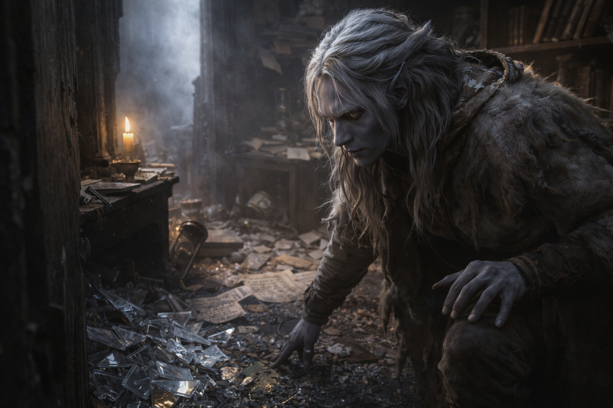

## Capítulo 7 | Parte 1
---

El humo de la torre le irritó la garganta en carne viva.

Drusniel se detuvo bajo los últimos árboles, con la capucha baja contra el cielo que empezaba a aclararse. Marcas de quemadura ennegrecían las paredes inferiores. La puerta colgaba torcida de bisagras rotas. Una construcción anexa había colapsado y sus vigas todavía humeaban.

Los daños eran recientes. ¿Habían venido allí los mismos hombres?

—¡Zaelar!

El viejo mago apareció en la puerta. Sus túnicas estaban chamuscadas. Un corte le cruzaba una mejilla. Sus ojos seguían alerta.

—Sobreviviste.

—Están muertos.

Zaelar bajó los escalones. —Lo supe antes del amanecer. En los mercados ya circulan tres versiones de lo ocurrido.

—Mis padres. Los sirvientes. Todos.

Zaelar lo observó un momento y después miró el temblor de sus piernas. —¿Cuándo comiste por última vez?

—No lo recuerdo.

—Entonces entra.

—Necesito respuestas.

—Necesitas suficiente sangre en la cabeza para entenderlas.

Drusniel estuvo a punto de discutir. La torre se inclinó en el borde de su visión.

Zaelar lo sujetó por el hombro antes de que cayera.

Dentro, el daño continuaba. Cristales por el suelo. Libros arrancados de los estantes. Una mesa partida por una pata. El destrozo era amplio sin ser total; el gabinete cerrado de Zaelar seguía contra la pared del fondo.

Drusniel miró del gabinete a la puerta rota.

—¿Quién te atacó?

—No tengo un nombre que darte.

—Armas Vrinn. Eso llevaban en mi casa. ¿Viste alguna?

—Puedo enseñarte habitaciones destrozadas. —Zaelar miró la daga en el cinturón de Drusniel y dejó pan, carne seca y agua sobre la mesa menos dañada—. Tú al menos te llevaste algo. Come antes de decidir qué demuestra.

Drusniel se detuvo.

Zaelar no le había dado la respuesta que esperaba.

—Vinieron la misma noche.

—Sí.

—Eso importa.

—Probablemente.

Drusniel comió porque las manos ya le temblaban demasiado para ignorarlo.

—No puedo volver a Umbra'kor —dijo después de los primeros bocados.

—No.

—Las otras casas repartirán lo que quede antes de que se seque la sangre.

—Probablemente.

—Y la luz del día impide que simplemente desaparezca por la superficie.

Zaelar señaló la capucha. —Puedes viajar aquí, pero no sin cuidado.

Drusniel bebió.

—Entonces, ¿adónde?

Zaelar despejó un espacio entre los papeles dispersos y extendió un mapa.

—Hay un lugar donde a la mayoría de las casas de Umbra'kor les costaría seguirte.

Drusniel reconoció primero la costa. Después, las marcas más allá.

—Wyrmreach.

Zaelar sostuvo su mirada.

—Termina de comer. Tenemos tiempo para mirarlo.

---

**Fin de Capítulo 7.1 —> 7.2: [El Paquete: La Misión](/el-paquete-la-mision/)**
