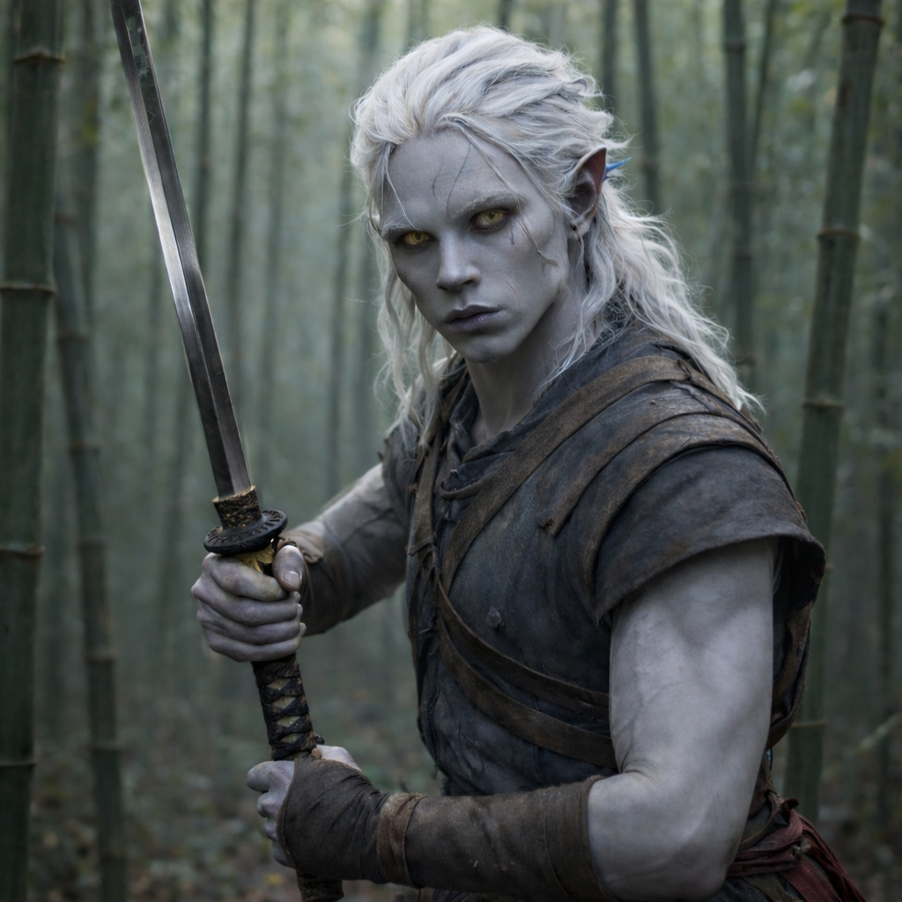
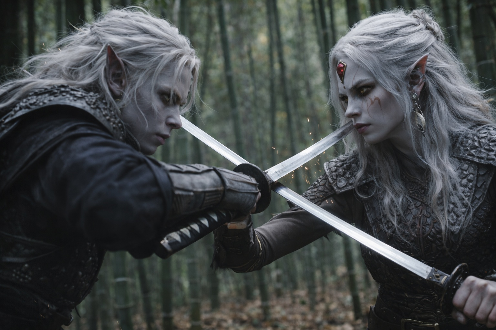

## Capítulo 2

--- 

*La oscuridad del pasaje se cerraba a su alrededor, y su mente buscó algo familiar...*

Drusniel se deslizó entre la arboleda de bambú, cada paso silencioso y preciso. Su espada, forjada en las profundidades de Umbra'kor, atrapaba la escasa luz que se filtraba a través del dosel. Adelante, el cabello pálido de su hermana resaltaba contra la penumbra, un recordatorio descarnado de su herencia compartida.

Los hermanos drow se rodearon el uno al otro, pies deslizándose sobre el suelo del bosque. La mente de Drusniel se aceleraba, recordando su entrenamiento con los Hojas de Sombra. En Umbra'kor, el combate era más que supervivencia: era política, religión, vida misma.

Hoja contra hoja. El choque reverberó a través del aire brumoso. Los brazos de Drusniel temblaban mientras empujaba contra la fuerza de Shyntara. Ella siempre había sido la mejor guerrera, un hecho que le ardía en las entrañas como ácido.

Apretó los dientes y empujó con fuerza, girando en una ráfaga de golpes. Shyntara fluía alrededor de sus ataques como agua en un arroyo subterráneo. Su cabello alabastro azotaba el aire mientras esquivaba y se movía. Siempre justo fuera de alcance. Siempre un paso por delante.

La frustración crecía en el pecho de Drusniel. Había dejado Umbra'kor para probarse a sí mismo, para encontrar la magia que sabía acechaba en su sangre. Pero aquí estaba, todavía luchando contra la sombra de su hermana.

Presionó hacia adelante, buscando una abertura. Ahí: una brecha en su defensa. Drusniel se lanzó, seguro de la victoria.

En el último instante, Shyntara giró. La espada de Drusniel cortó aire vacío. Un codo se estrelló contra su esternón. Retrocedió tambaleándose, los pulmones vaciándose de golpe.

Metal frío besó su garganta. Drusniel se quedó inmóvil, el pulso martilleando en sus orejas puntiagudas. Los dedos delgados de Shyntara ajustaron su agarre, el filo mordiendo más profundo. Alzó los ojos, encontrando una mirada tan gélida e implacable como los ríos subterráneos de su tierra natal.

—Te estás volviendo descuidado, hermanito. —El labio de Shyntara se curvó, sin un solo cabello fuera de lugar. En ese momento, ella encarnaba todo lo que un guerrero drow debía ser: letal, grácil y completamente despiadada.

Drusniel la fulminó con la mirada mientras bajaba su arma. —Si pudiera usar mi magia, te habría vencido.

La risa de Shyntara fue cortante y sin humor. Su espada se deslizó hasta su funda con un chasquido decisivo. —¿Todavía te aferras a esa fantasía? La magia solo fluye a través de la sangre noble, y la nuestra se ha vuelto débil y endeble.

Las palabras cortaron más hondo que cualquier hoja. Drusniel apartó la vista, la mandíbula trabajando en silencio. En Umbra'kor, la habilidad mágica significaba poder. Sin ella, nunca se elevaría por encima de su posición. Nunca ganaría un lugar en el Consejo de Matriarcas. Nunca demostraría su valor ante su familia.

—Estás perdiendo el tiempo aquí arriba —continuó Shyntara, su voz más suave ahora—. Vuelve a casa, Drusniel. Acepta tu lugar. Hay honor en servir como Hoja de Sombra.

Los puños de Drusniel se cerraron a sus costados. —No voy a volver a ser nadie. Sé que tengo poder. Annariel lo ve. Me está ayudando a desbloquearlo.

Los ojos de Shyntara se estrecharon. —¿Ese chico de la Casa Vrinn? Te está usando, hermano. Lo que sea que te haya prometido, es mentira. Sabes lo que nuestras familias sienten la una por la otra.

—Te equivocas. —Drusniel se dio la vuelta, mirando hacia el brumoso bosque de bambú—. Annariel es diferente. Entiende lo que es ser ignorado, que tu potencial sea desestimado. Vamos a cambiar las cosas, Shyntara. Para los dos.

—¿Cambiar las cosas? —Shyntara se burló—. Suenas como un niño. El único cambio en Umbra'kor llega a través de la sangre y la traición. Tu... amistad... con Annariel solo traerá la ruina a ambas casas.

Drusniel negó con la cabeza. —No lo entiendes. Ya no estamos jugando con las viejas reglas. Volveré a Umbra'kor con un poder que hará temblar hasta a las Matriarcas. Y cuando lo haga, no olvidaré quién estuvo a mi lado.

Sintió la mano de Shyntara en su hombro, sorprendentemente gentil. —Espero que tengas razón —dijo en voz baja—. Por tu bien. Pero si te equivocas... no esperes piedad del Consejo. Ni de mí.

Drusniel asintió una vez, con brusquedad. Entendía la advertencia en sus palabras. En el mundo despiadado de la política drow, el fracaso significaba la muerte. Pero había llegado demasiado lejos para dar marcha atrás.

Mientras Shyntara se fundía de vuelta en las sombras de la arboleda de bambú, Drusniel tocó la empuñadura de su espada.

**Fin de Capítulo 2 — continúa en Lore 1: [La magia en Astalor](/la-magia-en-astalor/)**