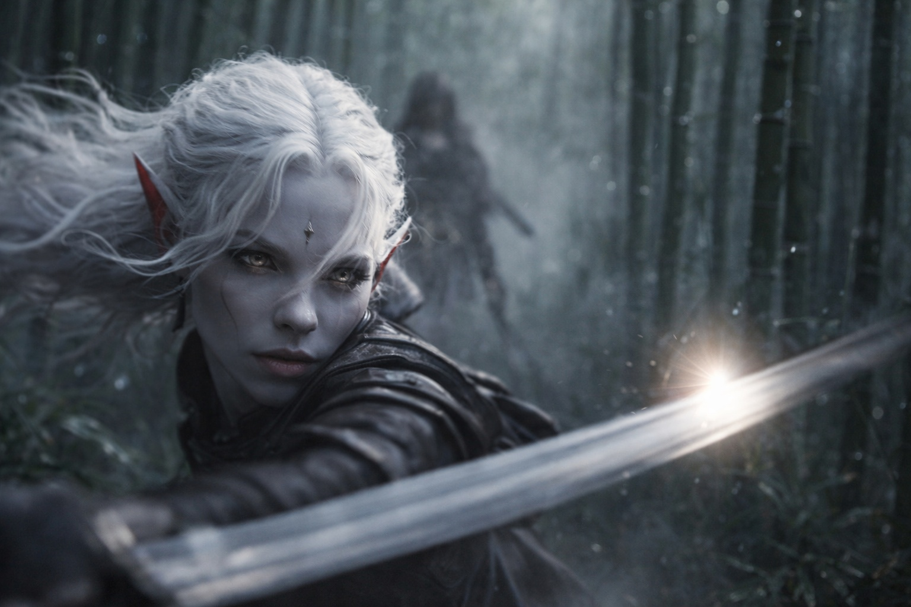
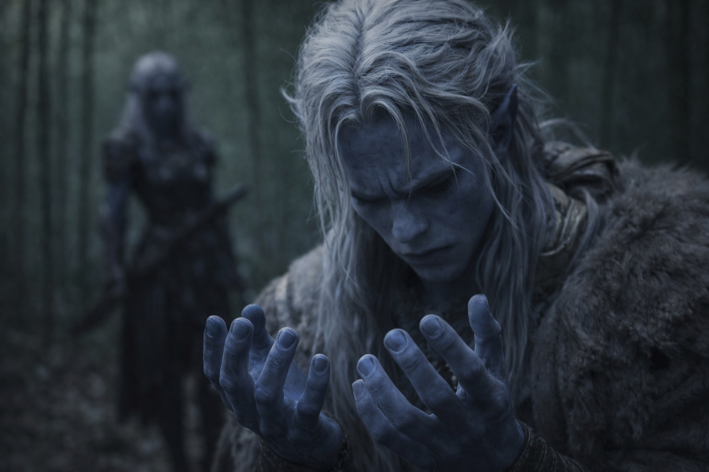
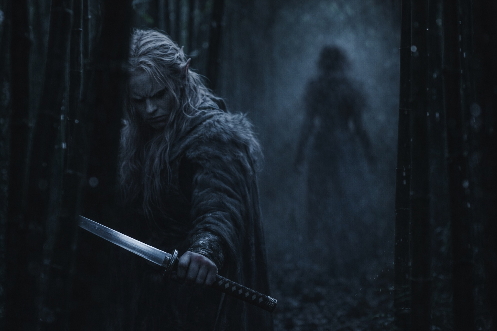

## Capítulo 1 | Parte 2
---

Drusniel se deslizó entre el bosque de bambú, cada paso colocado como sus instructores le habían enseñado desde que aprendió a caminar. Su espada captó un destello de luz. Adelante, el cabello pálido de Shyntara la marcaba contra la penumbra como un desafío.

Se rodearon el uno al otro. Pies silenciosos sobre el suelo del bosque, atentos al primer gesto de intención.

Hoja contra hoja. El choque resonó en la niebla. Los brazos de Drusniel temblaban al empujar contra su fuerza. Ella siempre había sido más fuerte. Saberlo no ayudaba.

Empujó con fuerza, girando en una serie de golpes. Shyntara esquivó cada uno. Se movió a la izquierda, se inclinó a la derecha, su cabello balanceándose con el movimiento. Siempre fuera de alcance.

La mandíbula se le tensó. Había entrenado para esto. Practicado hasta que le sangraban las manos. Y ella ni siquiera había cambiado el agarre.

Avanzó, encontró lo que parecía un hueco. Se lanzó.

En el último instante, Shyntara giró. Su hoja cortó el aire vacío. Un codazo se estrelló contra su esternón. Trastabilló hacia atrás, los pulmones vaciándose de golpe.

Metal frío contra su garganta. Drusniel se quedó inmóvil.

—Descuidado. —El labio de Shyntara se curvó. Ni un mechón fuera de lugar. Ni siquiera respiraba fuerte—. Cantaste esa estocada desde tres pasos antes.

Bajó la hoja. Drusniel se frotó el esternón. —Si pudiera usar mi magia, te habría vencido.

Shyntara limpió la hoja con un paño que guardaba doblado en el cinturón. No se rio. No discutió. Solo pasó el paño por el acero y dijo: —Padre preguntó por tus horas de entrenamiento.

La mano de Drusniel se detuvo en su pecho.

—Te cubrí. —Dobló el paño, precisa como un corte quirúrgico—. Le dije que estabas haciendo ejercicios en la terraza este. Lo comprobará en algún momento.

—No necesito que me cubras.

—No. Necesitas que no te denuncie. —Envainó la hoja—. Hay una diferencia.

Drusniel desvió la mirada. Los troncos de bambú se disolvían en la niebla en todas direcciones. Su pulgar golpeteaba contra el muslo. —Annariel me ha estado ayudando. Hemos estado practicando, y funciona. Puedo sentir algo cuando buscamos juntos.

Shyntara guardó silencio durante tres latidos. Cuando habló, su voz era plana y medida. —El segundo hijo de la Casa Vrinn.

—Es mi amigo.

—Es un Vrinn. —Dejó que el nombre quedara entre ellos. Sus familias llevaban dos generaciones en disputa por derechos mineros. En Umbra'kor todos lo sabían—. ¿Con qué frecuencia os reunís?

—Eso no viene al caso.

—Es exactamente lo que viene al caso. —Se recogió el pelo, atándolo con un cordón de cuero. El gesto fue pausado, práctico—. Si yo te encontré aquí, cualquiera puede encontrarte. Si alguien te encuentra practicando técnicas no autorizadas con el hijo de una casa rival, Padre no puede cubrirte. Yo no puedo cubrirte. El Consejo se encarga.

Los puños de Drusniel se apretaron. —¿Entonces qué? ¿Debería simplemente parar?

Shyntara lo estudió como estudiaba el filo de una espada. —El mes pasado ascendieron a tres Hojas Sombrías. Buenas asignaciones. Trabajo en la frontera, pero la paga es real. Podrías tener eso mañana.

—No quiero trabajo en la frontera.

—Sé lo que quieres. —Su voz no cambió—. Te estoy diciendo lo que cuesta si te equivocas.

Esperó el resto. La advertencia. La amenaza. El sermón de hermana mayor sobre conocer su lugar.

No llegó. Shyntara simplemente se quedó allí, brazos cruzados, observándolo con una expresión que no conseguía descifrar. No era enfado. Algo más parecido a aritmética. Como si midiera una distancia y no le salieran las cuentas.

—Las Pruebas del Ocaso son en seis días —dijo él.

—Lo sé.

—Si paso, nada de esto importa. El Consejo, Padre, la disputa con los Vrinn. Todo desaparece.

Shyntara descruzó los brazos. Miró hacia la niebla donde los troncos de bambú se perdían, y por un momento su compostura se agrietó, apenas un poco, alrededor de los ojos.

—Seis días —dijo. Luego se dio la vuelta y caminó hacia el bosque sin mirar atrás.

Drusniel se quedó solo en la niebla. Su mano descansaba en la empuñadura de la espada, el pulgar golpeteando contra el pomo. Cuatro, cinco, seis. Perdió la cuenta y empezó de nuevo.

El bambú crujió con una brisa que no sentía. En algún lugar abajo, los túneles de esporas llevaban el sonido de la ciudad despertando.

Debería volver. Hacer ejercicios en la terraza este, convertir la mentira en verdad. Eso era lo inteligente.

Recogió su espada y se dirigió al claro donde Annariel estaría esperando.

**Fin del Capítulo 2 — continúa en Capítulo 3: [La Prueba de Venemora](/la-prueba-la-prueba-de-venemora/)**
