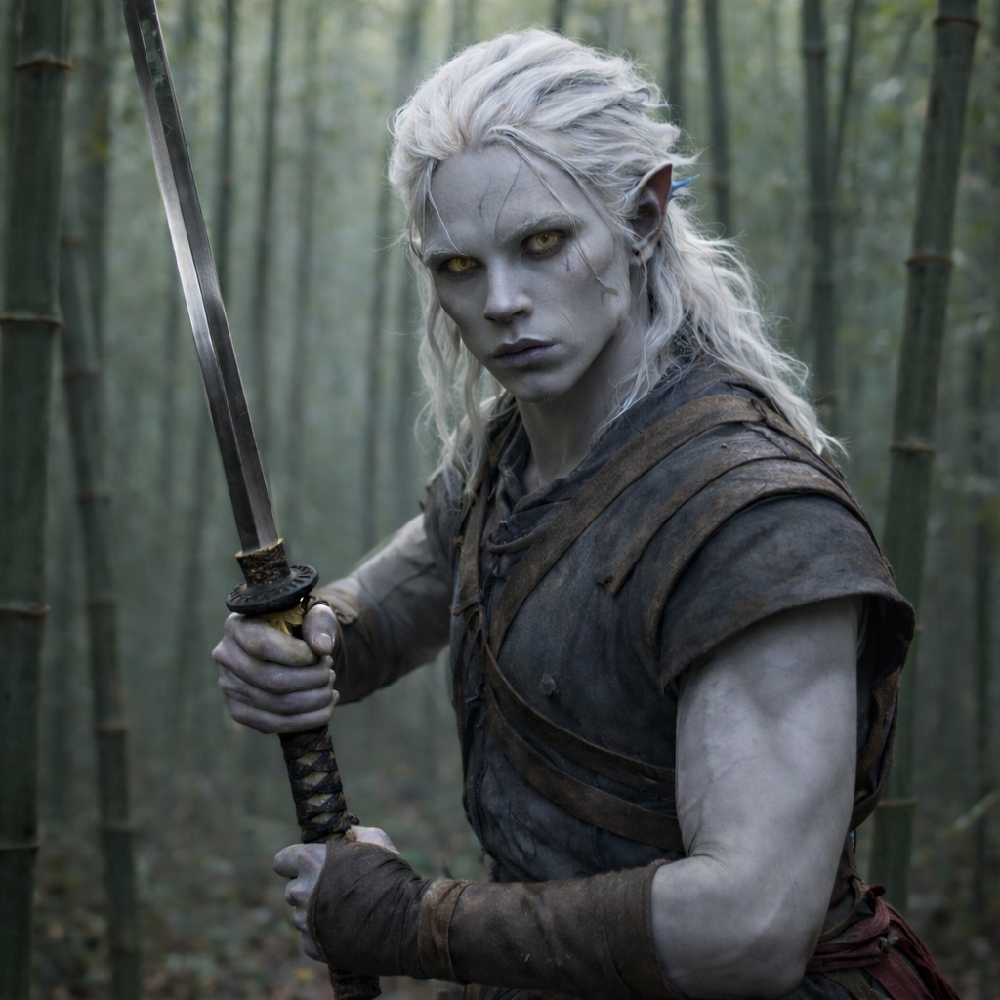
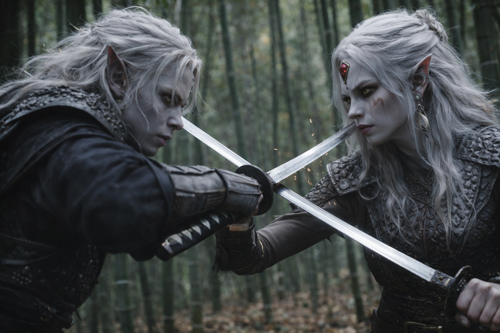
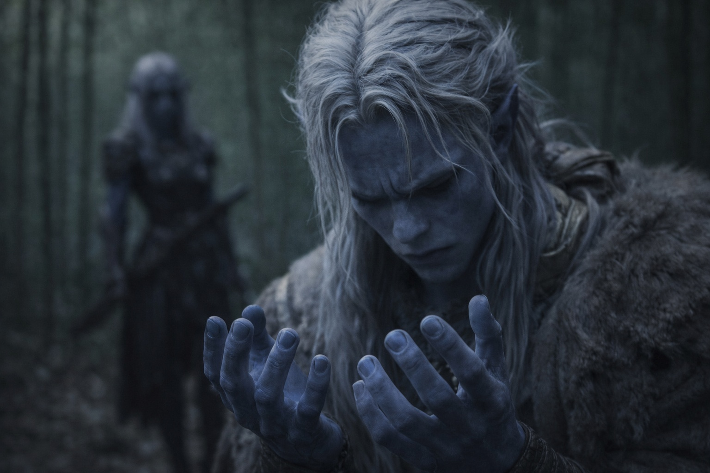
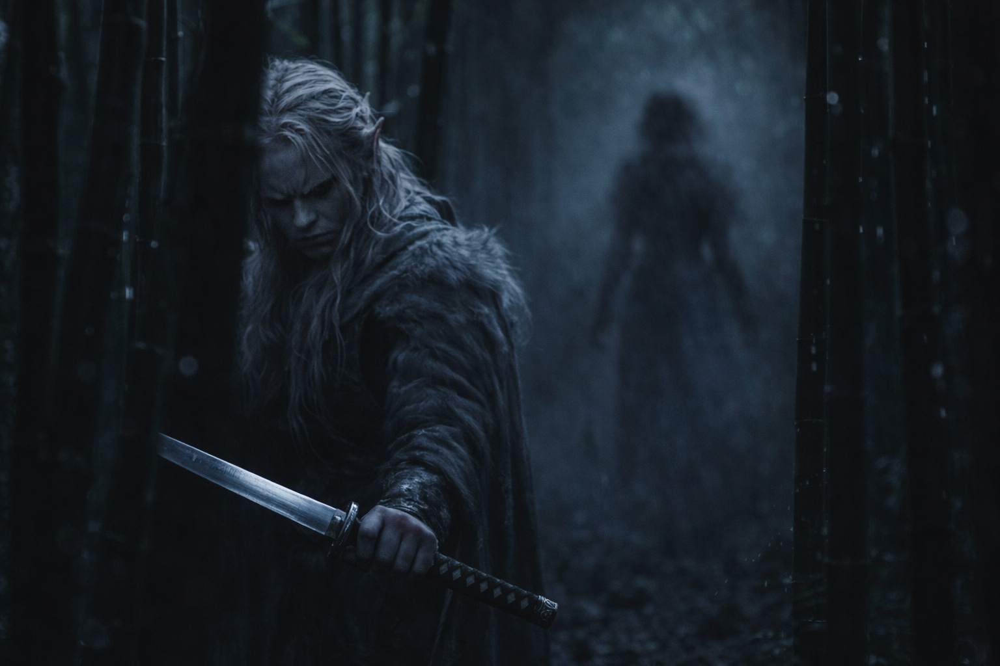

## Capítulo 1 | Parte 2
---

Drusniel se deslizó entre el bosque de bambú, cada paso colocado como sus instructores le habían enseñado desde que aprendió a caminar. Su espada captó un destello de luz. Adelante, el cabello pálido de Shyntara la marcaba contra la penumbra como un desafío.

Se rodearon el uno al otro. Pies silenciosos sobre el suelo del bosque, atentos al primer gesto de intención.

Hoja contra hoja. El choque resonó en la niebla. Los brazos de Drusniel temblaban al empujar contra su fuerza. Ella siempre había sido más fuerte. Saberlo no ayudaba.

Empujó con fuerza, girando en una serie de golpes. Shyntara esquivó cada uno. Se movió a la izquierda, se inclinó a la derecha, su cabello balanceándose con el movimiento. Siempre fuera de alcance.

Había practicado hasta que le sangraban las manos, y ella ni siquiera había cambiado el agarre.

Avanzó, encontró lo que parecía un hueco. Se lanzó.

En el último instante, Shyntara giró. Su hoja cortó el aire vacío. Un codazo se estrelló contra su esternón. Trastabilló hacia atrás, los pulmones vaciándose de golpe.

Metal frío contra su garganta. Drusniel se quedó inmóvil.

—Descuidado. —Shyntara ni siquiera respiraba con esfuerzo—. Cantaste esa estocada desde tres pasos antes.

Bajó la hoja. Drusniel se frotó el esternón. —Si pudiera usar mi magia, te habría vencido.

Shyntara limpió la hoja con el paño del cinturón. —Padre preguntó por tus horas de entrenamiento.

La mano de Drusniel se detuvo en su pecho.

—Te cubrí. —Dobló el paño—. Le dije que estabas haciendo ejercicios en la terraza este. Acabará comprobándolo.

—No necesito que me cubras.

—No. Necesitas que no te denuncie. —Envainó la hoja—. Hay una diferencia.

Drusniel miró hacia el sendero. —Annariel me está ayudando. Hemos estado practicando, y funciona. Puedo sentir algo cuando buscamos juntos.

Shyntara guardó el paño en el cinturón. —El segundo hijo de la Casa Vrinn.

—Es mi amigo.

—Es un Vrinn. ¿Cada cuánto te reúnes con él?

—Eso no viene al caso.

—Sí viene al caso. —Se recogió el pelo—. Yo te encontré. Una patrulla del Consejo también podría. Puedo cubrir que faltes a unos ejercicios, Drusniel. Una práctica no autorizada con una casa rival, no.

Los puños de Drusniel se apretaron. —¿Entonces qué? ¿Debería simplemente parar?

Shyntara lo estudió como estudiaba el filo de una espada. —El mes pasado ascendieron a tres Hojas Sombrías. Buenas asignaciones. Trabajo en la frontera, pero la paga es real. Podrías tener eso mañana.

—No quiero trabajo en la frontera.

—Sé lo que quieres. —Su voz no cambió—. Te estoy diciendo lo que cuesta si te equivocas.

Esperó el resto.

Shyntara miró el sendero a su espalda y volvió a mirarlo.

—Las Pruebas del Ocaso son en seis días —dijo él.

—Lo sé.

—Si paso, nada de esto importa. El Consejo, Padre, la disputa con los Vrinn. Todo desaparece.

Shyntara abrió la boca, pero acabó apartando la mirada hacia el bambú.

—Seis días —dijo. Luego se dio la vuelta y caminó hacia el bosque sin mirar atrás.

Drusniel esperó a que sus pasos se alejaran antes de agacharse a recoger la vaina caída.

El bambú crujió con una brisa que no sentía. En algún lugar abajo, los túneles de esporas llevaban el sonido de la ciudad despertando.

Debería volver. Hacer ejercicios en la terraza este, convertir la mentira en verdad. Eso era lo inteligente.

Envainó la espada y se dirigió al claro donde Annariel lo estaría esperando.

**Fin del Capítulo 1.2 —> 1.3: [La Cámara Sagrada](/la-camara-sagrada/)**
