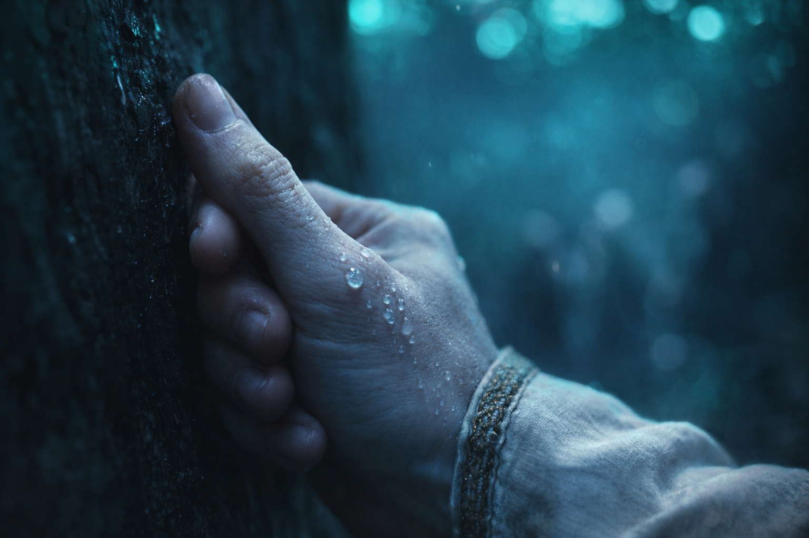
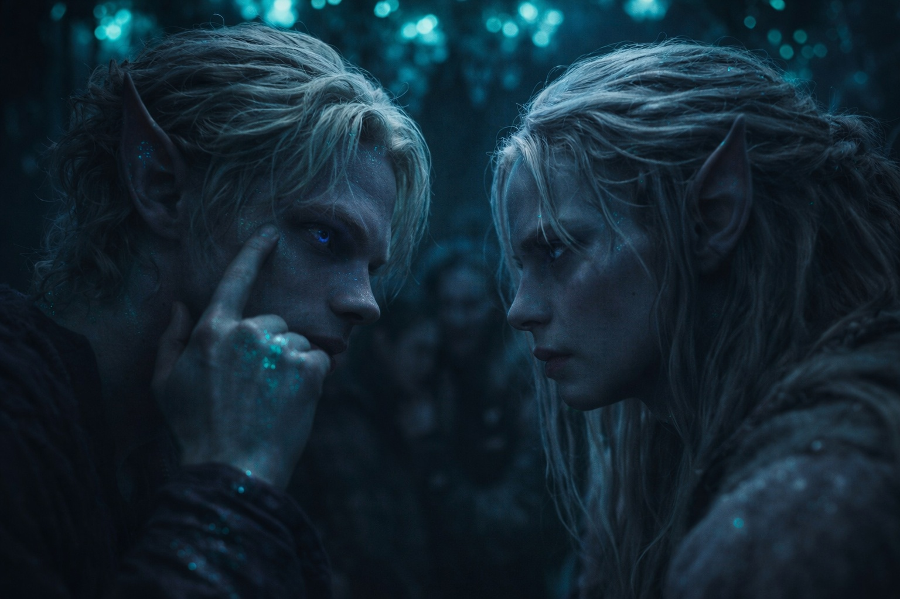
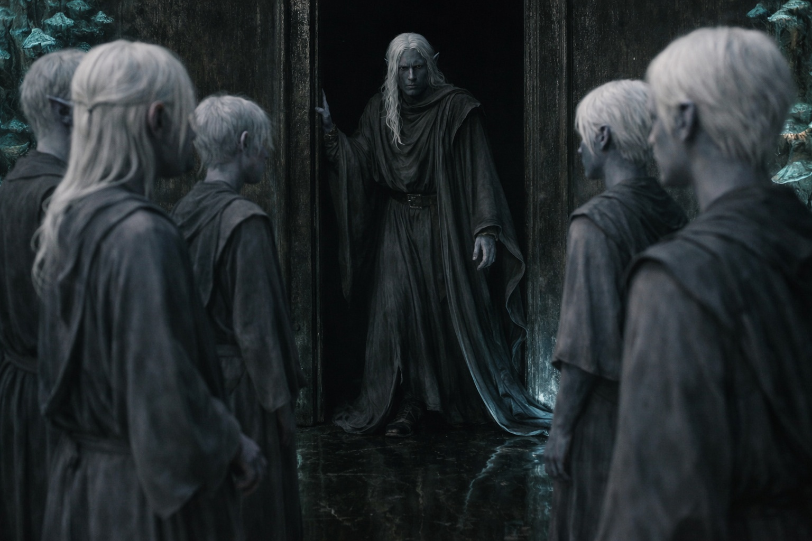

## Capítulo 1 | Parte 3
--- 

Drusniel apoyó la espalda contra el muro de la antecámara y siguió con la mirada las vetas de la obsidiana. Una larga. Una fracturada. La obsidiana estaba fría a través de su delgada túnica ceremonial.

Annariel se acuclilló a su lado, tamborileando los dedos contra la rodilla. —Lo estás haciendo otra vez.

—¿Haciendo qué?

—El muro. —La boca de Annariel se curvó—. Tus ojos siguen cada grieta.

Drusniel obligó a su mirada a quedarse quieta. De todas formas, ya había perdido la línea.

La antecámara se extendía ante ellos, tallada en la roca de las profundidades de Umbra'kor. Hongos bioluminiscentes se aferraban al techo en racimos pálidos y bañaban a la docena de candidatos en una luz azul verdosa. La mayoría se sentaba en grupos cerrados y susurraba plegarias a Venemora. Algunos permanecían solos, con los ojos cerrados, siguiendo los ejercicios de respiración que sus familias les habían inculcado desde niños.

Drusniel y Annariel se sentaban apartados de todos ellos.

—Shyntara me siguió hasta el distrito del mercado —dijo Drusniel en voz baja—. Tuve que dar un rodeo por las granjas de hongos.

—¿Te vio entrar en el pasaje del archivo?

—No. Me aseguré de ello. —Había pasado una hora extra en los túneles cargados de esporas, tomando rutas que ni siquiera los ojos entrenados de su hermana podían rastrear. Todavía le ardían los pulmones—. Sospecha algo.

—Siempre sospecha algo. Es su trabajo. —Annariel se acercó más, bajando la voz—. Estamos aquí ahora. Eso es lo que importa.

Padre había consentido que se presentara a la prueba. No que lo hiciera sin autorización del templo. Once magos Thel'varin habían aprobado antes que él; todos se habían preparado por los cauces establecidos. El escribano de la entrada había comprobado sus nombres en el registro y los había dejado pasar. Aún nadie les había pedido los sellos de sus instructores.

—Piensa en un número —dijo Annariel.

Drusniel cerró los ojos. Jugaban a aquello desde mucho antes de lograr ningún contacto en la arboleda.

Eligió el siete y lo mantuvo en la mente.

—Siete —dijo Annariel.

Drusniel abrió los ojos. —¿Cómo?

—Tu pulgar. —Annariel señaló su mano con la cabeza—. Me lo has contado tú mismo.

—Eso es contar. —Drusniel se miró la mano. Tenía el pulgar apoyado en el índice—. No sabía que lo estaba haciendo.

—La próxima vez prueba con las manos quietas. —Annariel sonrió—. A menos que quieras seguir poniéndomelo fácil.

El breve contacto en la arboleda los había dejado sin aliento. Venemora nunca había respondido.

Ahora las Pruebas lo harían oficial. De una forma u otra.

—Si preguntan quién nos enseñó —dijo Drusniel—, ¿qué les decimos?

—Ya han comprobado nuestros nombres. —Annariel miró la puerta interior—. Conocemos las formas. Si la conexión funciona, ¿quién va a preguntar dónde las aprendimos?

—Los demás tienen un instructor que responda por ellos.

—Y ninguno de esos instructores sintió lo que nosotros en la arboleda. —Annariel se frotó las palmas contra la túnica—. Quiero saber si podemos repetirlo.

Un sacerdote salió de la cámara interior, recogiéndose la túnica para cruzar el umbral. Las plegarias susurradas cesaron.

—Candidatos. —El sacerdote esperó a que cesara el último susurro—. Comienzan las Pruebas del Ocaso. Aquellos a quienes Venemora encuentre dignos recibirán su bendición y se unirán a las filas de los Sombríos.

Los que no fueran dignos saldrían por otra puerta. Drusniel había visto regresar a candidatos por allí. Después nadie les preguntaba por la prueba.

Padre ya tendría preparado su destino en la frontera.

—Primera prueba —continuó el sacerdote—. Busquen a la diosa. Que vea su devoción. Que sienta su valía.

Los candidatos comenzaron a desfilar hacia la cámara interior. Las piernas de Drusniel no querían moverse.

Annariel se levantó y le tendió la mano. —Vamos. Si esperamos más, me dará por pensar.

Drusniel se puso de pie.

Se unieron a la fila. Los ojos tallados de Venemora los acompañaban por los muros; el último grupo de hongos colgaba sobre el umbral interior.

Annariel no le soltó la mano al llegar al umbral.

—Te buscaré después —dijo Annariel. Todavía no le había soltado la mano—. Pase lo que pase.

Drusniel apretó de vuelta. Luego lo soltó.

La voz del sacerdote resonó desde algún lugar adelante, palabras ritualizadas más antiguas que la ciudad misma:

—Comienzan las pruebas. Que Venemora los encuentre dignos.

Drusniel se adentró en la oscuridad.

Más adelante, en el pasaje, Drusniel sintió una presión detrás de los ojos. Se detuvo lo justo para que el candidato de atrás le rozara el hombro.

Alcanzó hacia la sensación, intentó nombrarla.

Nada. Solo la oscuridad ordinaria del pasaje adelante.

Drusniel lo sacudió de su mente y siguió caminando.

---

**Fin de Capítulo 1.3 —> 1.4: [La Prueba: La Prueba de Venemora](/la-prueba-la-prueba-de-venemora/)**
