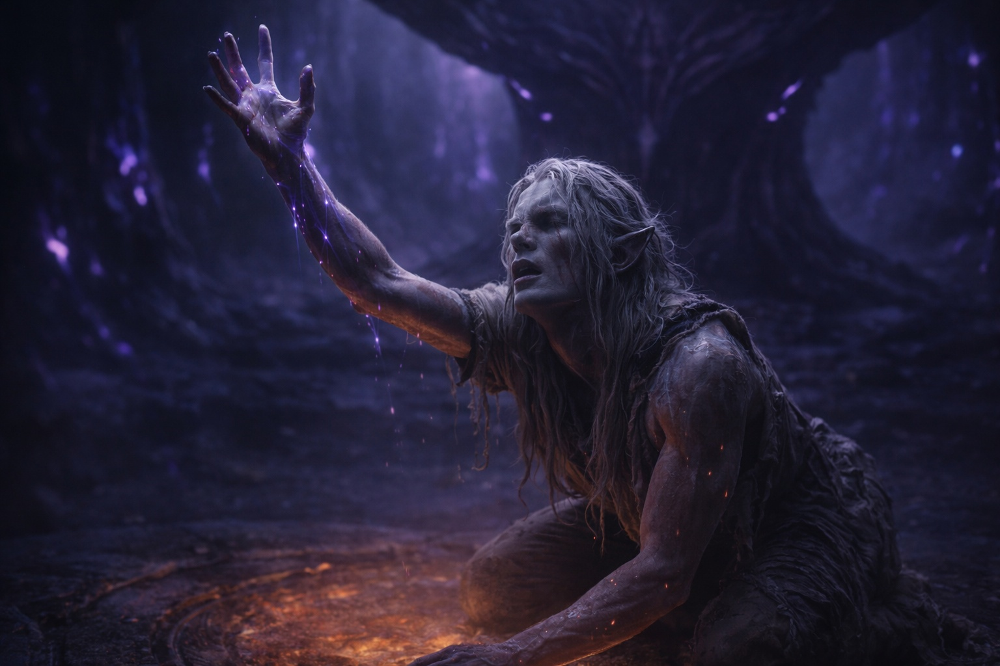
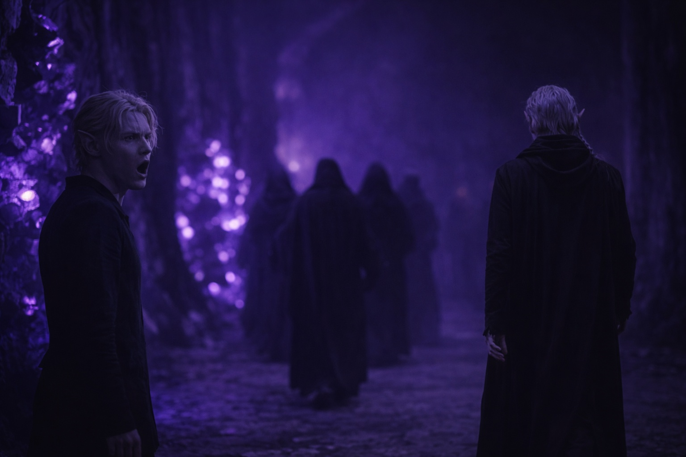

## Capítulo 1 | Parte 3
--- 

Las puertas de la cámara se abrieron con un gemido. Los ojos de Drusniel habían estado trazando las vetas en el muro de la antecámara —una larga, una fracturada, una delgada— y ahora el patrón había desaparecido.

*Trazando los muros.* La boca de Annariel se había curvado, momentos antes. *Siempre haces eso cuando estás nervioso.*

La cámara de pruebas se extendía ante ellos, vasta y tenue. Columnas de obsidiana se alzaban hacia un techo perdido en la oscuridad, sus superficies talladas con plegarias tan antiguas que el idioma había muerto con sus hablantes. Hongos bioluminiscentes se aferraban a las paredes en pálidos racimos, bañando el espacio con una luz púrpura amoratada. En el corazón de la cámara, una plataforma circular de piedra negra aguardaba bajo un altar con forma de alas plegadas.

El altar de Venemora. Donde la diosa los reclamaría o les daría la espalda.

Drusniel encontró un nuevo patrón: las grietas en la columna más cercana. Una ramificándose. Dos paralelas. Concentrarse en eso.

Tres magos permanecían cerca del altar con túnicas del color de la sangre seca. Sus rostros portaban el aburrimiento particular de funcionarios que habían observado este ritual un millar de veces. La maga principal —una drow anciana con cabello blanco cortado al ras del cráneo— consultó una lista grabada en pizarra.

—Annariel —llamó, sin molestarse con su nombre de casa—. Da un paso al frente.

Annariel apretó el brazo de Drusniel una vez, rápido y fuerte. Luego caminó hacia la plataforma con los hombros hacia atrás y la barbilla alzada. Fingiendo confianza. Drusniel lo conocía mejor. Había visto las manos de Annariel temblando en la antecámara.

Pero su práctica había funcionado. *Sí* había funcionado. Todas esas noches en la arboleda, alcanzando algo que no debían tocar: Annariel se había vuelto más fuerte. Sus chispas se habían convertido en llamas. Su alcance había encontrado asidero.

Annariel se arrodilló en la plataforma. Cerró los ojos.

Los magos observaron con el entusiasmo de personas observando secarse la pintura.

Drusniel contuvo el aliento. Trazó los bordes tallados del altar con los ojos. Un ala. Dos. El pliegue donde se encontraban...

Un destello recorrió el aire sobre el altar. Tenue, como calor elevándose de piedra veraniega. Las manos de Annariel se relajaron. Su respiración se estabilizó.

—Conexión adecuada —murmuró uno de los magos a otro—. Servirá.

Eso fue todo. Sin fanfarria. Sin bendición descendiendo en luz. Solo *adecuada* y *servirá*, y Annariel abrió los ojos con lágrimas rodando por su rostro porque comprendía lo que Drusniel comprendía: habían logrado lo imposible. Su práctica prohibida, su arboleda secreta, sus años de alcanzar sin permiso... había funcionado.

Annariel se levantó con piernas inestables. Sus ojos encontraron los de Drusniel al otro lado de la cámara. *Lo logramos*, decía esa mirada. *Tu turno.*

—Drusniel de la Casa Thel'varin —llamó la maga principal. Su tono sugería que ya estaba pensando en su comida del mediodía—. Da un paso al frente.

Sus piernas se movieron. El suelo de obsidiana se sentía demasiado liso bajo sus pies, demasiado frío. Fijó los ojos en el borde de la plataforma —la línea donde piedra negra se encontraba con piedra negra— y dejó que lo jalara hacia adelante.

La piedra estaba tibia donde Annariel se había arrodillado. Drusniel se acomodó en esa calidez prestada y cerró los ojos.

*Alcanza*, se dijo a sí mismo. *Igual que practicamos. Busca su bendición.*

Nunca se había sentido elegido. No en todos los años de práctica secreta, no en todas las noches alcanzando hacia algo que nunca le respondía. Pero había aprendido a alcanzar de todos modos. Eso tenía que contar para algo.

Alcanzó.

Y ahí estaba. La presencia que habían entrenado tanto tiempo para sentir —distante pero real, como una voz llamando a través de la niebla. La bendición de Venemora, el hilo de poder divino que lo convertiría en mago. Había pasado años aprendiendo a sentirla en secreto, y ahora aquí estaba, más cerca que nunca.

Drusniel se estiró hacia ella.

La bendición se acercó. Más cerca. Casi podía...

*Nada.*

Agarró y encontró aire vacío. La bendición había estado ahí, a un latido de distancia, y ahora el espacio donde aguardaba simplemente... se había ido. No retirada. No oculta. Desaparecida, como una puerta que nunca hubiera existido. Alcanzó hacia el lugar donde había estado y tocó ausencia lisa, un agujero con la forma de todo por lo que había trabajado.

Drusniel alcanzó de nuevo, con más fuerza esta vez. Tenía que haber algo. Lo había *sentido*...

El vacío era más grande ahora.

Su conteo tartamudeó. Perdió los números. Buscó a ciegas en su propia mente, rastreando la presencia familiar de potencial, y encontró solo paredes lisas. Como tejido cicatricial sobre una amputación. Como el recuerdo de una extremidad que había estado ahí momentos antes.

Tercer intento. Desesperado. Arañando.

Nada en absoluto. Ni siquiera el vacío, ahora. Solo el vacío ordinario de una mente que nunca había tocado la magia.

Abrió los ojos.

Los magos no lo miraban con conmoción. No intercambiaban miradas significativas. La anciana ya había marcado algo en su pizarra y estaba buscando el siguiente nombre en su lista.

—Sin conexión —anotó uno de los otros magos. Podría haber estado comentando sobre el clima—. Márcalo. Otro de las casas marciales.

—Consistente con los promedios —dijo el tercer mago, ya mirando más allá de Drusniel hacia el siguiente candidato.

Los oídos de Drusniel zumbaban. Sus manos se habían entumecido contra la piedra tibia.

—Fallido. —La maga principal ni siquiera levantó la vista de su pizarra—. Siguiente candidato.

*Fallido.*

La palabra no tenía sentido. Su práctica había funcionado: acababa de verla funcionar para Annariel. Había sentido la bendición de Venemora acercándose. Había estado *justo ahí*.

Se puso de pie. Sus piernas se sentían prestadas, operando bajo las órdenes de otro. Miró hacia Annariel, quien permanecía con los otros candidatos exitosos cerca del muro lejano de la cámara.

El rostro de Annariel se había vuelto del color de la ceniza vieja. Su boca colgaba ligeramente abierta. Sus ojos estaban fijos en Drusniel con una expresión que Drusniel nunca había visto antes: puro e indiluido horror.

Porque Annariel sabía. Habían practicado juntos. Habían alcanzado juntos. Ambos habían tocado esa presencia en la oscuridad.

Esto no debería haber pasado.

Drusniel se obligó a caminar hacia la salida. Los otros candidatos —los fallidos, la fila a la que ahora pertenecía— avanzaban arrastrando los pies en silencio. Sus rostros portaban derrota, resignación, el duelo ordinario de personas que lo habían intentado y se habían quedado cortas.

Esto no era eso. Drusniel no se había quedado corto. Había alcanzado y algo le había *quitado*.

Miró atrás una vez. Annariel seguía mirándolo fijamente. Pronunciando algo sin voz que podría haber sido *lo siento* o podría haber sido *qué pasó* o podría no haber sido nada en absoluto, solo la forma de la confusión en los labios de un amigo.

Un mago tomó el brazo de Annariel y lo guio hacia una puerta diferente, hacia los salones de entrenamiento, hacia el futuro que habían planeado compartir.

La voz de la maga principal resonó a través de la cámara. —Merinaal de la Casa...

Drusniel no escuchó el resto. Sus ojos encontraron los nombres tallados del pasillo de la vergüenza, trazando las letras sin leerlas. Una línea a la siguiente. Surcos desgastados y cortes frescos. Imperfecciones en la piedra.

Los patrones no significaban nada. No cambiaban nada. Pero le daban a su mente algo que sostener además de la forma de esa ausencia.

Había alcanzado hacia ella. Había estado ahí.

Luego ya no estaba.

A menos que lo hubiera imaginado. A menos que la desesperación hubiera conjurado la sensación de la aproximación de Venemora, una bendición fantasma para un chico que la quería demasiado. Quizás el vacío siempre había estado ahí, y él solo había sentido lo que necesitaba sentir.

Pero el rostro de Annariel permanecía con él. Ese horror. Ese reconocimiento.

Annariel lo había visto practicar. Annariel sabía.

Algo había sido arrebatado.

---

**Fin de Capítulo 1.3 — continúa en Capítulo 1.4: [Secretos y Sombras](/secretos-y-sombras/)**