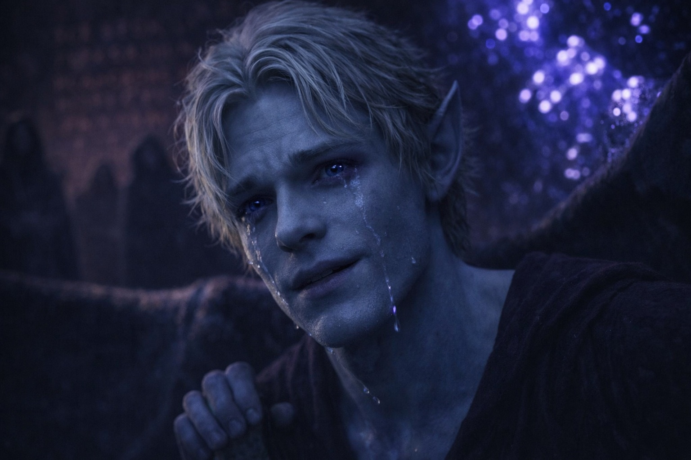
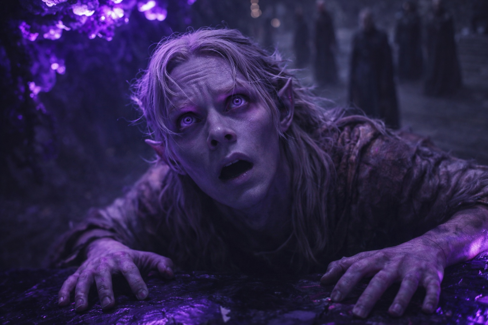
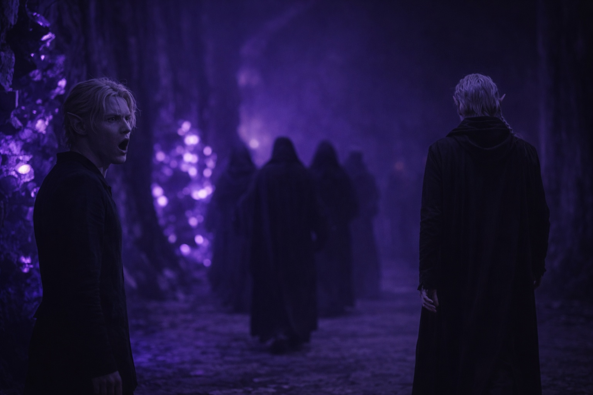

## Capítulo 1 | Parte 4
--- 

Las puertas de la cámara se abrieron con un chirrido que hizo que Drusniel apretara los dientes.

La cámara de pruebas se extendía ante ellos. Las columnas de obsidiana se alzaban hacia un techo perdido en la oscuridad; sus superficies estaban talladas con plegarias en una lengua que Drusniel no sabía leer. Hongos púrpuras crecían en los surcos y ocultaban líneas enteras. En el centro, una plataforma circular de piedra negra aguardaba bajo un altar con forma de alas plegadas. No veía ninguna salida para los candidatos aprobados. Annariel había dicho que estaría detrás del altar.

El altar de Venemora. Donde la diosa los reclamaría o les daría la espalda.

Tres magos aguardaban junto al altar, con túnicas del color de la sangre seca. La mayor, una drow de pelo blanco cortado al ras, consultaba una pizarra.

—Annariel —llamó, sin molestarse con su nombre de casa—. Da un paso al frente.

Annariel apretó el brazo de Drusniel una vez, rápido y fuerte. Luego caminó hacia la plataforma con los hombros hacia atrás y la barbilla alzada. Fingiendo confianza. Drusniel lo conocía mejor. Había visto las manos de Annariel temblando en la antecámara.

Annariel había sostenido su último contacto más tiempo que Drusniel. Quizá bastara.

Annariel se arrodilló en la plataforma. Cerró los ojos.

Drusniel contuvo el aliento hasta que le dolió el pecho.

El aire sobre el altar tembló. Los hombros de Annariel cedieron con la siguiente respiración, y un hilo de sudor le bajó de la sien al cuello de la túnica.

—Conexión adecuada —murmuró uno de los magos a otro—. Servirá.

Annariel abrió los ojos con lágrimas en las mejillas y miró directamente a Drusniel. Todas aquellas noches en la arboleda, y había funcionado.

Annariel se levantó con piernas inestables. Sus ojos encontraron los de Drusniel al otro lado de la cámara. Un breve asentimiento. *Tu turno.*

—Drusniel de la Casa Thel'varin —llamó la maga principal—. Adelante.

Cruzó el suelo frío, con cuidado de no resbalar sobre la piedra pulida.

Se detuvo donde Annariel se había arrodillado y cerró los ojos. Haría el intento de pie.

*Busca*, se dijo. *Igual que practicamos. Busca su bendición.*

Intentó alcanzarla.

Allí estaba: la presión que había sentido en los espacios rituales, ahora a su alcance. La respiración se le acortó al intentar tocarla.

La bendición se acercó. Intentó llegar hasta ella, seguro de que esta vez podría tocarla.

*Nada.*

Intentó agarrarla y no encontró nada. La bendición había estado allí, a un latido de distancia, y ahora el lugar donde aguardaba había desaparecido. Trató de ir más allá, de encontrar resistencia, y solo tocó una ausencia lisa. Recordaba hacia dónde había intentado llegar, pero ya no podía dirigirse allí. Esforzarse más solo lo devolvía al mismo espacio vacío.

Drusniel volvió a intentarlo, con más fuerza. Tenía que quedar algo. Lo había sentido hacía un instante.

El vacío era más grande ahora.

Buscó la presión familiar hasta que le dolieron las sienes. Ya no había nada hacia lo que tenderse.

Lo intentó por tercera vez.

Nada. Ni siquiera aquel vacío extraño. Solo el silencio de una mente que nunca hubiera tocado la magia.

Abrió los ojos.

La maga anciana hizo una marca en la pizarra y pasó el dedo al siguiente nombre.

—Sin conexión —anotó otro de los magos—. Apúntalo. Otro de las casas marciales.

—Consistente con los promedios —dijo el tercer mago, ya mirando más allá de Drusniel hacia el siguiente candidato.

A Drusniel le zumbaban los oídos. Se frotó las manos entumecidas contra la túnica.

—Fallido. —La maga principal ni siquiera levantó la vista de su pizarra—. Siguiente candidato.

Fallido. Pero la había sentido acercarse.

Se volvió hacia Annariel, junto al muro del fondo, y esperó a que las piernas dejaran de temblarle.

Annariel tenía la boca abierta. Dio un paso, pero se detuvo cuando el mago a su lado alzó una mano.

Drusniel bajó de la plataforma. Los candidatos fallidos se apartaron para hacerle sitio.

Miró atrás una vez. Annariel seguía observándolo.

¿Había imaginado la aproximación de Venemora? La desesperación podía imitar muchas cosas. El rostro de Annariel hacía más difícil aceptar esa explicación.

La maga principal llamó al siguiente nombre.

Drusniel siguió caminando.

---

**Fin de Capítulo 1.4 —> 1.5: [La Prueba: La Separación](/la-prueba-la-separacion/)**
