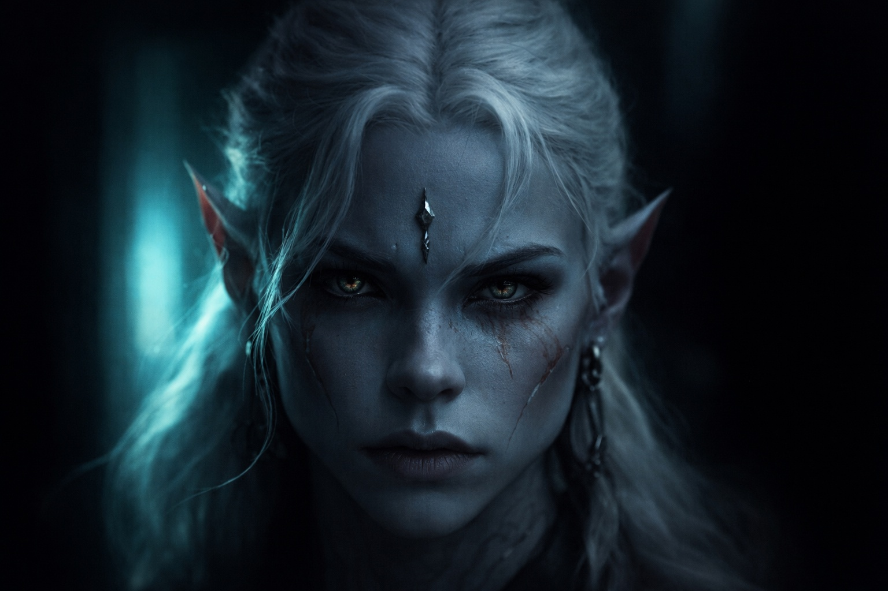
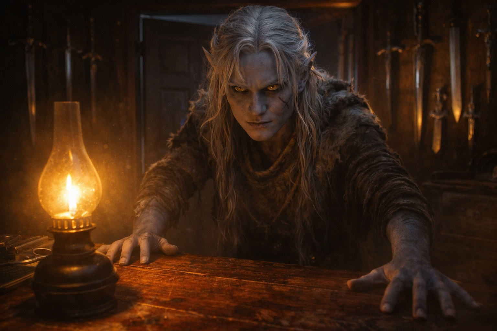

## Capítulo 1 | Parte 6
--- 

Su padre esperaba en la puerta del recinto.

Drusniel lo vio desde cincuenta pasos de distancia: una silueta oscura contra el resplandor bioluminiscente de la propiedad familiar. Brazos cruzados. Postura amplia. La posición de un hombre que había estado esperando malas noticias y las había recibido.

La caminata desde la cámara de pruebas había tomado una hora. Drusniel había trazado cada grieta en cada muro que pasó, vetas de obsidiana, costuras bioluminiscentes, las imperfecciones que hacían único a cada túnel. Los patrones no significaban nada excepto que su mente necesitaba algo a qué aferrarse.

Su padre no se movió cuando Drusniel se acercó. No habló. Solo observó con ojos que habían evaluado a mil objetivos y encontrado a la mayoría deficientes.

Drusniel se detuvo a tres pasos de distancia. La distancia adecuada para dirigirse al cabeza de la Casa Thel'varin.

—Así que —la voz de su padre era plana—. La prueba.

No era una pregunta. Ya lo sabía.

—Fallé.

La palabra sabía a ceniza. Drusniel se obligó a mantener la mirada de su padre. Los asesinos no apartaban la vista. Ni siquiera los fallidos.

La expresión de su padre apenas cambió. Drusniel vio resignación en ella. Tal vez también se lo estaba imaginando.

—Entra —dijo su padre—. Tu madre está esperando.

El recinto se sentía más pequeño de lo que Drusniel recordaba. Patios de entrenamiento, jardines pálidos, la casa principal: todo igual, pero esta noche lo oprimía. Una jaula con su puerta balanceándose abierta.

Su madre estaba de pie en el vestíbulo. Su rostro estaba cuidadosamente vacío, como se ponía siempre cuando procesaba algo que no quería sentir. La mirada de Drusniel encontró el marco de la puerta —madera vieja, veta familiar, una grieta que había trazado desde niño. Todavía ahí. Todavía igual.

Shyntara permanecía a su lado, brazos cruzados, ojos agudos.

—Drusniel. —Su madre cruzó hacia él y tocó su rostro. Sus manos estaban frescas—. Estás en casa.

—Madre, yo...

—Ya está hecho. —Lo interrumpió con suavidad—. Estás en casa. Eso es lo que importa.

Su madre se dio la vuelta antes de que pudiera decir el nombre de Annariel. Su padre ya lo observaba con aquella mirada evaluadora.

—El camino del asesino —dijo su padre— siempre fue tu verdadera vocación. La magia era una distracción. Ahora eso está resuelto.

Las manos de Drusniel se cerraron a los costados. —Algo salió mal ahí dentro. La prueba... sentí que funcionaba. Entonces simplemente...

—No funcionó. —La voz de su padre se endureció—. Eso es lo que significa el fracaso. Apostaste tiempo que deberías haber pasado entrenando, y perdiste. Ahora eso terminó. Seguimos adelante.

—Yo no...

—¿A dónde has estado escabulléndote?

La voz de Shyntara cortó a través de la tensión. No se había movido de su posición junto al muro, pero sus ojos se habían fijado en Drusniel con enfoque depredador.

—¿Qué?

—Antes de esto. Los últimos meses. —Se apartó de la pared y se acercó—. Has estado desapareciendo. Llegando a casa con quemaduras de esporas en la ropa. Tomando rutas a través de las granjas de hongos que no llevan a ningún lugar que yo conozca. —Se detuvo a un brazo de distancia—. ¿Dónde has estado, hermano?

El corazón de Drusniel martillaba. Sus ojos encontraron el muro detrás de Shyntara —una grieta corriendo diagonalmente hacia el techo. La trazó. La trazó de nuevo.

—En ningún lugar. Entrenando.

—Entrenando. —La boca de Shyntara se curvó. No era una sonrisa—. En las granjas de hongos. Solo.

—Necesitaba espacio. Para practicar las formas de la prueba. —La mentira salió más fácil de lo que debería—. Lejos de... —Hizo un gesto vago hacia el recinto—. Todo esto.

Shyntara sostuvo su mirada durante un largo momento. Luego apartó los ojos.

—Hijos. —La voz de su madre portaba un filo de advertencia—. Basta. Esta noche no es la noche para esto.

—Tiene razón. —Su padre se movió hacia el corredor que llevaba a su estudio—. Hay otros asuntos que discutir. Vengan. Los dos.

Drusniel siguió, agradecido de escapar del escrutinio de Shyntara. Su hermana cayó en paso detrás de él. Podía sentir su atención en su espalda como el filo de una hoja.

El estudio de su padre era una habitación estrecha cubierta de armas. Cuchillos de todo diseño colgaban de ganchos en las paredes: curvos, rectos, dentados, lisos. Trofeos de tres generaciones de contratos exitosos. Drusniel había aprendido a identificar cada uno por el sonido antes de cumplir doce años.

—Cierra la puerta —dijo su padre.

Shyntara lo hizo.

Su padre permaneció de pie detrás de su escritorio, manos planas sobre la superficie de madera cicatrizada. Su mandíbula trabajó en silencio por un momento. Cuando habló, su voz era más baja que antes. Cuidadosa.

—Lo que estoy a punto de decirles no sale de esta habitación. Su madre lo sabe. Nadie más.

Drusniel intercambió una mirada con Shyntara. Su expresión había cambiado: todavía aguda, pero enfocada ahora en su padre en lugar de en él.

—La Casa Vrinn —dijo su padre—. Han desviado contratos. Han tanteado nuestro territorio. Su gente ha empezado a aparecer cerca de nuestras rutas. Nada de eso es un ataque. Todo es presión.

Shyntara se inclinó hacia adelante. —¿Qué hacemos?

—Nadie sale solo. Dupliquen la guardia nocturna. Revisen las rutas del este.

Drusniel escuchó horarios de patrulla y posiciones defensivas. Shyntara respondía sin vacilar. Para cuando él entendía una ruta, ellos ya habían pasado a la siguiente.

—Quédense cerca de casa —dijo su padre finalmente, encontrando los ojos de Drusniel—. Todos ustedes. Lo que sea que haya pasado en la prueba, olvídalo. Tu familia te necesita aquí.

Casi lo dijo entonces. Casi les contó que algo había estado *mal*, que había sentido la bendición acercándose antes de que se desvaneciera. Pero su padre ya se estaba dando la vuelta. Ya siguiendo adelante.

No pudo obligarse a pedirles que le creyeran ahora.

Drusniel permaneció de pie en el estudio de su padre mientras la conversación seguía a su alrededor.

Su mejor amigo estaba en los salones de entrenamiento. Lo que había ocurrido con su magia seguía sin nombre. El futuro que había elegido para sí mismo ya no existía.

Trazó las marcas de hojas en los muros del estudio mientras su familia hacía planes contra la Casa Vrinn.

---

**Fin de Capítulo 1.6 —> 2.1: [Voces en la Oscuridad: Los Días Vacíos](/voces-en-la-oscuridad-los-dias-vacios/)**