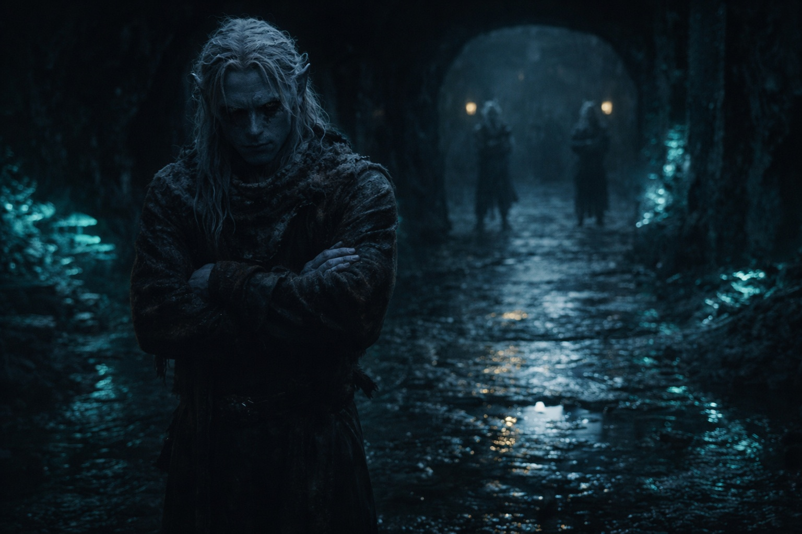
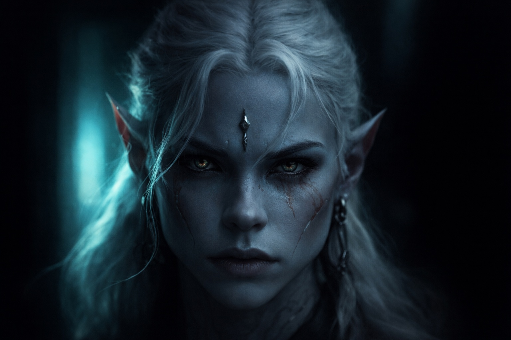
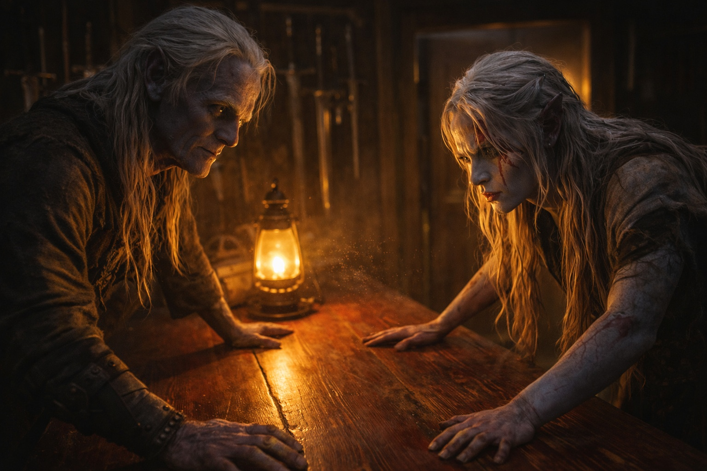
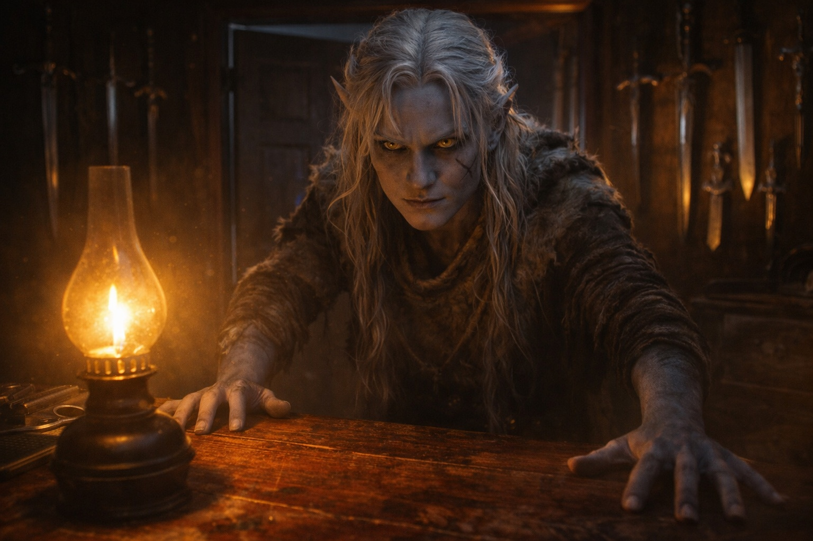

## Capítulo 1 | Parte 6
--- 

Su padre esperaba en la puerta del recinto.

Drusniel lo vio desde cincuenta pasos de distancia: una silueta oscura contra el resplandor bioluminiscente de la propiedad familiar. Brazos cruzados. Postura amplia. La posición de un hombre que había estado esperando malas noticias y las había recibido.

Había tardado una hora en volver del templo. El calzado ceremonial le había dejado en carne viva la piel sobre un talón.

Su padre lo observó acercarse sin decir nada.

Drusniel se detuvo a tres pasos de distancia. La distancia adecuada para dirigirse al cabeza de la Casa Thel'varin.

—Así que —la voz de su padre era plana—. La prueba.

—Fallé.

Tenía la boca seca. Se obligó a sostener la mirada de su padre.

La expresión de su padre apenas cambió. Drusniel vio resignación en ella. Tal vez también se lo estaba imaginando.

—Entra —dijo su padre—. Tu madre está esperando.

Dentro, pasó junto al patio de entrenamiento. Alguien había preparado los blancos de madera para el día siguiente.

Su madre esperaba en el vestíbulo. Le miró primero las manos y después el rostro.

Shyntara permanecía a su lado, brazos cruzados, ojos agudos.

—Drusniel. —Su madre cruzó hacia él y tocó su rostro. Sus manos estaban frescas—. Estás en casa.

—Madre, yo...

—Ya está hecho. —Lo interrumpió con suavidad—. Estás en casa. Eso es lo que importa.

Su madre se dio la vuelta antes de que pudiera decir el nombre de Annariel. Su padre ya lo observaba con aquella mirada evaluadora.

—Mañana te presentarás en la terraza este —dijo su padre—. Ya hemos perdido suficiente tiempo de entrenamiento.

—Algo salió mal. —Drusniel mantuvo las manos a los costados—. Sentí que funcionaba. Después se cortó.

—No funcionó. —La voz de su padre se endureció—. Eso es lo que significa el fracaso. Apostaste tiempo que deberías haber pasado entrenando, y perdiste. Ahora eso terminó. Seguimos adelante.

—Yo no...

—¿Alguien te ha preguntado cómo te preparaste?

Shyntara no se había apartado del muro.

—¿Qué?

—En el templo. —Se detuvo a un brazo de distancia—. ¿Alguien te ha preguntado quién te enseñó?

Drusniel miró a su padre.

—No.

—¿Y Annariel?

—Se lo llevaron al entrenamiento. No oí que nadie le preguntara.

Shyntara sostuvo su mirada durante un largo momento. Luego apartó los ojos.

—Hijos. —Había una advertencia en la voz de su madre—. Basta. Esta noche no.

—Tiene razón. —Su padre se movió hacia el corredor que llevaba a su estudio—. Hay otros asuntos que discutir. Vengan. Los dos.

Drusniel lo siguió. Shyntara lo dejó pasar delante.

El estudio de su padre era una habitación estrecha llena de armas. De las paredes colgaban cuchillos de todas las formas, trofeos de tres generaciones de contratos cumplidos. Drusniel sabía cuáles seguía usando su padre. Esa noche faltaba el cuchillo largo y sencillo más cercano al escritorio. Lo buscó sobre la mesa y lo encontró junto a los despachos sin abrir.

—Cierra la puerta —dijo su padre.

Shyntara lo hizo.

Su padre se quedó detrás del escritorio, con las palmas sobre la madera marcada. Movió la mandíbula sin decir nada. Cuando habló, había bajado la voz.

—Lo que estoy a punto de decirles no sale de esta habitación. Su madre lo sabe. Nadie más.

Drusniel miró a Shyntara. Se había vuelto hacia su padre.

—La Casa Vrinn —dijo su padre—. Han desviado contratos. Han tanteado nuestro territorio. Su gente ha empezado a aparecer cerca de nuestras rutas. Nada de eso es un ataque. Todo es presión.

Shyntara se inclinó hacia adelante. —¿Qué hacemos?

—Nadie sale solo. Dupliquen la guardia nocturna. Revisen las rutas del este.

Drusniel escuchó horarios de patrulla y posiciones defensivas. Shyntara respondía sin vacilar. Para cuando él entendía una ruta, ellos ya habían pasado a la siguiente.

—Quédate cerca de casa —dijo su padre, mirando a Drusniel—. Tu familia te necesita aquí.

No pudo obligarse a pedirles que le creyeran ahora.

Su mejor amigo estaba en los salones de entrenamiento. Lo que había ocurrido con su magia seguía sin nombre. El futuro que había elegido para sí mismo ya no existía.

Cuando su padre desplegó un mapa de patrullas, Drusniel se apartó para dejar sitio a Shyntara.

---

**Fin de Capítulo 1.6 —> 2.1: [Voces en la Oscuridad: Los Días Vacíos](/voces-en-la-oscuridad-los-dias-vacios/)**
