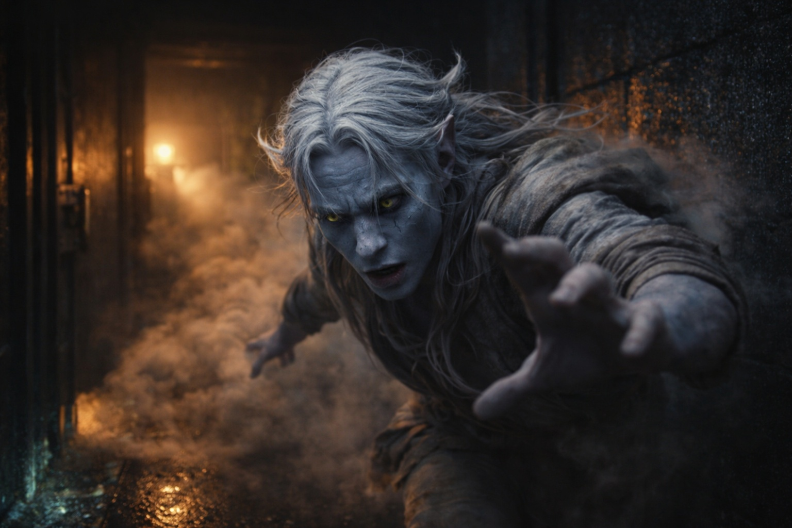
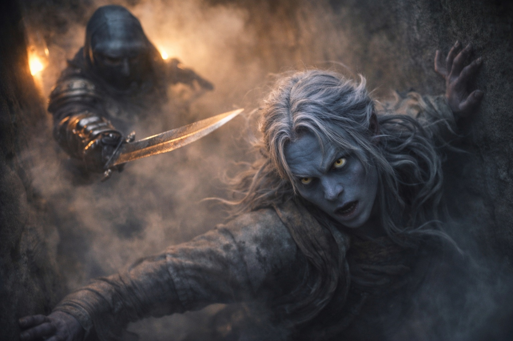
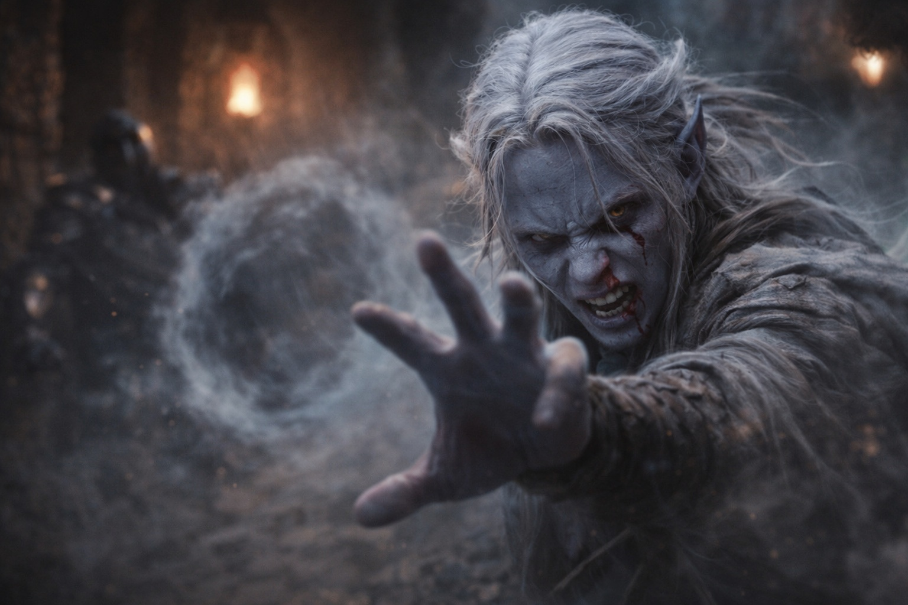
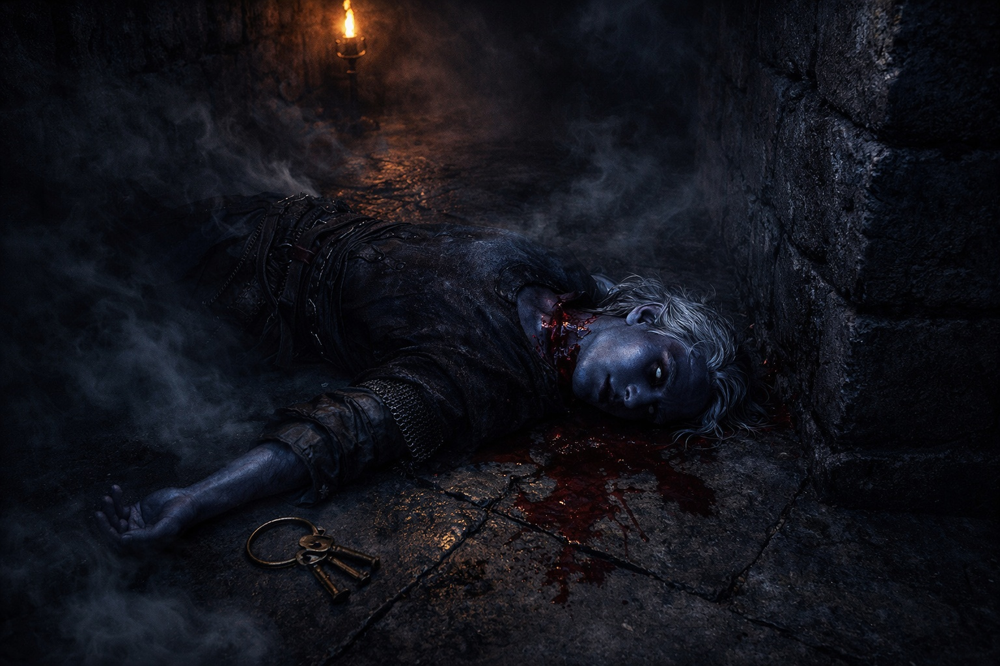
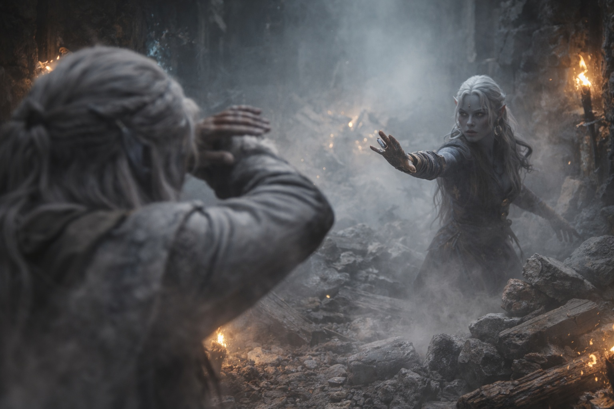

---
order: 1150
title: "La Rivalidad de la Casa: La Advertencia (Cortada)"
description: "Las palabras de Shyntara seguían dando vueltas en su cabeza —*Ten cuidado, Drusniel."
date: 2024-05-21
language: es
chapter: 5
subchapter: 5
storyline: drusniel
canon_phase: main
canon_sequence: D-005-005
narrative_weight: medium
category: Umbra'kor
author: Drusniel
type: Main
tags: ['#la rivalidad de la casa', '#drusniel', '#umbrakor']
thumbnail: image.jpg
featured: false
counterpart_path: site/content/posts/en/umbrakor/the-house-rivalry-the-warning-cut-short/index.mdx
counterpart_title: "The House Rivalry: The Warning (Cut Short)"
---

## Capítulo 5 | Parte 5
--- 

Una hora.

Así fue como Drusniel lo justificó.

Si Vrinn atacaba, otra hora de entrenamiento podía importar. Otra técnica podía ser la diferencia entre quedarse inútil detrás de Shyntara y proteger de verdad a alguien.

Esperó a que el recinto quedara en silencio, deslizó el cuchillo en su funda y tomó los túneles de superficie hacia la torre de Zaelar.

La sesión había sido buena.La sesión había sido buena. Zaelar le había mostrado una nueva técnica de compresión, y por primera vez, Drusniel había sostenido un empuje concentrado durante cuatro segundos completos. Progreso. Progreso real y medible que probaba que no estaba roto.

Todavía estaba pensando en ello cuando entró al pasaje de servicio de vuelta al recinto y probó el humo.

Humo químico. Acre y espeso, diseñado para cegar y confundir. Filtrándose por el túnel adelante, llenando el pasaje estrecho con algo que quemaba sus ojos y sus pulmones y su garganta.

Echó a correr.

El pasaje de servicio desembocaba en los corredores inferiores. Las luces bioluminiscentes estaban muertas —saboteadas, cortadas en la fuente. Incluso los ojos drow no podían penetrar este tipo de oscuridad. Y el aire le decía cosas que no quería escuchar: patrones de desplazamiento por todas partes, demasiados cuerpos moviéndose por el recinto, las firmas de presión de la violencia.

Pasos adelante. Múltiples, coordinados, demasiado pesados para ser sirvientes. El andar medido de profesionales que habían hecho esto antes. Voces, bajas y cortantes, comunicándose en susurros.

—Revisen los pasajes inferiores. Sin sobrevivientes.

Su mano se cerró sobre el cuchillo en su cadera.
Una forma se materializó del humo. Blindada. Enmascarada. Moviéndose con la eficiencia precisa de alguien que mataba para vivir. La figura se giró, lo vio, y la hoja se alzó sin vacilación.

Drusniel sintió el desplazamiento de aire antes de ver el golpe y se lanzó hacia un lado. La hoja cortó el espacio donde había estado su cabeza.

El cuchillo ya estaba en su mano.

Cortó hacia la muñeca del atacante. El asesino giró con el movimiento, atrapó el antebrazo de Drusniel y golpeó una vez en la base del pulgar. Sus dedos se abrieron.

El acero se perdió entre el humo.

Drusniel se agachó antes del corte de vuelta.

*El aire. Usa el aire.**El aire. Usa el aire.*

Alcanzó hacia la corriente más cercana.

El flujo de ventilación se había roto en remolinos superpuestos. El calor de los pasillos inferiores empujaba en una dirección, los conductos dañados tiraban en otra y el movimiento del atacante desgarraba ambas. Drusniel atrapó una corriente y la perdió bajo otras tres.

El pánico empeoraba cada límite.

Lo intentó de nuevo. Una corriente tiraba con fuerza a través de una puerta abierta detrás del asesino. Fuerza existente. Una dirección que podía usar.

El atacante se recuperó. Hoja alzándose.El atacante se recuperó. Hoja alzándose.

Drusniel atrapó la corriente de la puerta cuando el asesino entró en ella y redirigió el flujo contra su equilibrio.

El atacante tropezó hacia atrás. Solo un paso. Solo lo suficiente.El atacante tropezó hacia atrás. Solo un paso. Solo lo suficiente.

Calidez goteó de la nariz de Drusniel. Sangre. Había empujado demasiado fuerte, de la manera que Zaelar le había advertido que no hiciera.

No le importó.

Drusniel corrió.

El corredor se retorcía adelante, ahogado en humo. En algún lugar arriba, el acero resonaba contra acero.

—¡Madre! ¡Padre!

Su voz resonó en la oscuridad. Sin respuesta.

Corrió hacia las escaleras principales. Sus botas golpeaban contra la piedra. Sus pulmones ardían con el humo.

El cuerpo de un sirviente yacía desplomado en la unión. Ojos abiertos. Garganta cortada.

Drusniel siguió moviéndose. Las escaleras estaban adelante —y más allá, los aposentos de sus padres, el ala familiar, todos los que amaba—

—¡Drusniel!

Shyntara. Su voz cortó a través del caos, en algún lugar a su izquierda.

Se volvió. Intentó orientarse. El humo hacía imposible ver más de unos pocos pasos.

—¡Por aquí! —Su mano encontró su brazo, agarró fuerte—. La ruta de escape. Madre ya...

Un grito. Alto y terrible. Cortado en seco.

Ambos se congelaron.

—Madre —susurró Drusniel.

—No podemos ayudarla. —La voz de Shyntara era acero—. El pasaje. Ahora.

—No voy a dejar...

—Está muerta. —El agarre de Shyntara se tensó—. Padre está sosteniendo el corredor principal. Me ordenó sacarte.

—No. No, yo puedo...

El acero chocó en algún lugar cercano. Gritos. La voz de su padre, rugiendo algo que Drusniel no pudo distinguir.

Luego silencio.

El agarre de Shyntara se tensó. —Muévete. Ahora.

Lo jaló hacia adelante. A través del humo. Pasando los cuerpos. Alejándose de los sonidos de muerte.

El pasaje de escape apareció adelante. Una puerta oculta, apenas visible incluso para aquellos que sabían que existía.

Shyntara lo empujó hacia ella. —Ve. Yo seguiré.

—Shyn...

—VE.

Se volvió hacia el caos.

Una onda de presión golpeó el corredor.

La piedra crujió sobre sus cabezas.

Drusniel vaciló un instante de más.

El techo colapsó.

Piedra y madera se estrellaron entre ellos. Polvo y humo se arremolinaron. Drusniel alzó los brazos, sintió escombros golpear su hombro, su espalda...

Cuando levantó la vista, el corredor estaba bloqueado.

—¡Shyntara!

Sin respuesta.

El pasaje de escape estaba detrás de él.

Drusniel se apartó de él y corrió hacia el salón principal.

---

**Fin de Capítulo 5.5 —> 6.1: [Sangre en la Oscuridad: El Caos](/sangre-en-la-oscuridad-el-caos/)**
