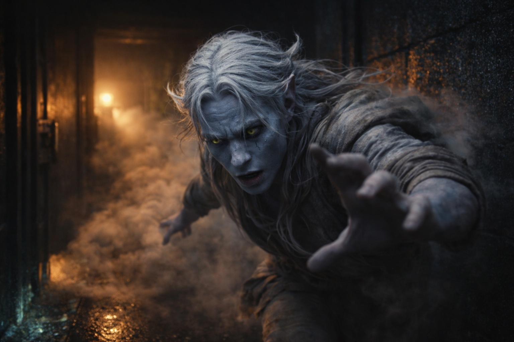
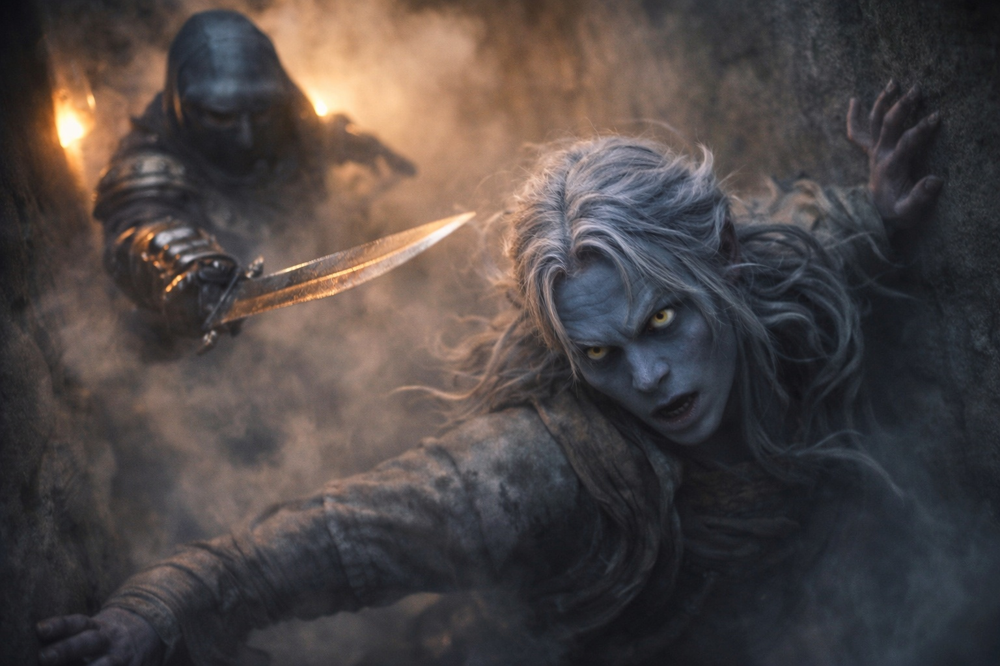
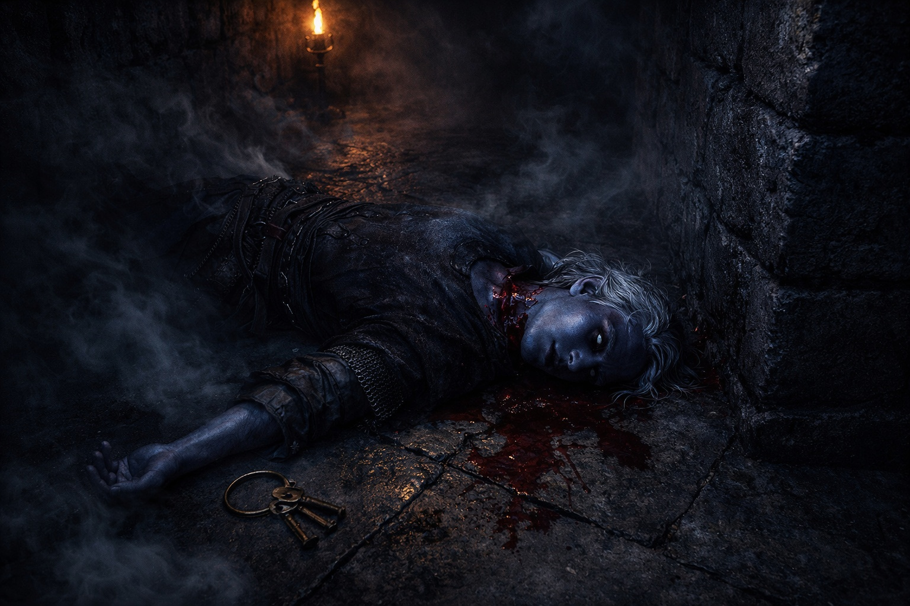

---
order: 1150
title: "La Rivalidad de la Casa: La Advertencia (Cortada)"
description: "Las palabras de Shyntara seguían dando vueltas en su cabeza —*Ten cuidado, Drusniel."
date: 2024-05-21
language: es
chapter: 5
subchapter: 5
storyline: drusniel
canon_phase: main
canon_sequence: D-005-005
narrative_weight: medium
category: Umbra'kor
author: Drusniel
type: Main
tags: ['#la rivalidad de la casa', '#drusniel', '#umbrakor']
thumbnail: image.jpg
featured: false
counterpart_path: site/content/posts/en/umbrakor/the-house-rivalry-the-warning-cut-short/index.mdx
counterpart_title: "The House Rivalry: The Warning (Cut Short)"
---

## Capítulo 5 | Parte 5
--- 

Una hora de enseñanza.

Drusniel se ajustó el cinturón del cuchillo. Entre la ida y la vuelta, faltaría casi toda la noche. Prefería pensar en la hora que pasaría en la torre.

Si Vrinn atacaba, otra hora de entrenamiento podía importar. Otra técnica podía ser la diferencia entre quedarse inútil detrás de Shyntara y proteger de verdad a alguien.

Esperó a que el recinto quedara en silencio. Las puertas principales estaban vigiladas; tomó el pasaje de servicio que había usado otras veces y levantó el pestillo despacio para que no golpeara la placa.

Zaelar seguía despierto. Le enseñó a sostener una corriente comprimida, y Drusniel mantuvo el empuje durante cuatro segundos antes de quedarse sin aliento. Después tuvo que sentarse en los escalones de la torre, esperando a que el dolor le permitiera caminar.

Todavía estaba pensando en ello cuando entró al pasaje de servicio de vuelta al recinto y probó el humo.

Le dejó una película amarga en la lengua. El humo avanzaba junto al techo del pasaje y le escoció los ojos cuando levantó la vista.

Echó a correr.

Los corredores inferiores estaban a oscuras. Habían arrancado los hongos luminosos de las paredes. Extendió su percepción del aire, pero los movimientos se superponían y no conseguía distinguirlos. El dolor de cabeza se agudizó.

Unas botas golpearon el suelo delante de él. Oyó una hebilla chocar contra la piedra y, después, una voz baja.

—Revisen los pasajes inferiores. Sin sobrevivientes.

Su mano se cerró sobre el cuchillo en su cadera.
Una figura enmascarada surgió del humo. Se volvió hacia él con la hoja ya alzada.

El aire cambió junto a su rostro. Se lanzó a un lado; un dolor le atravesó la cabeza cuando la hoja pasó a su lado.

El cuchillo ya estaba en su mano.

Cortó hacia la muñeca del atacante. El asesino giró con el movimiento, atrapó el antebrazo de Drusniel y golpeó una vez en la base del pulgar. Sus dedos se abrieron.

El acero se perdió entre el humo.

Drusniel se agachó antes del corte de vuelta.

*El aire. Usa el aire.*

Alcanzó hacia la corriente más cercana.

El calor de los pasillos inferiores cruzaba una corriente con otra. Drusniel agarró la más cercana, la perdió y tuvo que esquivar un segundo corte con los pulmones ya vacíos.

Una corriente tiraba del aire por la puerta a espaldas del asesino. Drusniel esperó a que pasara por ella.

El atacante volvió a alzar la hoja.

Drusniel atrapó la corriente de la puerta cuando el asesino entró en ella y redirigió el flujo contra su equilibrio.

El atacante retrocedió un paso, trastabillando.

La sangre le corrió sobre el labio. La saboreó al tomar aire con esfuerzo.

Drusniel corrió.

El corredor se retorcía adelante, ahogado en humo. En algún lugar arriba, el acero resonaba contra acero.

—¡Madre! ¡Padre!

Su voz resonó en la oscuridad. Sin respuesta.

Corrió hacia las escaleras principales. Sus botas golpeaban contra la piedra. Sus pulmones ardían con el humo.

El cuerpo de un sirviente yacía desplomado en la unión. Ojos abiertos. Garganta cortada.

Pasó por encima del cuerpo y corrió hacia las escaleras de los aposentos de sus padres.

—¡Drusniel!

Shyntara. Su voz cortó a través del caos, en algún lugar a su izquierda.

Se volvió. Intentó orientarse. El humo hacía imposible ver más de unos pocos pasos.

—¡Por aquí! —Su mano encontró su brazo, agarró fuerte—. La ruta de escape. Madre ya...

Un grito. Alto y terrible. Cortado en seco.

Los dos se quedaron inmóviles.

—Madre —susurró Drusniel.

—El pasaje. Ahora. —Shyntara tiró de él para apartarlo de las escaleras.

—Tenemos que ir a buscarla.

—Padre mantiene el corredor principal. Me ha enviado a buscarte.

—Puedo mover el humo. Déjame intentarlo.

El acero chocó en algún lugar cercano. Gritos. La voz de su padre, rugiendo algo que Drusniel no pudo distinguir.

Luego silencio.

El agarre de Shyntara se tensó. —Muévete. Ahora.

Lo arrastró junto a un guardia caído hacia un panel del muro.

Encontró el cierre al tacto y abrió la puerta oculta empujando con el hombro.

Shyntara lo empujó hacia ella. —Ve. Yo seguiré.

—Shyn...

—VE.

Se volvió hacia el caos.

Una onda de presión golpeó el corredor.

La piedra crujió sobre sus cabezas.

Drusniel vaciló un instante de más.

El techo colapsó.

La piedra y la madera cayeron entre ambos. Drusniel levantó los brazos. Los escombros le golpearon el hombro y lo arrojaron contra el muro opuesto.

Cuando levantó la vista, el corredor estaba bloqueado.

—¡Shyntara!

Sin respuesta.

El pasaje de escape estaba detrás de él.

Drusniel se apartó de él y corrió hacia el salón principal.

---

**Fin de Capítulo 5.5 —> 6.1: [Sangre en la Oscuridad: El Caos](/sangre-en-la-oscuridad-el-caos/)**
