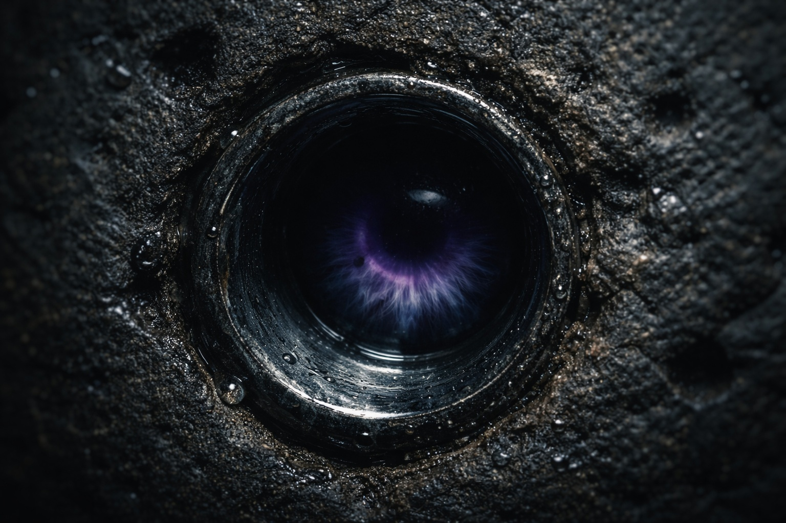

## Capítulo 5 | Parte 2
--- 

La presencia lo encontró esa noche.

Drusniel yacía en la oscuridad, incapaz de dormir, cuando la calidez familiar rozó su consciencia. La textura imitaba a Annariel lo bastante bien como para doler.

*Drus. ¿Estás bien? Sentí algo... mal.*

Alcanzó hacia la conexión. *Casa Vrinn. Mi padre dice que están haciendo movimientos contra nosotros.*

Una pausa. Luego, cuidadosamente: *He escuchado cosas.*

*¿Qué cosas?*

*Nombres. Fragmentos de fechas, creo: los informes estaban codificados.* La presencia pulsó con urgencia. *No puedo decir más: los salones de entrenamiento tienen oídos, y podrían estar monitoreando conexiones mentales. Pero algo sobre tu familia ha estado circulando. He visto referencias indirectas. Magos alineados con Vrinn discutiendo territorio Thel'varin.*

Drusniel se incorporó en la cama. Su corazón golpeaba contra sus costillas. *¿Cómo lo sabes?*

*Pasé las pruebas. Algunos informes llegan a los salones de entrenamiento antes de que los resuman para las casas.*

El pulgar de Drusniel se detuvo contra las yemas.

*¿Dónde viste las requisiciones? ¿En qué archivo?*

Una pausa.

*Anexo inferior del consejo. Copias de logística, no originales. Solo vi fragmentos.*

*¿Nombres?*

*Dos compañías mercenarias. Una de la superficie. Otra mixta. No reconocí ninguna.*

*¿Fechas?*

*No exactas. Pero las requisiciones estaban marcadas como urgentes.*

*Nos están espiando.*

*También había una referencia a una "solución Thel'varin". No sé qué significa.*

*Cítala.*

Otra pausa.

*Esa era la frase. Nada más.*

Drusniel contó cuatro respiraciones.

La familia sabía de exploradores y rutas de patrulla mapeadas. No había mencionado mercenarios ni requisiciones.

*¿Qué tan reciente?*

*Días. No semanas.*

*Comprobaré las requisiciones.*

*Bien. Mantente cerca de tu familia. Sigue entrenando si puedes.*

*Con Zaelar.*

*Sí. Pero no confundas utilidad con confianza. Ni con Zaelar, ni conmigo, ni con nadie.*

*Lo haré.*

*No podría soportar perderte a ti también.* La conexión se tensó alrededor de las palabras. *Eres la única persona que me conocía antes de todo esto.*

*Tendré cuidado*, envió Drusniel. *Lo prometo.*

*Bien.* La calidez comenzó a desvanecerse. *Seguiré escuchando.*

La presencia se retiró.

Drusniel yació en la oscuridad.

Mercenarios. Requisiciones urgentes. Una frase que no podía verificar.

Tres afirmaciones.

Al amanecer pensaba poner a prueba al menos una.

---

**Fin de Capítulo 5.2 —> 5.3: [La Rivalidad de la Casa: La Reunión Secreta](/la-rivalidad-de-la-casa-la-reunion-secreta/)**