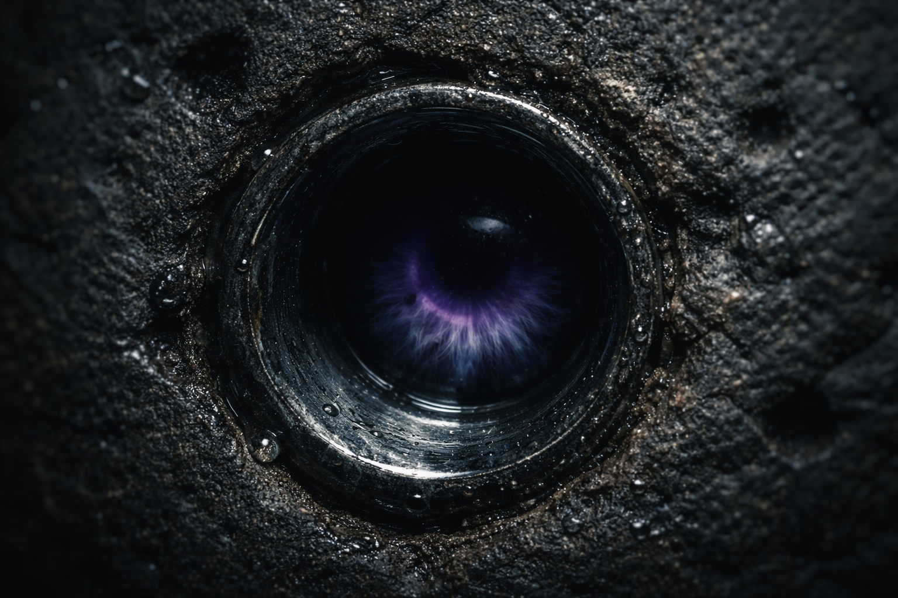

## Capítulo 5 | Parte 2
--- 

La presencia lo encontró esa noche.

Acomodó la almohada bajo la cabeza dolorida y respondió a aquella presión familiar.

*Drus. ¿Estás bien? Sentí algo... mal.*

*Tu casa*, transmitió Drusniel. *Los Vrinn. ¿Qué está haciendo tu padre?*

*Sabes lo que significa el aislamiento. Sin visitas de casa.*

*Entonces, ¿cómo puedes ayudarme?*

*Hay requisiciones en el anexo inferior del Consejo. Dos compañías mercenarias. Ambas marcadas como urgentes.*

Drusniel se incorporó en la cama. Su corazón golpeaba contra sus costillas. *¿Cómo lo sabes?*

*Las copias de logística llegan al anexo antes de que las casas reciban sus resúmenes.*

*¿En qué archivo?*

*Despachos recientes. Empieza por el registro de entrada.*

*¿Qué compañías?*

*Las copias describen una como procedente de la superficie y otra como mixta. No dan nombres.*

*¿Fechas?*

*No exactas. Pero las requisiciones estaban marcadas como urgentes.*

*Nos están espiando.*

*Busca la expresión «solución Thel'varin».*

*¿Qué pone antes?*

*Eso es todo lo que tengo para ti.*

La familia sabía de exploradores y rutas de patrulla mapeadas. No había mencionado mercenarios ni requisiciones.

*¿Qué tan reciente?*

*Días. No semanas.*

*Comprobaré las requisiciones.*

*Bien. Mantente cerca de tu familia. Sigue entrenando si puedes.*

*Con Zaelar.*

*Si tiene algo útil que enseñarte.*

*Yo decido qué es útil.*

*Claro. Quiero que sobrevivas a esto, Drus.*

*Entonces tráeme algo que pueda comprobar.*

*Mira en el anexo.* El contacto se debilitó.

La presencia se retiró.

Drusniel se frotó la frente hasta que pudo soportar encender una lámpara.

Anotó el archivo y la expresión. Si solo llevaba una advertencia a su padre, le preguntaría dónde la había oído.

Comprobaría el registro de entrada por la mañana.

---

**Fin de Capítulo 5.2 —> 5.3: [La Rivalidad de la Casa: La Reunión Secreta](/la-rivalidad-de-la-casa-la-reunion-secreta/)**
