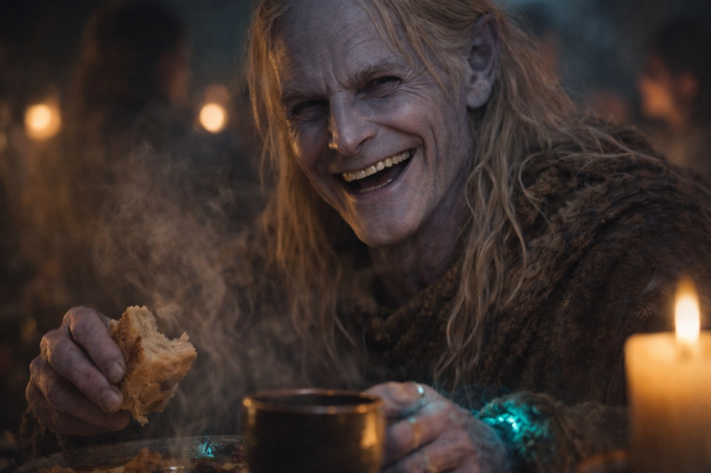
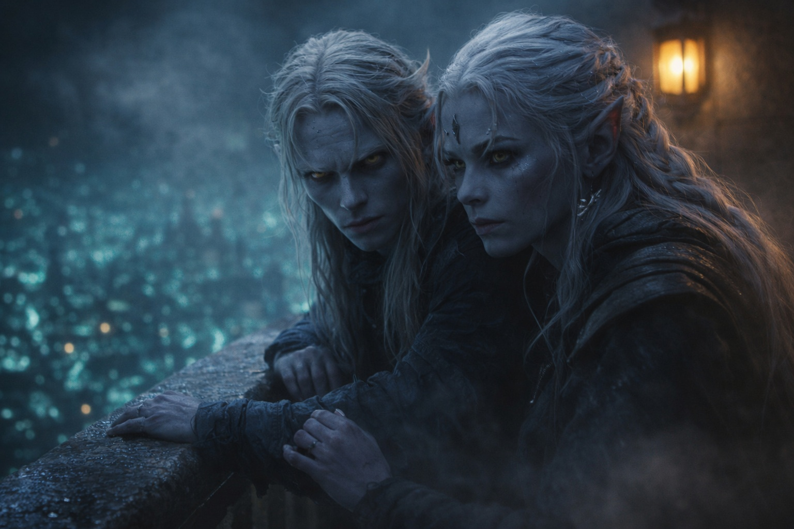

---
order: 1149
title: "La Rivalidad de la Casa: La Noche Antes"
description: "—Todos juntos —dijo, arreglando la mesa con movimientos precisos—. Eso es lo que importa. Pase lo que pase, lo enfrentamos como familia."
date: 2024-05-20
language: es
chapter: 5
subchapter: 4
storyline: drusniel
canon_phase: main
canon_sequence: D-005-004
narrative_weight: medium
category: Umbra'kor
author: Drusniel
type: Main
tags: ['#la rivalidad de la casa', '#drusniel', '#umbrakor']
thumbnail: image.jpg
featured: false
counterpart_path: site/content/posts/en/umbrakor/the-house-rivalry-the-night-before/index.mdx
counterpart_title: "The House Rivalry: The Night Before"
---

## Capítulo 5 | Parte 4
--- 

La cena familiar fue idea de su madre.

—Todos juntos —dijo, arreglando la mesa con movimientos precisos—. Eso es lo que importa. Pase lo que pase, lo enfrentamos como familia.

Drusniel ayudó a llevar platos desde la cocina —ayuda real, no la observación que solía hacer. Los sirvientes habían recibido la noche libre. Solo familia esta noche. Solo los cuatro.

El comedor resplandecía con flores bioluminiscentes, su luz suave proyectando sombras gentiles sobre las paredes. Su madre las había arreglado al estilo antiguo, como su abuela le había enseñado. Tradición frente a la incertidumbre.

Fuera del comedor, los guardias caminaban en parejas. Las puertas habían sido reforzadas. Armas que normalmente permanecían en la armería colgaban junto a cada puerta.

Se sentaron. Comieron. La comida era mejor de lo usual: los platos favoritos de su padre, los que su madre hacía solo en ocasiones importantes. Estofado de hongos especiado con hierbas de tierra profunda. Pescado de caverna preparado al estilo antiguo, piel crujiente y carne tierna. Pan fresco, todavía tibio.

—¿Recuerdan —dijo su padre, alcanzando más pan— cuando Drusniel intentó convencernos de que había entrenado a una araña de caverna para que le trajera sus zapatos?

Shyntara resopló. —Tenía ocho años. Y la araña sí traía cosas. Solo que no zapatos.

—Trajo una rata —dijo su madre, sonriendo a pesar de sí misma—. A su cama. A medianoche.

—Grité —admitió Drusniel—. No estoy orgulloso de ello.

—Gritaste durante diez minutos —corrigió Shyntara—. Los guardias pensaron que nos estaban atacando.

—Casi lo estábamos —añadió su padre—. La araña era del tamaño de un perro.

—Era del tamaño de un gato —protestó Drusniel—. Quizás un gato grande.

Su padre se rio. Drusniel levantó la vista tan rápido que Shyntara lo vio y sonrió de lado.

—Y el primer intento de asesinato de Shyntara —dijo su madre—. Cuéntenles sobre eso.

Los ojos de Shyntara se entrecerraron. —Acordamos nunca discutir eso.

—Yo nunca acordé nada.

—Tenía doce años —dijo Shyntara a la defensiva—. Y el objetivo se movió.

—El objetivo era un melón —dijo su padre—. Estaba sentado en un poste.

—Se tambaleó.

Drusniel se rio tanto que tuvo que dejar la copa sobre la mesa.

—Deberíamos hacer esto más seguido —dijo su madre suavemente—. Solo nosotros. Sin política. Sin obligaciones.

—Cuando esto termine —respondió su padre.

Drusniel robó un hongo del plato de Shyntara. Ella le golpeó los nudillos con el extremo romo del tenedor.

—¿Más vino? —preguntó su madre, alcanzando la botella—. Tenemos bastante.

—Por favor.

Ella sirvió. Su padre pidió el pan. Shyntara insistió en que el melón se había movido.

---

Shyntara lo encontró en el balcón después de la cena.

Se movió silenciosamente —hábito de asesina— pero Drusniel sintió el aire cambiar cuando se acercó. Su nuevo sentido, siempre activo ahora. Supo que estaba ahí tres segundos antes de que sus pasos lo alcanzaran.

—Sentiste que venía —dijo ella.

No era una pregunta. Él asintió.

—Eso es nuevo. —Su voz era neutral, evaluadora—. No podías hacer eso antes.

—He estado practicando.

Ella se apoyó contra la barandilla junto a él, mirando hacia el resplandor de hongos de los distritos distantes de Umbra'kor. La ciudad se extendía debajo de ellos, un entramado de senderos bioluminiscentes y edificios ensombrecidos. En algún lugar allá afuera, la Casa Vrinn estaba planeando su destrucción.

—Algo está mal —dijo ella finalmente—. Puedo sentirlo. Y no es solo la Casa Vrinn.

—¿Qué quieres decir?

—Has estado diferente. Desde la prueba. Desde... —Hizo una pausa, eligiendo sus palabras cuidadosamente—. ¿A dónde has estado desapareciendo, Drusniel? Cada día. A veces antes del amanecer. Te he cubierto tres veces cuando Padre preguntó.

—He estado entrenando —dijo cuidadosamente—. En privado.

—¿Con quién?

No respondió.

—Estás mintiendo. —Su voz era plana, profesional. La voz que usaba con objetivos antes de que supieran que eran objetivos—. Siempre puedo decir cuando mientes. Tu respiración cambia. Tu latido se acelera. —Se volvió para enfrentarlo—. Has estado yendo a la superficie. Te seguí dos veces antes de perder el rastro.

La garganta de Drusniel se tensó. —¿Me seguiste?

—Estaba protegiéndote. Eres mi hermano. —Su mandíbula se apretó—. ¿Quién está allá arriba? ¿Qué estás haciendo?

*Debería decirle*, pensó. *Sobre Zaelar. Sobre la magia. Sobre todo.*

Las palabras se sentaban en su lengua, listas para derramarse. Meses de secretos. Meses de mentiras por omisión. Meses de poder creciente que no había compartido con nadie excepto una voz que podría no ser real y un mago que hacía demasiadas preguntas.

Pero si le decía, ella le diría a su padre. Y su padre lo detendría. Lo arrastraría de vuelta al camino del asesino, la vida aceptable, el futuro donde él era solo otra sombra en la estela de su hermana.

—Encontré un maestro —dijo finalmente—. Alguien que entiende lo que me pasó en la prueba. Ha estado ayudándome a entender mi magia.

La expresión de Shyntara no cambió. —Magia.

—No estoy roto, Shyntara. Soy diferente. La prueba no pudo medir lo que realmente soy. —Encontró su mirada—. Puedo hacer cosas ahora. Cosas reales. El poder que se suponía debía tener: finalmente estoy aprendiendo cómo usarlo.

Un largo silencio. El zumbido distante de la ciudad llenó el espacio entre ellos.

—No estás mintiendo sobre eso —dijo ella en voz baja—. Realmente lo crees.

—Porque es verdad.

—Quizás. —Volvió a mirar hacia la barandilla—. Desapareces todos los días. Mientes sobre adónde vas. Regresas más fuerte y, cada vez que te pido que pares, defiendes a quien te está enseñando antes de defenderte a ti mismo.

Drusniel no dijo nada.

—Quienquiera que sea, se ha asegurado de que lo que más quieres sea algo que solo él puede darte. —Su mandíbula se tensó—. Eso lo hace peligroso aunque cada lección funcione.

—Me está enseñando lo que soy.

—Y lo escondes de cualquiera que pudiera decirte que te alejes.

—No tenemos tiempo para esto ahora —continuó ella—. Sea lo que sea que estés haciendo, sean cuales sean los riesgos que estés tomando, déjalos a un lado hasta que hayamos lidiado con Vrinn. Mantente alerta esta noche. Algo se siente mal, y mis instintos me han mantenido viva hasta ahora.

—Lo haré. Lo prometo.

Ella asintió una vez. Luego, tan suavemente que casi lo perdió: —Ten cuidado, Drusniel. No puedo perderte a ti también.

Se fue sin esperar respuesta.

Drusniel observó el corredor hasta que sus pasos desaparecieron.

---

**Fin de Capítulo 5.4 —> 5.5: [La Rivalidad de la Casa: La Advertencia (Cortada)](/la-rivalidad-de-la-casa-la-advertencia-cortada/)**

