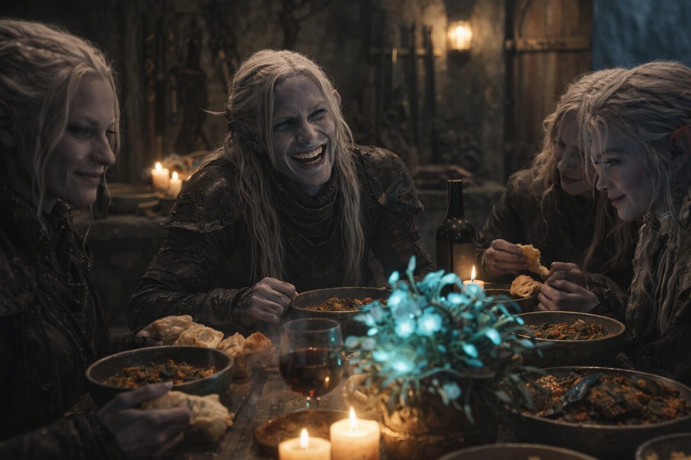
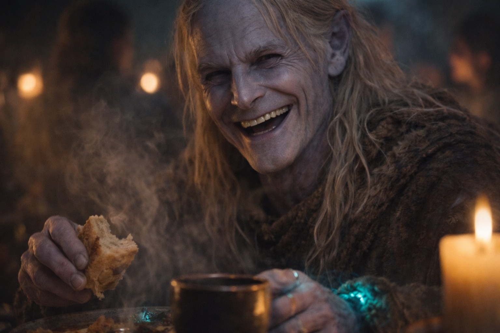

---
order: 1149
title: "La Rivalidad de la Casa: La Noche Antes"
description: "—Todos juntos —dijo, arreglando la mesa con movimientos precisos—. Eso es lo que importa. Pase lo que pase, lo enfrentamos como familia."
date: 2024-05-20
language: es
chapter: 5
subchapter: 4
storyline: drusniel
canon_phase: main
canon_sequence: D-005-004
narrative_weight: medium
category: Umbra'kor
author: Drusniel
type: Main
tags: ['#la rivalidad de la casa', '#drusniel', '#umbrakor']
thumbnail: image.jpg
featured: false
counterpart_path: site/content/posts/en/umbrakor/the-house-rivalry-the-night-before/index.mdx
counterpart_title: "The House Rivalry: The Night Before"
---

## Capítulo 5 | Parte 4
--- 

La cena familiar fue idea de su madre.

—Trae el pan antes de que se enfríe —le dijo a Drusniel—. Y deja esa silla para tu padre.

Llevó los platos desde la cocina, cambiándose de mano la cesta caliente del pan. Su madre había enviado a los sirvientes a cenar en sus dependencias. Esa noche se servirían ellos mismos.

Su madre había colocado flores luminosas alrededor de las fuentes, como hacía su abuela. La luz atravesaba los bordes finos de las copas.

Fuera del comedor, los guardias caminaban en parejas. Las puertas habían sido reforzadas. Armas que normalmente permanecían en la armería colgaban junto a cada puerta.

Su padre destapó el estofado de hongos y acercó la fuente. Al lado había pescado de caverna con la piel crujiente, como siempre lo pedía, y el pan que había traído Drusniel.

—¿Recuerdan cuando Drusniel intentó convencernos de que había adiestrado a una araña de caverna para que le trajera los zapatos? —Su padre tomó otro trozo de pan.

Shyntara resopló. —Tenía ocho años. Y la araña sí traía cosas. Solo que no zapatos.

—Trajo una rata —dijo su madre, sonriendo a pesar de sí misma—. A su cama. A medianoche.

—Grité —admitió Drusniel—. No estoy orgulloso de ello.

—Gritaste durante diez minutos —corrigió Shyntara—. Los guardias pensaron que nos estaban atacando.

—Casi lo estábamos —añadió su padre—. La araña era del tamaño de un perro.

—Era del tamaño de un gato —protestó Drusniel—. Quizás un gato grande.

Su padre se rio. Drusniel levantó la vista tan rápido que Shyntara lo vio y sonrió de lado.

—Y el primer intento de asesinato de Shyntara —dijo su madre—. Cuéntaselo a tu hermano.

Los ojos de Shyntara se entrecerraron. —Acordamos nunca discutir eso.

—Yo nunca acordé nada.

—Tenía doce años —dijo Shyntara a la defensiva—. Y el objetivo se movió.

—El objetivo era un melón —dijo su padre—. Estaba sentado en un poste.

—Se tambaleó.

Drusniel se rio tanto que tuvo que dejar la copa sobre la mesa.

—La próxima vez lo haremos sin dejar que se enfríe el estofado —dijo su madre, tendiendo el cucharón hacia su padre.

—Cuando esto termine —respondió su padre.

Drusniel robó un hongo del plato de Shyntara. Ella le golpeó los nudillos con el extremo romo del tenedor.

—¿Más vino? —preguntó su madre, tomando la botella—. Tenemos de sobra.

—Por favor.

Ella sirvió. Su padre pidió el pan. Shyntara insistió en que el melón se había movido.

---

Shyntara lo encontró en el balcón después de la cena.

El aire fresco de la puerta alteró la quietud a su espalda. Drusniel lo buscó con su percepción, sintió una figura que se acercaba y se volvió. El dolor familiar regresó a su frente.

—Sentiste que venía —dijo ella.

No era una pregunta. Él asintió.

—Ayer pensé que habías oído el pestillo de la cocina. Ahora no me has oído.

—He estado practicando.

Se apoyó en la barandilla junto a él. Abajo, dos guardias se detuvieron a comprobar una puerta antes de seguir junto al muro.

—Madre me ha contado lo de las requisiciones.

—¿Padre consiguió las copias?

—El anexo cerró antes de que llegara el mensajero. Volverá mañana. —Miró a Drusniel—. Te cubrí en el desayuno. Tardaste mucho más de lo que lleva visitar un archivo.

—He estado entrenando —dijo cuidadosamente—. En privado.

—¿Con quién?

No respondió.

—Te seguí dos veces. Las dos tomaste los pasajes de la superficie. —Esperó a que la mirara—. ¿Adónde fuiste después?

La garganta de Drusniel se tensó. —¿Me seguiste?

—Estaba protegiéndote. Eres mi hermano. —Su mandíbula se apretó—. ¿Quién está allá arriba? ¿Qué estás haciendo?

Si le daba el nombre de Zaelar, su padre pondría guardias en la puerta de la superficie antes del amanecer.

—Encontré un maestro —dijo finalmente—. Alguien que entiende lo que me pasó en la prueba. Ha estado ayudándome a entender mi magia.

La expresión de Shyntara no cambió. —Magia.

—Aire. Puedo sentir el movimiento a través de él. A veces consigo mover cosas.

Un largo silencio. El zumbido distante de la ciudad llenó el espacio entre ellos.

—Y él deja que sigas volviendo herido.

—Me esfuerzo demasiado. Eso me toca corregirlo a mí.

—Vuelves a defenderlo. Y sigo sin tener un nombre.

Drusniel no dijo nada.

—Si mañana dejara de enseñarte, ¿qué harías?

—Tengo sus notas. Puedo practicar.

—Pues practica aquí.

—Hasta que sepamos qué están haciendo los Vrinn —añadió—. Esta noche quédate donde pueda encontrarte.

—Lo haré. Lo prometo.

Volvió a mirar a los guardias de abajo. —Si suena la campana, ven directamente al salón interior. No te vayas a buscar a nadie.

Se fue sin esperar respuesta.

Drusniel observó el corredor hasta que sus pasos desaparecieron.

---

**Fin de Capítulo 5.4 —> 5.5: [La Rivalidad de la Casa: La Advertencia (Cortada)](/la-rivalidad-de-la-casa-la-advertencia-cortada/)**

