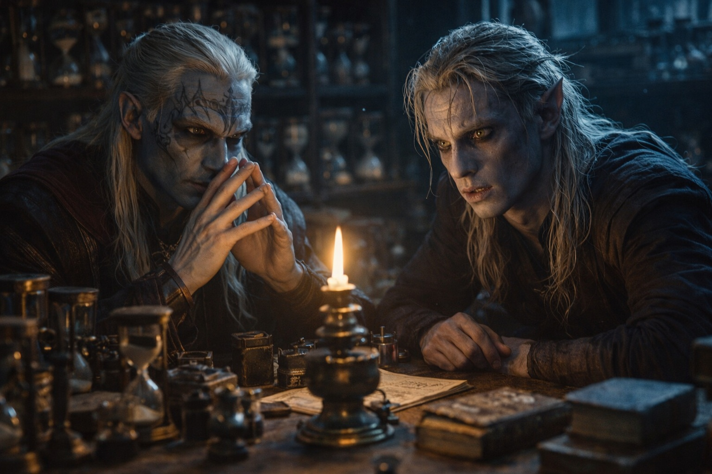

---
order: 1148
title: "La Rivalidad de la Casa: La Reunión Secreta"
description: "—La Casa Vrinn está amenazando a mi familia."
date: 2024-05-19
language: es
chapter: 5
subchapter: 3
storyline: drusniel
canon_phase: main
canon_sequence: D-005-003
narrative_weight: medium
category: Umbra'kor
author: Drusniel
type: Main
tags: ['#la rivalidad de la casa', '#drusniel', '#umbrakor']
thumbnail: image.jpg
featured: false
counterpart_path: site/content/posts/en/umbrakor/the-house-rivalry-the-secret-meeting/index.mdx
counterpart_title: "The House Rivalry: The Secret Meeting"
---

## Capítulo 5 | Parte 3
--- 

—La Casa Vrinn está amenazando a mi familia.

Drusniel permanecía de pie en el estudio de Zaelar, el pecho jadeando por los ejercicios de entrenamiento de la mañana. No había pretendido decirlo —no había planeado traer los problemas de su familia a la torre— pero las palabras salieron de todas formas. El peso de la reunión familiar, el miedo en los ojos de su padre, la sensación de peligro rodeándolos: tenía que ir a algún lugar.

Zaelar dejó el texto que había estado leyendo. Su estudio olía a papel viejo y tinta, relojes de arena haciendo tic-tac en cada superficie. Trescientos de ellos, al menos, cada uno midiendo tiempo en diferentes intervalos.

—¿Casa Vrinn?

—La casa rival. Han estado mapeando nuestras patrullas. —Drusniel se limpió el sudor de la frente—. La voz afirma que Vrinn está contratando mercenarios. Requisiciones urgentes.

Zaelar dejó de girar el reloj de arena que tenía en la mano. —¿Mercenarios?

Cómo lo dijo —demasiado conocedor, demasiado mesurado— hizo que Drusniel se detuviera.

—¿Los conoces?

—Sé de ellos. Lo suficiente para saber que las hojas contratadas cambian el problema.

—¿Por qué?

—Son más difíciles de predecir que los asesinos de una casa. Menos costumbres. Menos obligaciones. —Zaelar movió una ficha de práctica sobre la mesa entre ambos—. Supón que Vrinn viene esta noche. ¿Dónde esperarías la primera presión?

Drusniel miró la ficha. —Me estás preguntando por las defensas de mi familia.

—Te pregunto cómo piensas.

—Pienso que no voy a darte nuestros puntos de entrada.

La boca de Zaelar se movió apenas. —Bien.

—Si usaran forasteros —dijo Zaelar—, ¿qué cambiaría?

—Reconocimiento de patrullas. Acento. Forma de moverse. —Drusniel lo consideró—. Podrían usar rutas que un asesino drow evitaría por considerarlas deshonrosas o demasiado expuestas.

—Mejor.

Zaelar volvió a ordenar las fichas de práctica en una línea.

—Concéntrate en tu entrenamiento —dijo Zaelar—. El poder es la respuesta a los enemigos. Cuando seas lo suficientemente fuerte, amenazas como la Casa Vrinn se vuelven manejables.

Drusniel asintió lentamente. La conversación se sentía mal —demasiadas preguntas específicas, demasiado interés en detalles tácticos— pero no podía articular por qué. Zaelar lo estaba ayudando. Enseñándole. Fueran cuales fueran sus peculiaridades, fuera cual fuera su pasado, la magia era real.

—El ejercicio de ayer —dijo Drusniel, empujando la inquietud a un lado—. Percepción de aire. Quiero practicarlo más.

—Por supuesto. —Zaelar sonrió, y casi alcanzó sus ojos—. Comencemos.

---

El entrenamiento duró hasta el mediodía. Para cuando Drusniel dejó la torre, le palpitaba la cabeza y las piernas le temblaban.

En el camino a casa, una pregunta siguió con él.

¿Por qué Zaelar había detenido el reloj de arena cuando Drusniel dijo *mercenarios*?

Drusniel contó sus pasos y siguió caminando.

---

**Fin de Capítulo 5.3 —> 5.4: [La Rivalidad de la Casa: La Noche Antes](/la-rivalidad-de-la-casa-la-noche-antes/)**

