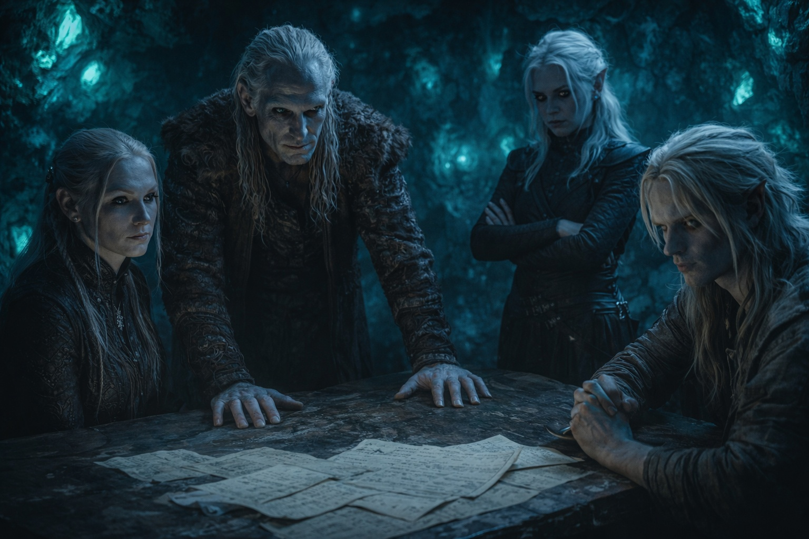
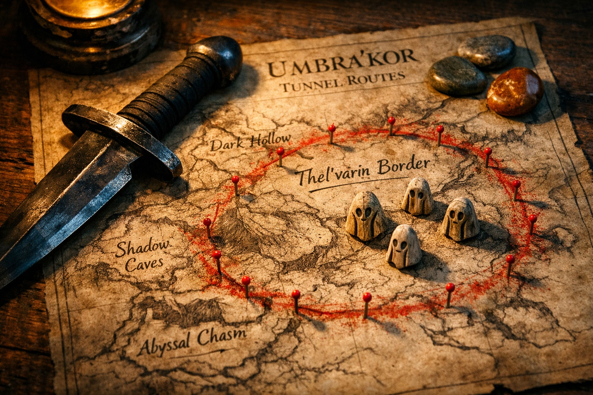
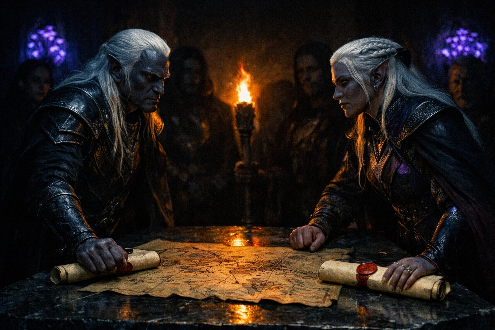

## Capítulo 5 | Parte 1
--- 

—Reunión familiar. Ahora. Todos.

Drusniel nunca había escuchado a su padre usar ese tono. En dieciocho años de vivir bajo el mismo techo, la voz de su padre había sido muchas cosas —fría, despectiva, ocasionalmente orgullosa— pero nunca urgente. Nunca asustada.

Encontró el camino hacia el estudio donde sus padres esperaban, Shyntara ya ahí, de pie con los brazos cruzados y el rostro cuidadosamente vacío. La habitación olía a papel viejo y aceite de armas.

Su padre permanecía de pie detrás de su escritorio, manos planas sobre la madera cicatrizada. La postura que usaba cuando daba noticias serias. Pero esta vez, algo más vivía detrás de sus ojos. Algo que tensó el estómago de Drusniel.

—La Casa Vrinn ha cruzado líneas.

Drusniel había oído el nombre en corredores y en las reuniones de su padre, pero nunca pronunciado con tanta claridad delante de la familia.

—Movimientos territoriales —continuó su padre—. Insultos en el consejo del mercado. Desafíos a nuestros acuerdos comerciales. Nos están probando.

—Esto es diferente de la postura habitual. —Su madre habló desde su silla junto a la ventana, su voz mesurada—. El patrón ha cambiado. Ya no están negociando. Se están preparando.

Shyntara descruzó los brazos. —Sus asesinos han sido vistos cerca de nuestras fronteras. Tres veces esta semana. Puntos de entrada diferentes cada vez. Están mapeando nuestras rutas de patrulla.

—¿Estás segura? —preguntó su padre.

—Rastreé al último yo misma. Marcadores Vrinn en su equipo. Ya ni siquiera se molestan en ocultarlo.

El pulgar de Drusniel golpeteó contra sus dedos. Siete, ocho, nueve. El conteo lo ayudaba a procesar lo que estaba escuchando.

*La voz me advirtió sobre esto*, pensó. *Algo sobre la Casa Vrinn planeando movimientos. Incómodamente cercano a lo que está pasando ahora.*

—¿Qué vamos a hacer? —preguntó Drusniel.

La atención de su padre se desplazó hacia él. Por un momento, algo como sorpresa cruzó sus rasgos, como si hubiera esperado que Drusniel permaneciera en silencio.

—Estamos duplicando las patrullas. Revisando todas las protecciones. Moviendo objetos de valor a la bóveda segura. —Hizo una pausa—. Y estamos enviando palabra a nuestros aliados. Si esto escala, necesitaremos apoyo.

—¿Por qué ahora? —presionó Drusniel—. ¿Qué cambió?

—Ambición. —La mandíbula de su padre se tensó—. Vrinn lleva años acumulando fuerza. Territorio. Comercio. Influencia en el consejo. Les hemos bloqueado suficientes veces como para que resulte útil quitarnos de en medio.

—Somos un objetivo porque estamos en su camino —dijo Shyntara.

—También hay historia —dijo su madre—. Cuatro generaciones.

Su padre exhaló por la nariz. —Korenth todavía trata una antigua resolución minera como un robo. Ha tenido décadas para convertir un agravio en política.

—Ha estado construyendo hacia esto durante décadas —dijo su madre—. Paciente. Metódico. Esperando el momento adecuado para atacar.

—Y ahora lo ha encontrado —terminó Shyntara—. Nuestros informantes están muertos. Nuestros aliados están distraídos con sus propios problemas. Estamos aislados.

—No aislados. —La voz de su padre se endureció—. Todavía tenemos nuestros muros. Nuestros guardias. Nuestro entrenamiento. —Su mirada se movió hacia cada uno de ellos—. Todavía nos tenemos el uno al otro.

—Quédense cerca de casa. —La voz de su padre se endureció—. Todos ustedes. Nada de viajes innecesarios. Nada de excursiones en solitario. Algo se aproxima, y quiero a esta familia junta cuando llegue.

Drusniel pensó en la torre de Zaelar. El entrenamiento que pasaba cada día en la superficie. El poder que finalmente estaba llenando el vacío en su pecho.

No dijo nada.

—¿Entendido? —presionó su padre.

—Entendido —dijo Shyntara.

—Entendido —repitió Drusniel.

Su padre asintió. —Bien. Ahora váyanse. Prepárense como necesiten prepararse. Pero manténganse alerta. Todos ustedes.

La reunión terminó. Drusniel se retiró a su habitación.

La torre de Zaelar abriría al amanecer.

Su padre le había ordenado permanecer cerca.

Drusniel flexionó la mano. Un hilo de aire le recorrió los nudillos.

---

**Fin de Capítulo 5.1 —> 5.2: [La Rivalidad de la Casa: La Grieta](/la-rivalidad-de-la-casa-la-grieta/)**