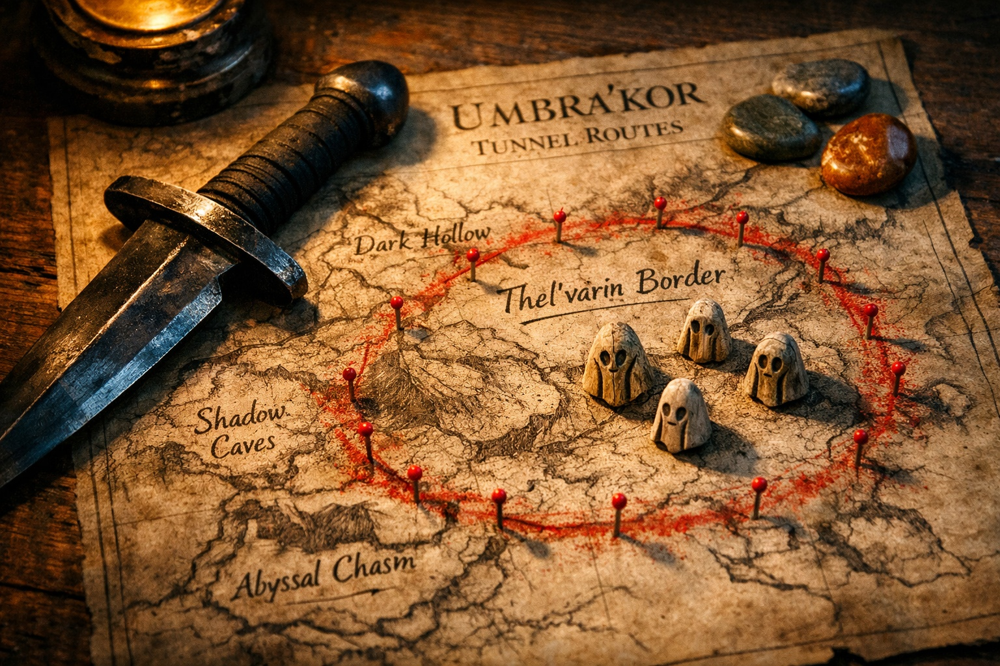
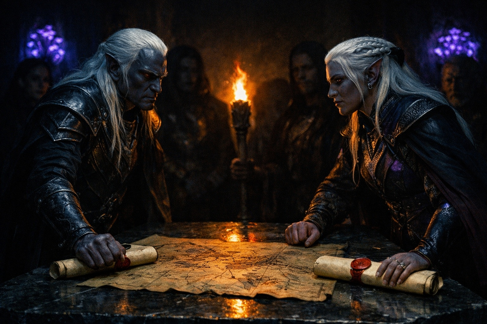

## Capítulo 5 | Parte 1
--- 

—Reunión familiar. Ahora. Todos.

Su padre llamó desde el estudio sin esperar a un sirviente. Drusniel dejó la taza tan deprisa que se derramó agua sobre la muñeca.

Fue al estudio, donde sus padres lo esperaban. Shyntara ya estaba allí, con los brazos cruzados y sin dejar traslucir nada. Olía a papel viejo y aceite de armas.

Había un despacho abierto sobre el escritorio. Su madre había traído las llaves de la casa.

—La tregua del Consejo está fallando. Los exploradores Vrinn la han quebrantado.

—Tres avistamientos esta semana —dijo su padre—. Sus delegados niegan los tres.

—He bajado la plata —dijo su madre—. Y los registros de la casa. Están empaquetados por si tenemos que irnos.

Shyntara puso un mapa marcado junto al despacho. —Puntos de entrada distintos cada vez. Están comprobando dónde se cruzan nuestras patrullas.

—¿Estás segura? —preguntó su padre.

—Seguí al último hasta un almacén Vrinn. No pude entrar.

—¿Qué vamos a hacer? —preguntó Drusniel.

—Replieguen las patrullas exteriores dentro del muro. Revisen los anclajes de las protecciones. Después de la campana de la tarde no se abre nada sin mi orden.

—¿Por qué ahora? —insistió Drusniel.

Su padre dio un golpecito al despacho. —Nuestros aliados se han negado a enviar tropas. Los Vrinn ya lo sabrán.

—Entonces acortamos la línea —dijo Shyntara—. Puedo mantener las puertas interiores con los guardias que tenemos.

—Organízalo. —Su padre le entregó el mapa.

—Y Drusniel se queda dentro. Se acabaron las salidas mientras resolvemos esto.

Drusniel pensó en la torre y en el ejercicio que había dejado a medias. El día anterior casi lo había conseguido. Si se quedaba allí, no sabría si hoy podría hacerlo.

No dijo nada.

—¿Entendido? —insistió su padre.

—Entendido —dijo Shyntara.

—Entendido —repitió Drusniel.

—Avísenme cuando las puertas estén aseguradas.

La reunión terminó. Drusniel se retiró a su habitación.

La torre de Zaelar abriría al amanecer.

Su padre le había ordenado permanecer cerca.

Drusniel flexionó la mano y atrajo un hilo de aire sobre los nudillos. Un dolor le tensó la frente. Lo soltó antes de intentar más.

---

**Fin de Capítulo 5.1 —> 5.2: [La Rivalidad de la Casa: La Grieta](/la-rivalidad-de-la-casa-la-grieta/)**
