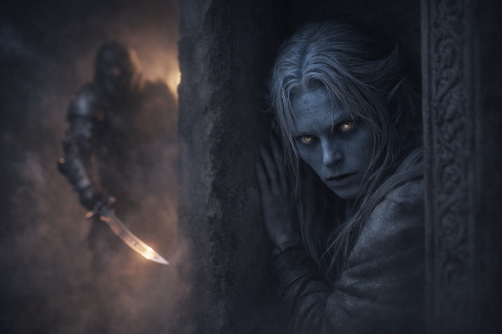

---
order: 1151
title: "Sangre en la Oscuridad: El Caos"
description: "Veyla salió tambaleándose del humo delante de él, con una mano apoyada en la pared."
date: 2024-05-22
language: es
chapter: 6
subchapter: 1
storyline: drusniel
canon_phase: main
canon_sequence: D-006-001
narrative_weight: medium
category: Umbra'kor
author: Drusniel
type: Main
tags: ['#sangre en la oscuridad', '#drusniel', '#umbrakor']
thumbnail: image.jpg
featured: false
counterpart_path: site/content/posts/en/umbrakor/blood-in-the-dark-the-chaos/index.mdx
counterpart_title: "Blood in the Dark: The Chaos"
---

## Capítulo 6 | Parte 1
--- 

Veyla salió tambaleándose del humo delante de él, con una mano apoyada en la pared.

Drusniel la agarró del brazo. Veyla. Una de las sirvientas más antiguas de su madre.

—¿Dónde están mis padres?

—Salón principal... —Se dobló, vomitando. Sangre salpicó la piedra—. Vinieron a través de las cocinas. Tantos de ellos. Coordinados. Profesionales. —Otra tos, húmeda y terrible—. Corra, joven amo. No hay nada que pueda... corra...

Colapsó. Drusniel la bajó al suelo de piedra.

Sus padres estaban en el salón principal.

Los corredores se retorcían adelante, geografía familiar convertida en algo ajeno por la oscuridad y el humo. Drusniel se movía por memoria y tacto, su entrenamiento de asesino activándose a pesar de todo. Cuenta las puertas. Rastrea los giros. Conoce tu terreno incluso cuando no puedes verlo.

*El humo. Puedo moverlo. Puedo...*

No. Encuéntralos primero. La magia podía esperar. La magia no traería a Veyla de vuelta. La magia no desharía lo que estaba pasando en el salón principal.

Gritos resonaban desde algún lugar adelante. Acero golpeando acero.

Una forma surgió de la oscuridad. Drusniel se congeló.

Blindado. Enmascarado. Moviéndose con la eficiencia precisa de alguien que mataba para vivir. La figura se volvió, y la luz de fuego desde algún lugar detrás de ella brilló en una hoja ya húmeda con sangre. Sangre oscura. Sangre drow.

*Sangre familiar.*

Drusniel se presionó en un hueco. Un nicho decorativo que su madre siempre había llenado con pequeñas esculturas. Vacío ahora: todo lo valioso había sido movido a la bóveda cuando la amenaza Vrinn se hizo clara.

No es que importara ya.

Contuvo el aliento, la mandíbula apretada hasta que le dolió. El pulso le martillaba tan fuerte que estaba seguro de que el hombre podría oírlo.

*Uno. Dos. Tres. Cuatro. Cinco.*

La figura pasó. Revisó una habitación lateral —vacía— y continuó por el corredor. Profesional. Meticuloso. Sin apresurarse, porque no necesitaban apresurarse. Eran dueños de este recinto ahora.

Drusniel esperó hasta que los pasos se desvanecieron. Hasta que el humo tragó la silueta completamente.

Entonces se movió de nuevo.

El salón principal estaba adelante. Podía ver luz parpadeante a través del humo —antorchas, o quizás partes del edificio ardiendo. Sombras se movían contra el resplandor. Luchando. Alguien todavía estaba luchando.

—¡Madre! ¡Padre!

Sin respuesta. Solo el choque de acero y los gritos.

Empujó hacia adelante. A través del humo. A través del miedo. A través de todo lo que le decía que diera la vuelta, que corriera, que se salvara.

Y entonces la encontró.

---

Su madre yacía al pie de las escaleras.

No se movía. Sus ojos estaban abiertos, mirando el techo que había mirado diez mil veces a lo largo de su vida. Sangre se acumulaba debajo de ella, extendiéndose sobre la piedra en un espejo oscuro de las flores bioluminiscentes que había arreglado para la cena hacía solo horas.

Drusniel cayó de rodillas junto a ella. Sus manos encontraron las de ella —frías ya, imposiblemente frías. Siempre había tenido las manos frías. Solía bromear sobre ello. "Manos frías, corazón caliente", decía, y su padre ponía los ojos en blanco, y Shyntara fingía no sonreír.

—Madre. Madre, despierta. Por favor...

No respondió.

Un grito desgarró el humo. La voz de su padre. Desafiante. Furiosa.

Viva.

La cabeza de Drusniel se alzó de golpe.

El salón principal. Justo adelante. Su padre todavía estaba luchando.

Se obligó a ponerse de pie. Se obligó a dejar su cuerpo en las escaleras. Se obligó a moverse hacia los gritos, hacia la única familia que todavía podría ser capaz de salvar.

La mano de su madre se deslizó de la suya mientras se levantaba.

---

**Fin de Capítulo 6.1 —> 6.2: [Sangre en la Oscuridad: La Matanza](/sangre-en-la-oscuridad-la-matanza/)**
