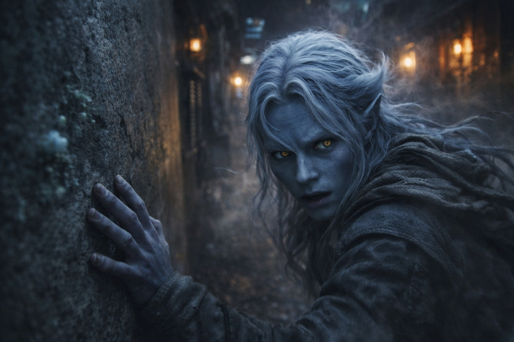
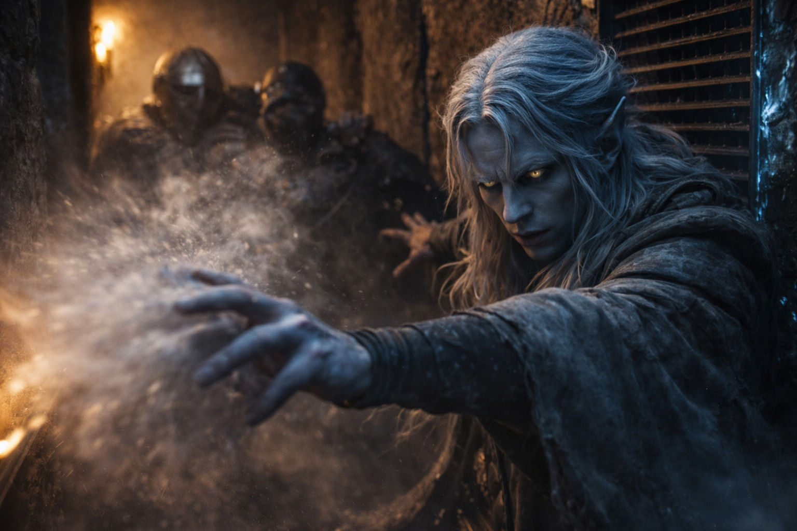
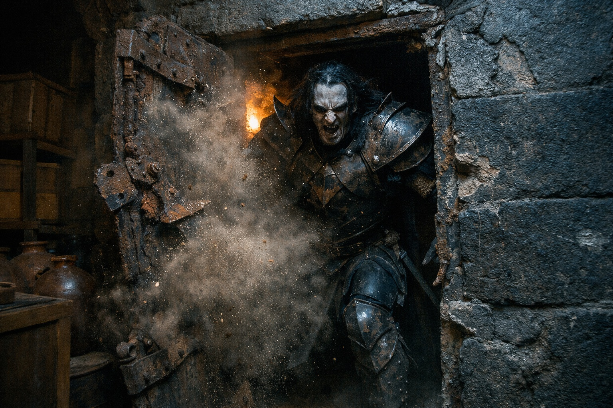
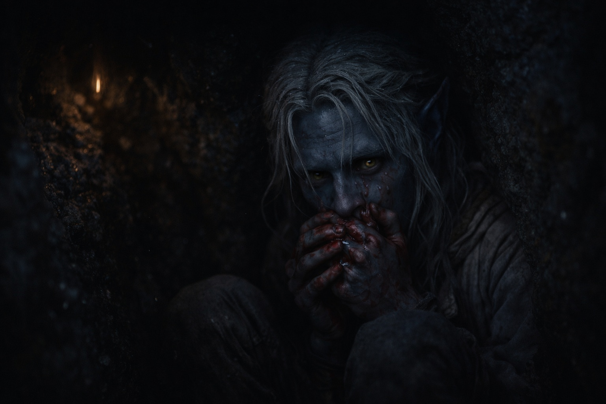

---
order: 1153
title: "Sangre en la Oscuridad: El Escape"
description: "El corredor se retorcía adelante, ramificándose en pasajes de servicio y almacenes."
date: 2024-05-24
language: es
chapter: 6
subchapter: 3
storyline: drusniel
canon_phase: main
canon_sequence: D-006-003
narrative_weight: medium
category: Umbra'kor
author: Drusniel
type: Main
tags: ['#sangre en la oscuridad', '#drusniel', '#umbrakor']
thumbnail: image.jpg
featured: false
counterpart_path: site/content/posts/en/umbrakor/blood-in-the-dark-the-escape/index.mdx
counterpart_title: "Blood in the Dark: The Escape"
---

## Capítulo 6 | Parte 3
---

El corredor se retorcía adelante, ramificándose en pasajes de servicio y almacenes. Drusniel corría sin pensar, guiado por instinto y los mapas medio recordados que su padre le había hecho memorizar años atrás.

*Salidas de emergencia. Puntos de encuentro. Los pasajes que nadie usa. Las rutas que podrían salvarte la vida cuando todo lo demás falla.*

La voz de su padre, paciente y precisa, inculcando información a un hijo que no había querido escuchar.

*Presta atención. Esto importa.*

Lo seguían pasos. En cada cruce un hombre gritaba una dirección y otro respondía.

—Por aquí. Fue a la izquierda. Revisen los almacenes.

Drusniel se metió en un pasaje lateral y se pegó a la pared. Hundió la boca en la manga para amortiguar la respiración.

*Calma. La precisión requiere calma.*

La voz de Zaelar en su cabeza. El entrenamiento que había parecido abstracto hacía solo horas.

Respiró más despacio, como Zaelar le había enseñado, obligándose a esperar antes de tomar aire de nuevo.

*Siente el aire. Deja que te diga lo que está pasando.*

Buscó los pasos a través del aire. Le creció una presión detrás de los ojos al distinguir a dos hombres que se acercaban por el corredor principal. Un tercero alteraba la corriente en la salida del fondo.

No tenía arma. Si el tercer hombre llegaba primero, tendría que pasar junto a su espada.

El recinto de su padre tenía un sistema de ventilación que traía aire fresco desde las cavernas profundas. Las corrientes recorrían canales en las paredes y salían por rejillas a intervalos regulares.

Ahí. Una corriente fuerte, tirando a través de la rejilla detrás de él. Aire frío de los túneles profundos.

*No ordenes. Sugiere.*

El primer atacante dobló la esquina y alzó la espada. Drusniel alcanzó a ver las viejas cicatrices de su antebrazo descubierto.

—No hay a dónde correr, chico.

Drusniel reunió la corriente. En la torre había sujetado otras más fuertes, pero ahora no conseguía mantener la forma en la mente.

*La precisión requiere calma.*

El rostro de su madre destelló en su mente. Ojos vacíos. Sangre extendiéndose.

Apartó la imagen. Ahora no. Todavía no.

Liberó.

La ráfaga golpeó al atacante en el pecho. Tropezó contra el hombre que iba detrás y dejó libre el pasaje por un instante. La vista de Drusniel se nubló.

Drusniel corrió.

Sus pulmones ardían. Su cabeza palpitaba. Jadeaba por aire, la visión nadando en los bordes. Sangre goteaba de su nariz, tibia contra el labio superior.

*Otra vez no. Todavía no.*

El tercer atacante apareció adelante, bloqueando el pasaje. El que había circulado. Más rápido de lo que Drusniel había esperado.

Buscó una corriente y solo encontró aire inmóvil. El dolor le subió de las costillas a la garganta.

Se agachó, un movimiento que le habían inculcado mucho antes de que deseara la magia. La hoja pasó sobre su cabeza, tan cerca que sintió el aire que desplazaba.

Drusniel rodó. Se levantó corriendo. Sintió los dedos del hombre atrapar su manga y soltarse.

La salida estaba adelante. Una puerta de servicio, oculta en la pared, llevando a los túneles exteriores. La había encontrado años atrás mientras exploraba. Se había preguntado por qué alguien necesitaría una puerta secreta en un corredor de almacenamiento.

Ahora lo sabía.

Encontró el pestillo oculto y empujó la puerta con el hombro. Se abrió raspando la piedra, apenas lo suficiente para dejarlo pasar.

Detrás de él, gritos. —¡Está en los túneles! ¡Muévanse! ¡No dejen que...!

Conocía los túneles. En la primera bifurcación tomó el ramal más estrecho y luego retrocedió por un paso de conexión, mientras los gritos se alejaban en la otra dirección.

Cuando las piernas le fallaron, se arrastró hasta una grieta y se encajó contra la piedra fría.

La sangre de la nariz le goteaba sobre las manos. Intentó limpiarse la cara y descubrió que también tenía las mejillas mojadas.

*Si no me hubiera quedado tanto tiempo en la torre...*

El pensamiento afloró y lo cortó.

En algún lugar de la oscuridad detrás de él, los asesinos seguían cazándolo.

---

**Fin de Capítulo 6.3 —> 6.4: [Sangre en la Oscuridad: La Evidencia](/sangre-en-la-oscuridad-la-evidencia/)**
