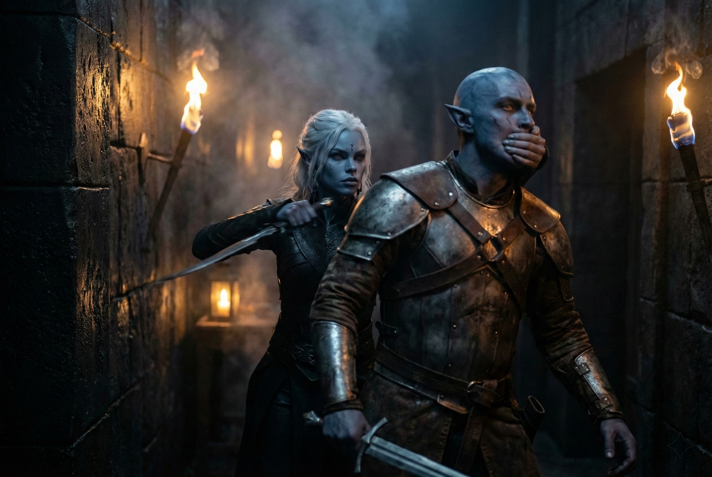

---
order: 1155
title: "Sangre en la Oscuridad: La Huida de Shyntara"
description: "Los escombros bloqueaban el corredor completamente."
date: 2024-05-26
language: es
chapter: 6
subchapter: 5
storyline: drusniel
canon_phase: main
canon_sequence: D-006-005
narrative_weight: medium
category: Umbra'kor
author: Shyntara
type: Main
tags: ['#sangre en la oscuridad', '#drusniel', '#umbrakor']
thumbnail: image.jpg
featured: false
counterpart_path: site/content/posts/en/umbrakor/blood-in-the-dark-shyntaras-flight/index.mdx
counterpart_title: "Blood in the Dark: Shyntara's Flight"
---

## Capítulo 6 | Parte 5
--- 

*Shyntara*

---

Los escombros bloqueaban el corredor completamente.

Shyntara miró el techo colapsado, sangre corriendo de un corte sobre su ojo, e hizo cálculos. Tiempo para despejar un camino: demasiado largo. Rutas alternativas: comprometidas o desconocidas. Drusniel: al otro lado, dirección incierta.

*Muerto o escapado.*

No podía permitirse asumir lo peor. Si asumía lo peor, se congelaría. Y congelarse significaba morir. Su padre le había enseñado eso antes de que tuviera edad para entender lo que significaba.

*Muévete. Evalúa. Adapta. Sobrevive.*

Se volvió y se movió más profundo en el recinto.

Los atacantes estaban en todas partes. Ya había matado a tres de ellos —golpes rápidos y eficientes desde las sombras, el entrenamiento que su padre le había inculcado desde la infancia. Hoja a través de la garganta desde atrás. Estocada entre las placas de la armadura. La anatomía de la muerte, aprendida como otro idioma.

Pero eran demasiados. Sin importar cuán hábil fuera, los números contaban. Y estos no eran sirvientes de casa o luchadores callejeros contratados. Estos eran profesionales.

Los atacantes se movían en equipos que ella no reconocía.

*Mercenarios.*

Y habían dejado demasiado acero Vrinn donde cualquier superviviente podía encontrarlo.

Shyntara archivó ambos datos y siguió moviéndose.

Se deslizó a través de un pasaje oculto —una de las rutas de emergencia que solo la familia conocía— y emergió en los jardines exteriores. El recinto ardía detrás de ella. El humo se elevaba hacia el techo de la caverna, extendiéndose como una infección a través del aire quieto.

*Madre. Padre.*

Había visto sus cuerpos. Había tenido que pasar sobre el cadáver de su madre para alcanzar este pasaje. La imagen viviría detrás de sus ojos para siempre: el rostro de su madre, tan quieto, tan diferente de la mujer que la había criado.

No había forma de salvarlos ahora.

*Drusniel.*

Su hermano había corrido hacia el salón principal. Hacia sus padres. Hacia lo peor de la lucha. Había intentado seguirlo, pero el techo había colapsado, y para cuando encontró otra ruta, los atacantes habían inundado el área.

*No está muerto. No puede estar muerto.*

No tenía evidencia para esa creencia. Solo el rechazo desesperado a aceptar un mundo donde ella era la única que quedaba.

La entrada del túnel esperaba adelante —el mismo pasaje que Drusniel había usado para escabullirse a la superficie. Lo había rastreado ahí dos veces antes de perder el rastro, curiosa sobre a dónde estaba desapareciendo su hermano. Ahora era su única ruta de escape.

En la entrada del túnel miró atrás una vez.

Mercenarios.

Acero Vrinn.

Drusniel en algún lugar detrás del humo.

Entró en el túnel.

---

**Fin de Capítulo 6.5 —> 6.6: [Sangre en la Oscuridad: La Victoria Hueca](/sangre-en-la-oscuridad-la-victoria-hueca/)**
