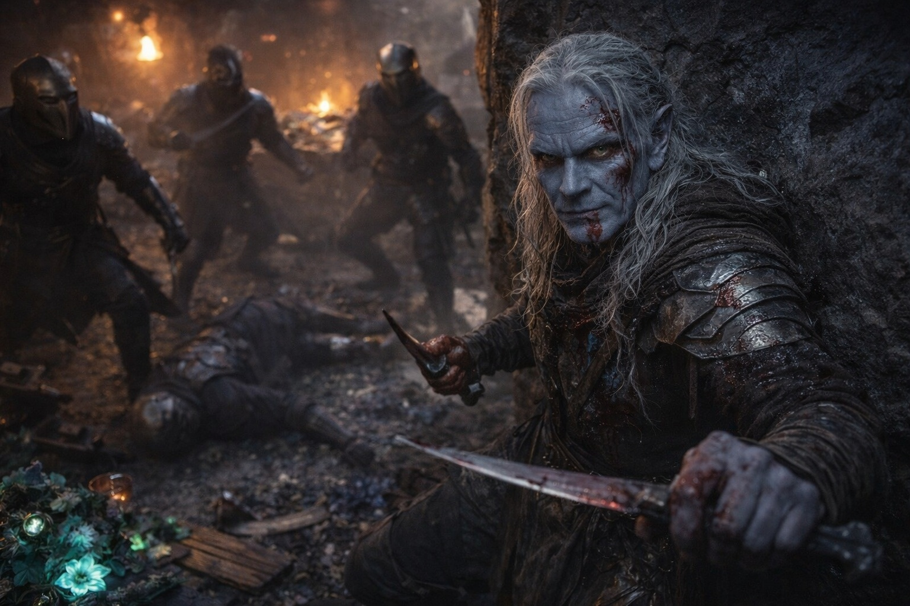
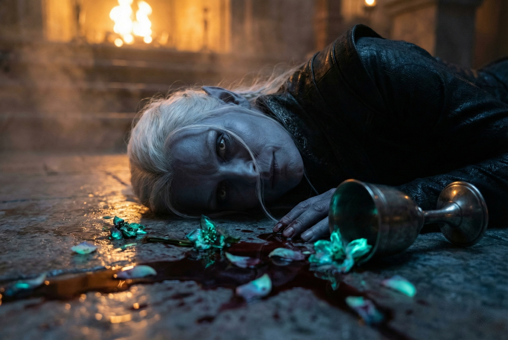
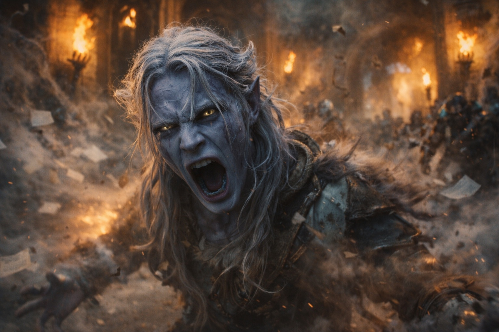

---
order: 1152
title: "Sangre en la Oscuridad: La Matanza"
description: "Su padre luchaba como un animal acorralado."
date: 2024-05-23
language: es
chapter: 6
subchapter: 2
storyline: drusniel
canon_phase: main
canon_sequence: D-006-002
narrative_weight: medium
category: Umbra'kor
author: Drusniel
type: Main
tags: ['#sangre en la oscuridad', '#drusniel', '#umbrakor']
thumbnail: image.jpg
featured: false
counterpart_path: site/content/posts/en/umbrakor/blood-in-the-dark-the-slaughter/index.mdx
counterpart_title: "Blood in the Dark: The Slaughter"
---

## Capítulo 6 | Parte 2
--- 

Su padre luchaba como un animal acorralado.

Drusniel alcanzó la entrada del salón principal a tiempo para verlo: su padre respaldado contra la pared del fondo, hoja en mano, tres atacantes rodeándolo. Sangre corría de una herida en su brazo, otra en su costado. Se movía como si no las sintiera.

La mesa de la cena estaba volcada. Vino se acumulaba sobre la piedra, mezclándose con sangre. Las flores bioluminiscentes yacían dispersas y aplastadas, su suave resplandor muriendo. Horas antes, se habían sentado alrededor de esa mesa. Su padre había reído. Su madre había servido vino.

Ahora su madre estaba muerta, y su padre estaba muriendo.

—Vamos, entonces. —La voz de su padre era firme a pesar de todo—. ¿Vinieron por la Casa Thel'varin? Aquí estoy. Veamos de qué están hechos.

Los atacantes rodeaban. Eran cuidadosos: habían visto lo que pasó con la primera oleada. Dos cuerpos yacían a los pies de su padre ya. A uno le faltaba una mano. El otro había recibido una hoja a través de la garganta.

Eran demasiados. Más venían por los pasajes laterales. Cuatro ahora. Cinco.

—¡Padre!

La palabra se desgarró de la garganta de Drusniel antes de que pudiera detenerla.

La cabeza de su padre se volvió. Sus ojos se encontraron a través del caos.

—¡Corre, Drusniel!

—Puedo ayudar...

—¡CORRE!

Los atacantes no esperaron. La distracción les había dado su apertura. Dos de ellos se lanzaron hacia Drusniel. Los tres restantes presionaron la ventaja contra su padre.

Drusniel vio caer la primera hoja. Su padre bloqueó —apenas— pero el segundo atacante ya se estaba moviendo. El acero mordió su hombro. Su padre se tambaleó pero no cayó.

*No va a caer. Va a hacerlos trabajar por ello.*

El pensamiento era frío y claro y completamente inútil.

Su padre mató a uno más. Un golpe preciso a través de una brecha en la armadura, los instintos de toda una vida cristalizando en un momento final. Luego los otros dos estaban sobre él.

El segundo golpe alcanzó a su padre en el costado. El tercero abrió su garganta.

Cayó.

Su padre cayó.

Drusniel gritó.

El aire respondió.

El aire estalló hacia afuera. Los papeles se alzaron. Las antorchas vacilaron. Los atacantes tropezaron...

No lo suficiente.

—Es un mago —dijo uno de ellos, recuperándose rápidamente—. Cuidado. Captúrenlo vivo si pueden. El cliente quiere confirmación.

*El cliente.*

La palabra quedó atrapada en su mente.

Antes de que Drusniel pudiera aferrarse a ella, uno de los atacantes se lanzó hacia él.

—El chico. —El atacante líder señaló hacia Drusniel—. Atrapen al chico. Sin sobrevivientes significa sin sobrevivientes.

Drusniel corrió.

---

**Fin de Capítulo 6.2 —> 6.3: [Sangre en la Oscuridad: El Escape](/sangre-en-la-oscuridad-el-escape/)**
