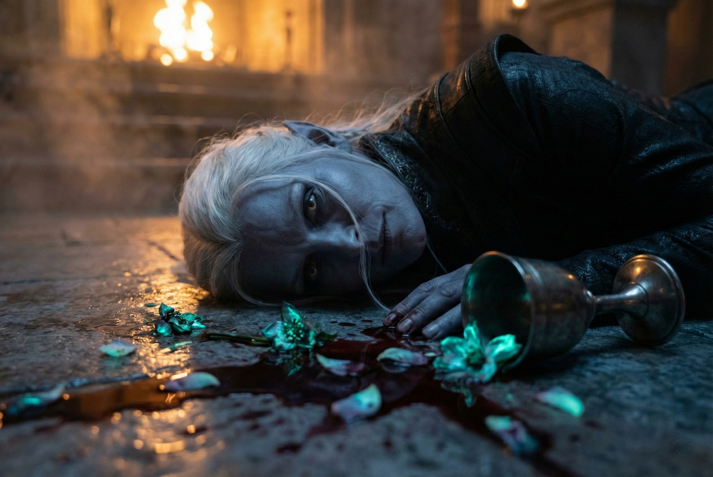
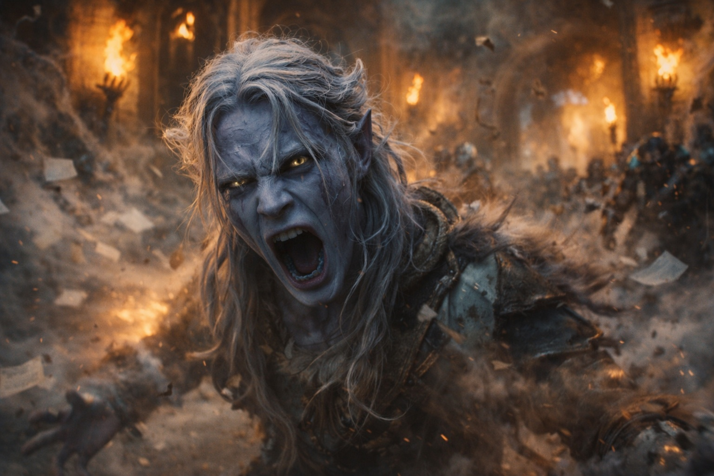

---
order: 1152
title: "Sangre en la Oscuridad: La Matanza"
description: "Su padre luchaba como un animal acorralado."
date: 2024-05-23
language: es
chapter: 6
subchapter: 2
storyline: drusniel
canon_phase: main
canon_sequence: D-006-002
narrative_weight: medium
category: Umbra'kor
author: Drusniel
type: Main
tags: ['#sangre en la oscuridad', '#drusniel', '#umbrakor']
thumbnail: image.jpg
featured: false
counterpart_path: site/content/posts/en/umbrakor/blood-in-the-dark-the-slaughter/index.mdx
counterpart_title: "Blood in the Dark: The Slaughter"
---

## Capítulo 6 | Parte 2
---

Su padre había retrocedido hasta la pared del fondo, donde nadie podía atacarlo por la espalda.

Drusniel llegó a la entrada del salón principal. Tres atacantes rodeaban a su padre. La sangre le corría por el brazo de la espada y le empapaba el costado, pero mantenía la punta entre él y el hombre más cercano.

La mesa de la cena estaba volcada. Vino se acumulaba sobre la piedra, mezclándose con sangre. Las flores bioluminiscentes yacían dispersas y aplastadas, su suave resplandor muriendo. Horas antes, se habían sentado alrededor de esa mesa. Su padre había reído. Su madre había servido vino.

Ahora su madre estaba muerta, y su padre estaba muriendo.

—Casa Thel'varin —dijo su padre, con voz que llenó el salón—. Querían a su señor. Aquí estoy.

Los atacantes lo rodeaban con cautela. Ya había dos cuerpos a los pies de su padre. A uno le faltaba una mano. Al otro le habían atravesado la garganta.

Eran demasiados. Más venían por los pasajes laterales. Cuatro ahora. Cinco.

—¡Padre!

La palabra se desgarró de la garganta de Drusniel antes de que pudiera detenerla.

La cabeza de su padre se volvió. Sus ojos se encontraron a través del caos.

—¡Corre, Drusniel!

—Puedo ayudar...

—¡CORRE!

Los atacantes no esperaron. La distracción les había dado su apertura. Dos de ellos se lanzaron hacia Drusniel. Los tres restantes presionaron la ventaja contra su padre.

Su padre apenas logró detener la primera hoja. La siguiente le alcanzó el hombro antes de que pudiera volverse para pararla. Se tambaleó, pero no cayó.

*No va a caer. Va a hacerlos trabajar por ello.*

El pensamiento era frío y claro y completamente inútil.

Su padre hundió la punta en un hueco de la armadura de uno de los hombres. Antes de que pudiera sacarla, los otros dos se le echaron encima.

El segundo golpe alcanzó a su padre en el costado. El tercero abrió su garganta.

Cayó.

Su padre cayó.

Drusniel gritó.

El aire respondió.

El aire estalló hacia fuera, levantando papeles y haciendo retroceder un paso a los atacantes. El dolor le atenazó las costillas; Drusniel trastabilló contra el marco de la puerta.

No lo suficiente.

—Mago —dijo uno de ellos, recuperando el equilibrio—. Vigilen sus manos. El cliente quiere un cuerpo que pueda identificar.

*El cliente.*

La palabra quedó atrapada en su mente.

Antes de que Drusniel pudiera aferrarse a ella, uno de los atacantes se lanzó hacia él.

—El chico. —El atacante líder señaló hacia Drusniel—. Atrapen al chico. Sin sobrevivientes significa sin sobrevivientes.

Drusniel corrió.

---

**Fin de Capítulo 6.2 —> 6.3: [Sangre en la Oscuridad: El Escape](/sangre-en-la-oscuridad-el-escape/)**
