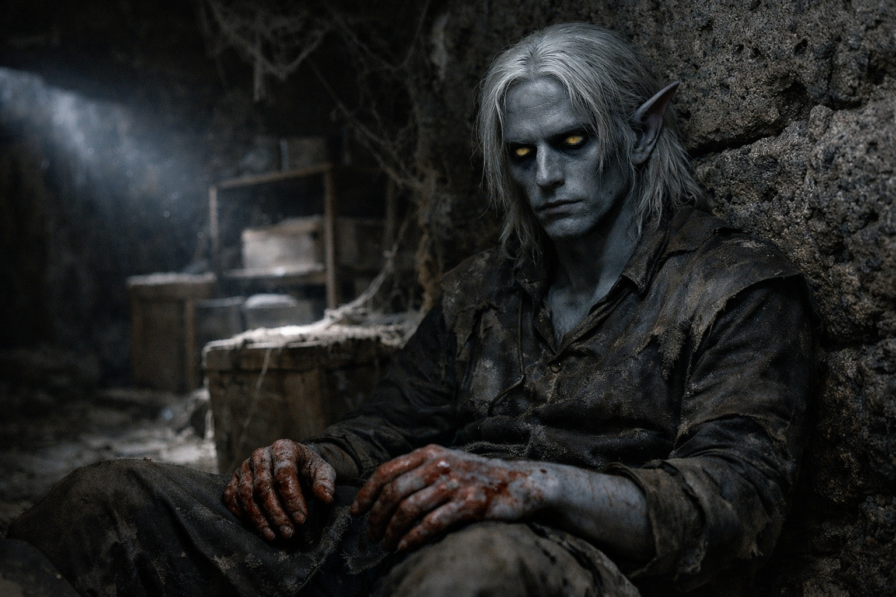
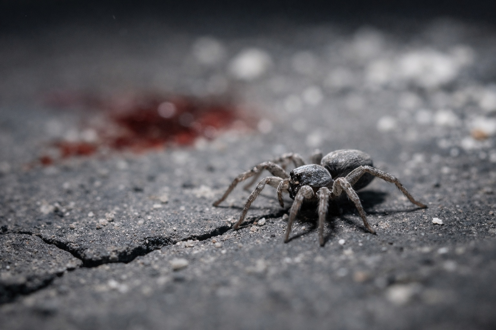

## Capítulo 6 | Parte 6
---

*Drusniel*

---

Drusniel salió a un almacén en desuso. Rozó con el hombro una pila de sacos vacíos y se le llenó la boca de polvo. Escupió y cerró la puerta del túnel.

Se sentó contra una pared hasta que su respiración se calmó.

La sangre se había secado en sus manos. Parte de ella era suya.

Una araña cruzó el suelo y desapareció en una grieta.

Drusniel se puso de pie.

---

La presencia lo encontró mientras escalaba hacia los pasajes de superficie.

*Drus.*

Una calidez familiar le rozó la consciencia. Dejó de subir.

*Drus, ¿estás vivo? Sentí algo terrible. He estado intentando contactarte durante horas.*

Respondió al contacto. El dolor le ciñó la frente y tuvo que apoyarse en la pared antes de contestar.

*Estoy vivo.*

*Gracias a los dioses profundos.* El alivio cruzó el enlace, lo bastante cálido como para que Drusniel se permitiera creerlo durante un instante. *¿Qué pasó? Sentí dolor, miedo, luego nada. La conexión solo... se detuvo. Pensé que estabas...*

*Están muertos.*

Silencio.

Luego, más suave: *¿Tus padres?*

*Todos los que encontré.* No consiguió enumerarlos. *Armas Vrinn. Hombres que conocían la casa. Mataron a mi padre delante de mí.*

*Lo siento, Drus.* La calidez se acercó. *No deberías estar solo ahora.*

Algo en el ritmo de la respuesta estaba mal.

*Meren seguía vivo cuando lo encontré.* Drusniel se miró la mano. *No pude detener la sangre.*

*Necesitas un lugar donde descansar. Donde no vayan a buscarte primero.*

Drusniel se apoyó en el consuelo de todas formas.

*No tengo ningún lugar seguro antes del amanecer.*

*Ve con Zaelar.*

*¿Qué?*

*Sea lo que sea Zaelar, tiene comida y un lugar donde refugiarte.*

Zaelar había ofrecido Wyrmreach.

Poder.

Por primera vez desde el salón principal, Drusniel supo para qué lo quería.

*¿Y tú?* preguntó Drusniel. *Si voy a Wyrmreach...*

*Estaré aquí.* La presencia se suavizó. *Primero llega a un lugar seguro.*

Drusniel tocó la daga en su cadera.

*Iré con Zaelar. Ahora.*

*Bien.* La presencia comenzó a desvanecerse. *Ten cuidado, Drus.*

La calidez se retiró.

La hoja Vrinn seguía limpia. Su mano había dejado sangre en la empuñadura.

Drusniel empezó a caminar hacia la torre de Zaelar.

---

**Fin de Capítulo 6.6 —> 7.1: [El Paquete: El Instrumento Roto](/el-paquete-el-instrumento-roto/)**
