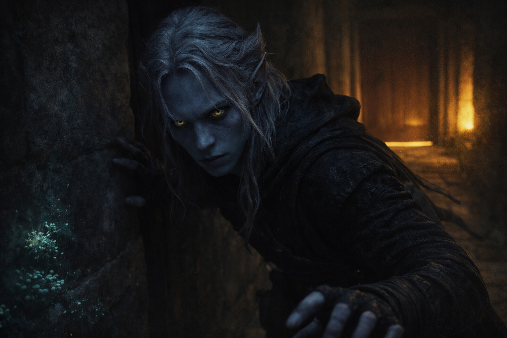
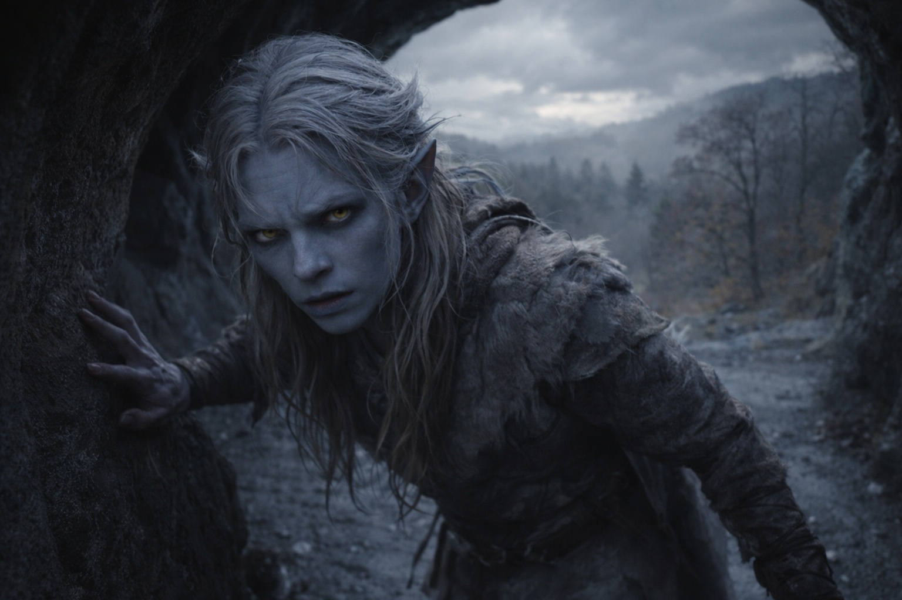
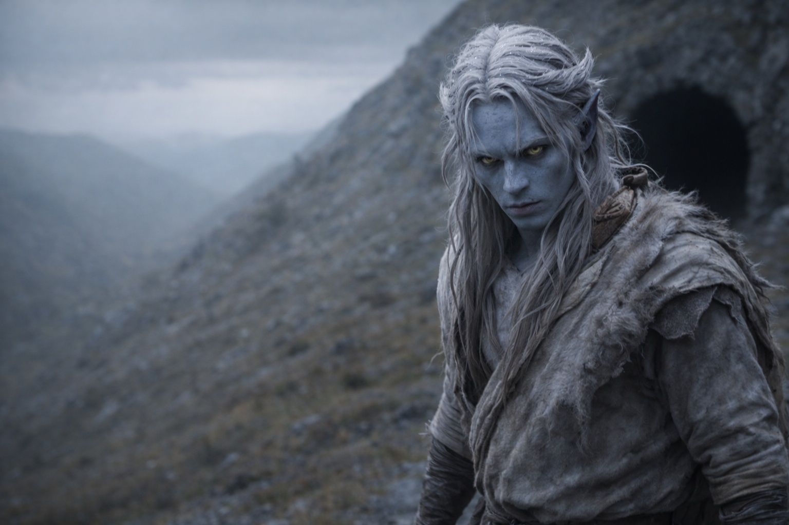

## Capítulo 2 | Parte 4
--- 

Drusniel esperó hasta la tercera hora pasada la medianoche.

El recinto estaba más silencioso entonces: los guardias cambiaban de turno, los sirvientes dormían, y su padre se retiraba a su estudio para revisar informes hasta el amanecer. Drusniel había aprendido los ritmos de este lugar durante dieciocho años. Sabía qué corredores estaban vigilados y cuáles olvidados. Qué puertas crujían y cuáles se abrían en silencio.

Se vistió con ropa oscura y guardó agua, comida para un día, un cuchillo y la capa con capucha más gruesa que tenía. Nada que no pudiera abandonar si tenía que correr.

Los pasajes a la superficie no eran exactamente secretos. Todos en Umbra'kor sabían que existían: túneles tallados que conducían desde la ciudad subterránea al mundo de arriba, donde la luz del sol mataba y los moradores de la superficie caminaban bajo la luz ardiente. La mayoría de los drow nunca los usaba. La mayoría de los drow nunca quería hacerlo.

Pero Drusniel sabía dónde estaban. El estatus de su familia daba acceso a ciertos mapas, cierta información. Años atrás, por curiosidad, había memorizado las rutas. Una habilidad inútil, había pensado entonces.

Ya no era inútil.

Se movió a través del recinto como una sombra. Pasó los aposentos de sus padres, donde la lámpara de su padre todavía ardía tras puertas cerradas. Pasó la habitación de Shyntara, donde el silencio sugería sueño, o lo fingía. Pasó el ala de los sirvientes, las cocinas, los salones de entrenamiento donde había pasado tantas horas fingiendo convertirse en asesino.

En el borde del recinto, un corredor de servicio llevaba a los túneles exteriores. Drusniel se detuvo en el umbral.

Algo había ocurrido durante la prueba. O había fallado y necesitaba entender por qué se había sentido de otra manera.

Si Zaelar comprendía cómo podía bloquearse —o romperse— la magia, quizá supiera distinguir una cosa de la otra.

El corredor de servicio se extendía ante él, iluminado por escasos racimos de hongos. Al final, una puerta marcada con símbolos descoloridos: advertencias sobre exposición a la superficie, protocolos de descontaminación. Drusniel nunca la había abierto.

La estaba abriendo ahora.

La manija estaba fría bajo su palma. Se detuvo, y su mirada encontró una grieta fina en la piedra junto a las bisagras. Síguela. Deja pasar el momento.

Podía dar la vuelta.

Su mano se cerró sobre la manija. Volver a casa significaba dejar sin comprobar la única pista que podía comprobar.

Aire fresco pasó junto a él —diferente de la quietud del recinto, llevando el leve aroma de cosas que crecían sin luz de hongos. El túnel más allá era más oscuro, la bioluminiscencia escasa. Drusniel atravesó.

La puerta se cerró tras él. Drusniel siguió caminando.

El túnel ascendía gradualmente, serpenteando a través de roca que se volvía más fría mientras subía. Sus oídos crepitaron con los cambios de presión. Sus ojos se ajustaron a la oscuridad, luego se ajustaron de nuevo cuando una luz tenue comenzó a aparecer adelante —no el resplandor de hongos, sino algo más áspero. Más gris.

Drusniel nunca había visto luz de superficie. Había escuchado descripciones: dolorosa, cegadora, capaz de quemar la piel drow en minutos de exposición directa. Pero esta luz era filtrada, difusa. El amanecer, quizás, o una cobertura de nubes espesa.

El túnel terminaba en otra puerta. Esta era más pesada, reforzada, marcada con más advertencias. Drusniel las ignoró. Presionó su palma contra el mecanismo de liberación.

La puerta se abrió.

Y por primera vez en su vida, Drusniel pisó la superficie.

---

El mundo de arriba no era nada como había imaginado.

Había esperado dolor. Ardor. La sensación de piel crepitando bajo luz hostil.

En cambio, encontró gris. Cielo gris, piedra gris, árboles grises con hojas del color de la ceniza. La luz era apagada, filtrada a través de nubes tan espesas que parecían presionar contra la tierra misma. Luz del amanecer, se dio cuenta. No el sol asesino del mediodía.

Drusniel permaneció en la boca del túnel y respiró aire que sabía a lluvia y cosas que crecían. Aire frío. Aire húmedo. Aire que se movía por sí mismo, llevando aromas para los que no tenía nombres.

No había techo. Sus ojos seguían intentando encontrar uno.

Miró atrás. La entrada del túnel estaba incrustada en una ladera rocosa, casi invisible a menos que supieras dónde mirar. Más allá, muy abajo, las cavernas de Umbra'kor esperaban: su familia, su recinto, la vida que estaba dejando atrás.

Giró hacia el norte.

La voz le había dado un detalle útil: una torre negra más allá de la segunda loma.

La luz gris le escocía los ojos, pero no de forma insoportable. Su piel hormigueaba con la exposición desconocida, pero no ardía. El amanecer, se recordó. No el mediodía. Tenía horas antes de que la luz se volviera peligrosa, asumiendo que las nubes aguantaran.

Si las nubes se abrían, la capa le daría unos minutos. Siguió avanzando.

Siguió la cresta norte que recordaba de los mapas. La primera elevación solo mostró árboles, rocas y más colinas. Continuó, manteniendo el este pálido detrás de su hombro izquierdo.

Solo después de la segunda loma apareció la torre en el horizonte.

Piedra oscura. Ángulos agudos. De pie sola en una colina como un dedo señalando las nubes.

La torre de Zaelar.

Drusniel se detuvo el tiempo justo para fijar su posición contra la cresta.

*Ahí.*

Empezó a caminar hacia la torre.

Detrás de él, la entrada del túnel desapareció en la ladera.

La voz había fallado su prueba.

Zaelar todavía no había fallado ninguna.

Drusniel siguió caminando.

---

**Fin de Capítulo 2.4 —> 3.1: [El Mago de Superficie: La Torre](/el-mago-de-superficie-la-torre/)**