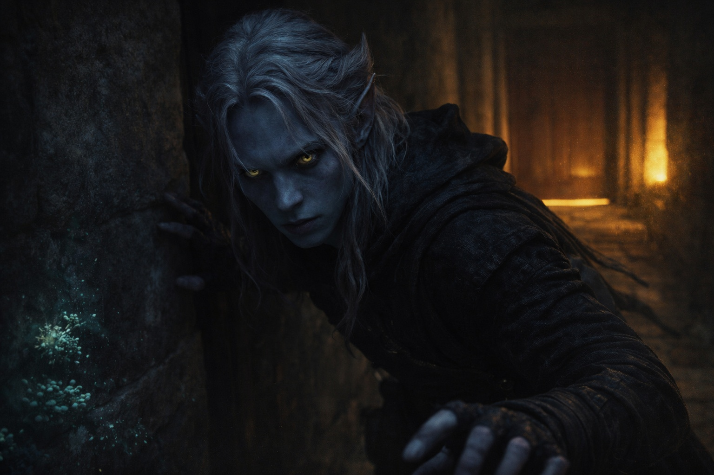
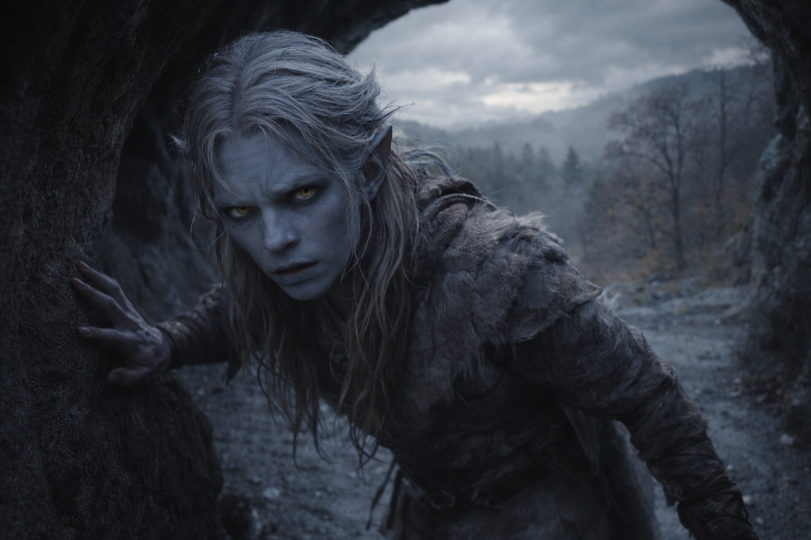
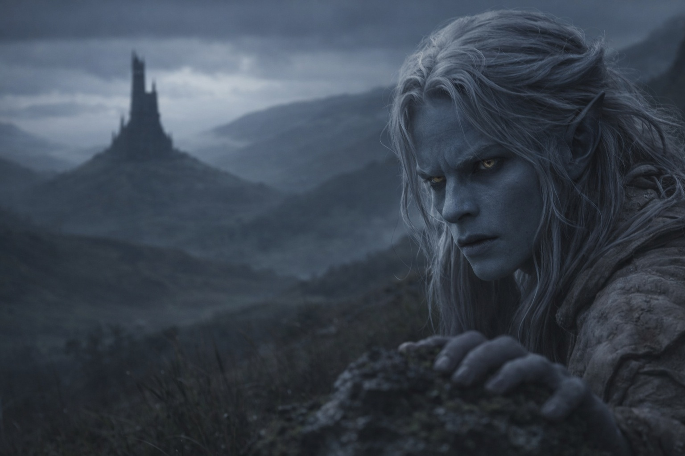
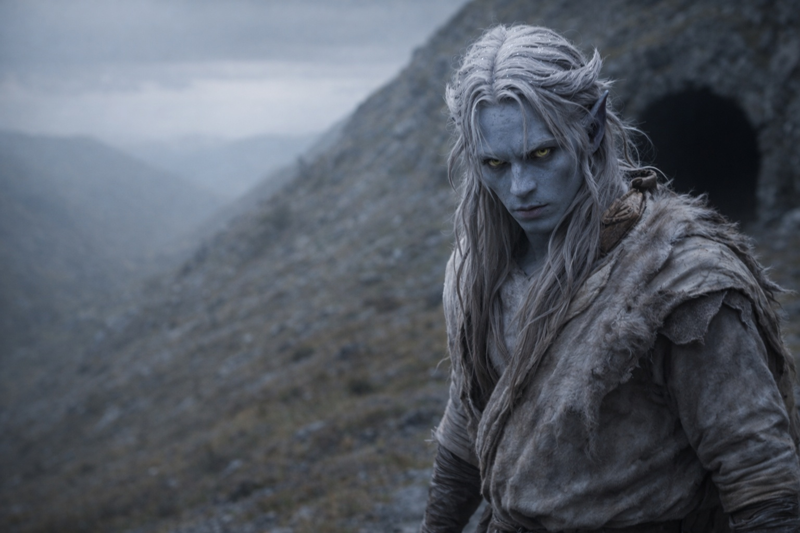

## Capítulo 2 | Parte 4
--- 

Drusniel esperó hasta la tercera hora pasada la medianoche.

Oyó las botas del relevo pasar bajo su ventana. Esperaría a que la patrulla llegara al patio antes de levantar el pestillo. La lámpara del estudio de su padre seguiría encendida hasta el amanecer; tomaría el corredor del otro lado de la casa.

Se vistió con ropa oscura y guardó agua, comida para un día, un cuchillo y la capa con capucha más gruesa que tenía. Nada que no pudiera abandonar si tenía que correr.

Los pasajes a la superficie figuraban en los mapas de su padre. Los había memorizado años atrás sin pensar que llegaría a usarlos.

Pasó ante la puerta de Shyntara sin pisar la tabla suelta que había delante. Se detuvo a escuchar junto a las cocinas y cruzó hacia el ala de servicio.

En el borde del recinto, un corredor de servicio llevaba a los túneles exteriores. Drusniel se detuvo en el umbral.

Algo había ocurrido durante la prueba. O había fallado y necesitaba entender por qué se había sentido de otra manera.

Si Zaelar comprendía cómo podía romperse la magia, Drusniel le preguntaría por lo que había sentido.

El corredor de servicio se extendía ante él, iluminado por escasos racimos de hongos. Al final, una puerta marcada con símbolos descoloridos: advertencias sobre exposición a la superficie, protocolos de descontaminación. Drusniel nunca la había abierto.

La manija estaba fría bajo su palma. Volvió a escuchar por si se acercaban pasos.

Abrió la puerta. Lo envolvió una corriente fresca, con un olor húmedo a hojas que no supo identificar. Entró en el túnel y cerró tras de sí.

El túnel ascendía entre rocas cada vez más frías. Se le taponaron los oídos y tragó para despejarlos. Más allá del último recodo, una luz gris se extendía por el suelo.

Drusniel nunca había visto luz de superficie. Había escuchado descripciones: dolorosa, cegadora, capaz de quemar la piel drow en minutos de exposición directa. Pero esta luz era filtrada, difusa. El amanecer, quizás, o una cobertura de nubes espesa.

El túnel terminaba en otra puerta. Esta era más pesada, reforzada, marcada con más advertencias. Drusniel las ignoró. Presionó su palma contra el mecanismo de liberación.

La puerta se abrió.

Y por primera vez en su vida, Drusniel pisó la superficie.

---

El mundo de arriba no era nada como había imaginado.

Mantuvo las manos dentro de las mangas, esperando que la luz empezara a doler.

Las nubes cubrían el cielo. Bajo ellas distinguía piedras y árboles, pero apenas colores. Aflojó las manos con las que sujetaba la capa.

El aire frío le llenó la boca. Olía a hojas mojadas, con más intensidad cada vez que el viento soplaba hacia él.

No había techo. Sus ojos seguían intentando encontrar uno.

Miró atrás y memorizó la entrada: una roca partida sobre el dintel, pizarra suelta a su izquierda.

Giró hacia el norte.

La voz le había dado un detalle útil: una torre negra más allá de la segunda loma.

La luz gris le escocía los ojos. Se ajustó la capucha y avanzó por las hondonadas entre las crestas.

Si las nubes se abrían, la capa le daría unos minutos. Siguió avanzando.

Siguió la cresta norte que recordaba de los mapas, con el cielo cada vez más claro a su derecha.

Solo después de la segunda loma apareció la torre en el horizonte.

Se alzaba sola sobre una colina, sin una sola ventana iluminada en sus muros oscuros.

La torre de Zaelar.

Drusniel se detuvo el tiempo justo para fijar su posición contra la cresta.

*Ahí.*

Empezó a caminar hacia la torre.

Detrás de él, la entrada del túnel desapareció en la ladera.

---

**Fin de Capítulo 2.4 —> 3.1: [El Mago de Superficie: La Torre](/el-mago-de-superficie-la-torre/)**
