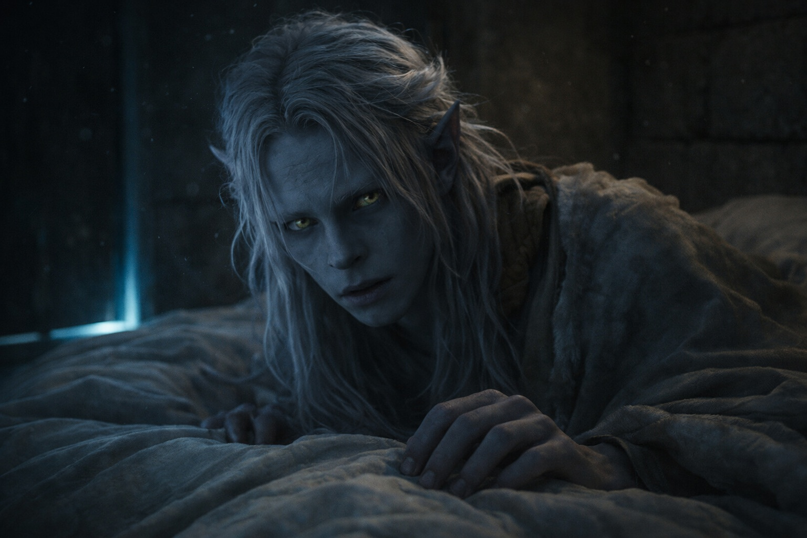
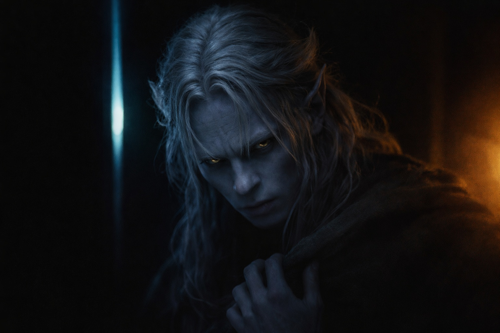
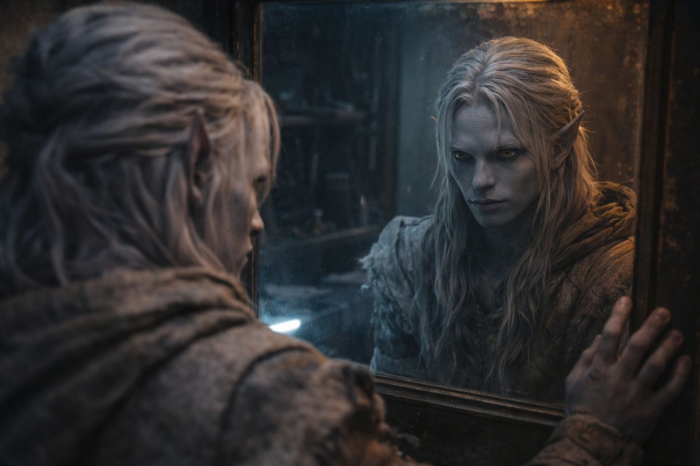

## Capítulo 2 | Parte 3
--- 

Los mensajes llegaron con más frecuencia durante los siguientes dos días.

No constantemente: la conexión parecía requerir esfuerzo de ambos lados. Pero cada noche, la presencia parpadeaba en el borde de la consciencia de Drusniel. Cada noche, él alcanzaba hacia ella, y cada noche, la voz de "Annariel" llenaba el silencio.

Hablaban sobre la prueba. Sobre el aislamiento de Drusniel. Sobre los intentos incómodos de normalidad de su familia. La presencia era cálida, preocupada, empática de todas las formas correctas.

Zaelar volvía una y otra vez a la conversación.

*Los magos aquí hablan sobre candidatos bloqueados*, dijo la voz en la segunda noche. *Es raro, pero sucede. Cuando alguien lo suficientemente poderoso no quiere que un candidato pase.*

Drusniel yacía en la oscuridad, mirando el techo. *Bloqueados. Quieres decir deliberadamente.*

*Piénsalo.* La presencia pulsó con urgencia. *¿Quién se beneficiaría si fallaras? ¿Quién podría verte como una amenaza?*

*No soy una amenaza para nadie. No soy nadie.*

*No eres un don nadie.* Una pausa. *Eres más inteligente que muchos de los que aprobaron, Drus. Siempre lo has sido. Quizás alguien se dio cuenta. Quizás vieron a un candidato que hacía demasiadas preguntas, que no aceptaba simplemente lo que le decían.*

El pulgar de Drusniel rozó una vez las yemas de sus dedos y se detuvo.

*¿Crees que alguien me bloqueó deliberadamente?*

*No lo sé con certeza. Pero es posible. Y Zaelar podría saber cómo averiguarlo.*

Era la tercera vez en dos noches que la conversación había vuelto al mago de la superficie. Drusniel notó el patrón. Lo archivó.

---

En la tercera noche, probó algo.

La presencia llegó como siempre: una calidez en el borde de la consciencia, seguida de palabras presionadas en su mente como huellas dactilares.

*¿Cómo te sientes?*

Drusniel no respondió de inmediato. En cambio, hizo lo que él y Annariel habían hecho mil veces en la arboleda. Golpeteó su pulgar contra sus dedos. Uno, dos, tres. Lento y deliberado.

El viejo juego. *Léeme.*

Una pausa.

*Estás preocupado por tu familia*, dijo la voz. *Es natural. La situación política es peligrosa.*

El estómago de Drusniel se tensó. Respuesta incorrecta.

Tres golpes significaban miedo. Annariel lo sabía desde hacía años.

La voz había adivinado.

*¿Drus?* La presencia parpadeó con preocupación. *¿Estás bien?*

*Bien.* Mantuvo sus pensamientos cuidadosamente neutrales. *Solo cansado.*

*Deberías descansar. Podemos hablar mañana.*

*No, yo...* Dudó. Empujó la duda hacia abajo. *Cuéntame más sobre Zaelar. ¿Qué más has escuchado?*

La presencia continuó, como si la pregunta nunca hubiera ocurrido.

*Es poderoso. Eso está claro. Los magos aquí hablan de él en susurros: algunos dicen que fue exiliado de Umbra'kor hace décadas. Otros dicen que se fue por elección.* Una pausa. *No sé cuál es verdad. Solo escucho fragmentos, pedazos de conversaciones que no debería estar escuchando. Pero dicen que entiende la magia como un herrero entiende el hierro. No solo cómo usarla, sino cómo funciona. Cómo se rompe.*

*Si alguien bloqueó tu conexión con Venemora, Zaelar podría conocer el método. Las firmas. Podría identificar quién lo hizo.*

Drusniel cerró los ojos. La prueba fallida seguía con él. Zaelar también.

*Hay algo más*, dijo la voz con cuidado. *No quería decirlo antes. No estaba seguro de que estuvieras listo.*

*Dilo.*

*Sigo pensando en cómo te miraban*, dijo la voz. *Hacías preguntas que los demás candidatos no hacían. Intentaste alcanzar sin sanción. Si alguien intervino, quizá no fue porque fueras débil.*

*Entonces, ¿por qué?*

*Porque eras difícil de encajar. Porque podías convertirte en algo que no sabían cómo clasificar.*

Drusniel sabía lo que aquellas palabras le ofrecían.

Eso no impedía que quisiera que fueran ciertas.

*Siempre estuviste destinado a más de lo que te permitieron*, continuó la voz. *Algo te quitó eso. ¿No quieres saber qué?*

El pulgar de Drusniel rozó las yemas de sus dedos y se detuvo.

*¿Y si te equivocas?*

Una pausa.

*Entonces Zaelar te lo dirá. Encuéntralo. Pregúntale tú mismo. Después decide si algo de esto es verdad.*

Eso sonaba más a Annariel. O a algo que había aprendido cómo debía sonar Annariel.

*¿Dónde?*

*Al norte de las antiguas salidas a la superficie. Los magos mencionaron una torre negra más allá de la segunda loma.*

La voz podía mentir sobre quién era. Eso no significaba que Zaelar fuera imaginario.

Había una afirmación que sí podía comprobar.

*Lo encontraré*, envió Drusniel.

*Bien. Haz tus propias preguntas.*

La presencia se desvaneció.

Drusniel golpeó tres veces las yemas de sus dedos.

No hubo respuesta.

---

**Fin de Capítulo 2.3 —> 2.4: [Voces en la Oscuridad: La Decisión](/voces-en-la-oscuridad-la-decision/)**