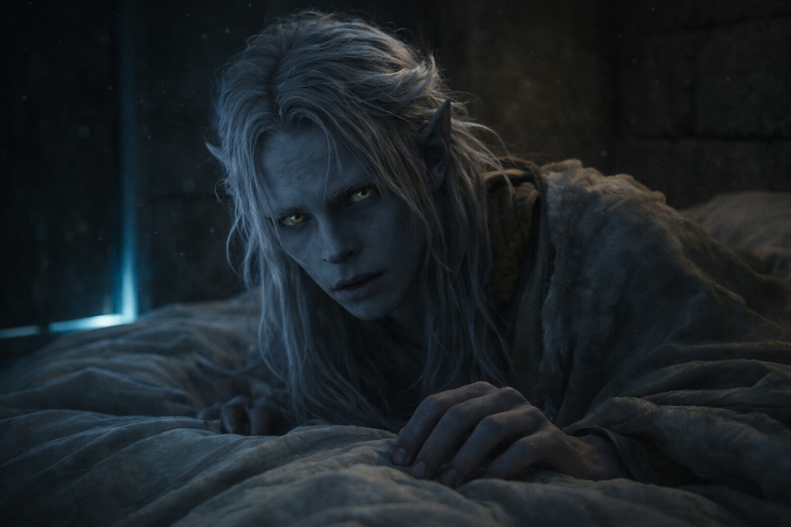
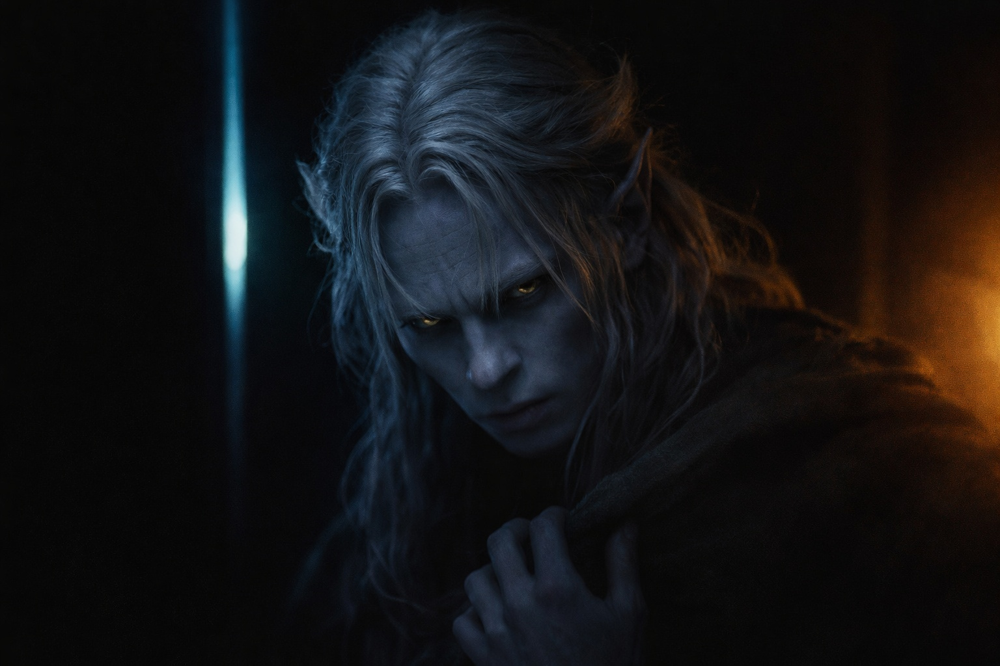
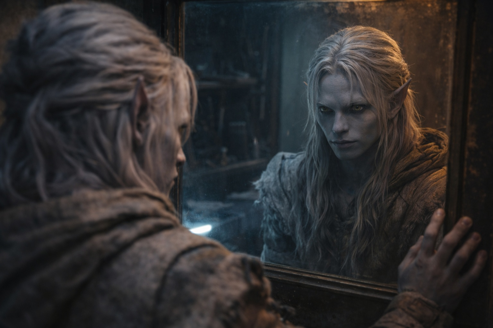

## Capítulo 2 | Parte 3
--- 

Los mensajes llegaron con más frecuencia durante los siguientes dos días.

Eran lo bastante breves para que el dolor de cabeza remitiera antes de la mañana. Drusniel empezó a esperar aquella presión familiar antes de intentar dormir.

Él hablaba de la prueba y de su familia. La presencia escuchaba.

Zaelar volvía una y otra vez a la conversación.

*Un mago poderoso podría bloquear a un candidato*, dijo la voz la segunda noche. *Superar la prueba no depende solo de la capacidad.*

Drusniel yacía en la oscuridad, mirando el techo. *Bloqueados. Quieres decir deliberadamente.*

*Piénsalo.* La presencia pulsó con urgencia. *¿Quién se beneficiaría si fallaras? ¿Quién podría verte como una amenaza?*

*No soy una amenaza para nadie. No soy nadie.*

*No eres un don nadie.* Una pausa. *Eres más inteligente que muchos de los que aprobaron, Drus. Siempre lo has sido. Quizás alguien se dio cuenta. Quizás vieron a un candidato que hacía demasiadas preguntas, que no aceptaba simplemente lo que le decían.*

*¿Crees que alguien me bloqueó deliberadamente?*

*Zaelar podría explicarte cómo se hace.*

Era la tercera vez en dos noches que la conversación volvía a Zaelar.

---

En la tercera noche, probó algo.

La presencia llegó mientras se masajeaba las sienes doloridas.

*¿Cómo te sientes?*

Drusniel se tocó tres dedos con el pulgar y transmitió el ritmo por la conexión. En la arboleda lo usaban cuando oían pasos cerca y ninguno se atrevía a hablar. Tres toques significaban miedo.

El viejo juego. *Léeme.*

Una pausa.

*Estás preocupado por tu familia*, dijo la voz. *Es natural. La situación política es peligrosa.*

Annariel conocía aquella señal. Drusniel estuvo a punto de repetirla, pero se detuvo. Si explicaba qué significaban los tres toques, nunca sabría si la próxima respuesta procedía del recuerdo o de lo que acababa de contarle.

*¿Drus?* La presencia parpadeó con preocupación. *¿Estás bien?*

*Bien.* Mantuvo sus pensamientos cuidadosamente neutrales. *Solo cansado.*

*Deberías descansar. Podemos hablar mañana.*

*Cuéntame más de Zaelar. ¿Qué enseña?*

La presencia continuó, como si la pregunta nunca hubiera ocurrido.

*Magia elemental. Aire, agua. Cosas que el templo no te permite intentar.*

*Si alguien bloqueó tu conexión, él reconocería el método.*

*Buscaste sin autorización*, prosiguió la voz. *Si alguien intervino, quizá no fue porque fueras débil.*

*Entonces, ¿por qué?*

*Quizá no querían otro candidato que hiciera preguntas.*

Drusniel quería que esa fuera la razón. Había visto cómo los magos dejaban de mirarlo, ocupados ya con el siguiente nombre. Dolía menos imaginar que le habían temido. Se quedó quieto hasta poder separar lo que había visto de lo que deseaba.

*¿Y si te equivocas?*

*Entonces Zaelar te lo dirá. Encuéntralo. Pregúntale tú mismo. Después decide si algo de esto es verdad.*

*¿Dónde?*

*Al norte de las antiguas salidas a la superficie. Una torre negra más allá de la segunda loma.*

Podía buscar una torre sin contarle nada más a la voz.

*Miraré los mapas*, transmitió Drusniel.

*Bien. Decide tú mismo.*

La presencia se desvaneció.

Esperó a que la presión abandonara su mente antes de ir a buscar la capa.

Partiría esa noche. Eso no se lo había contado a la voz.

---

**Fin de Capítulo 2.3 —> 2.4: [Voces en la Oscuridad: La Decisión](/voces-en-la-oscuridad-la-decision/)**
