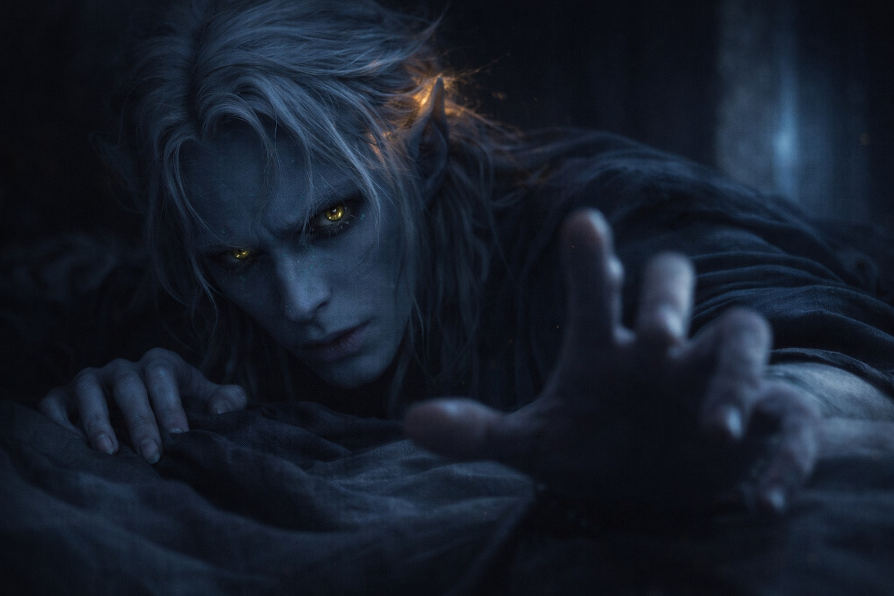
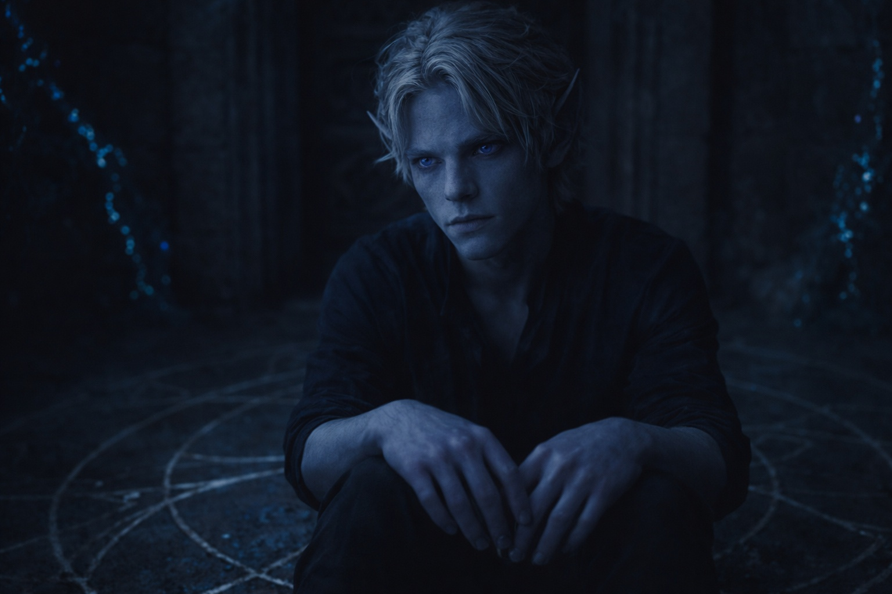
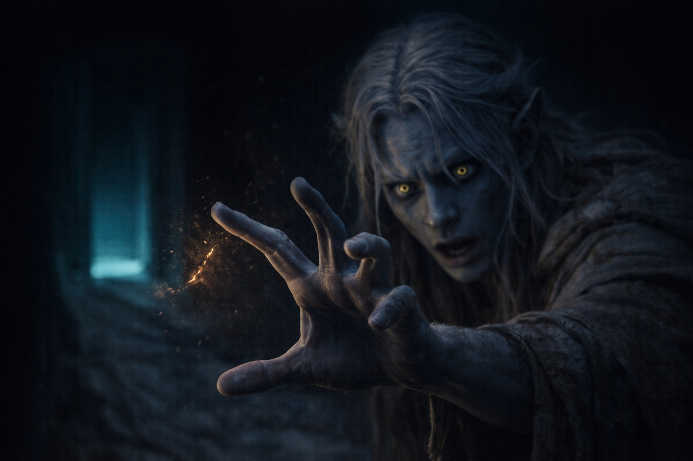

## Capítulo 2 | Parte 2
--- 
 
La presencia se fortaleció. Se solidificó. Como un hilo tensándose entre ellos.

*¿Drusniel? ¿Puedes oírme?*

Se incorporó en la cama, el corazón latiendo tan fuerte que podía sentirlo en la garganta. La voz no era sonido: era impresión, significado presionado directamente en su mente. La forma en que su conexión siempre había funcionado, allá en la arboleda. Reconocimiento de patrones. Intimidad. Algo que nunca habían podido nombrar.

*¿Annariel?* Formó el pensamiento tan claramente como pudo. *¿Cómo? Pensé que te habían aislado.*

Una pausa. La presencia parpadeó, como si reuniera fuerzas.

*Lo hicieron.* La voz llegó más clara ahora. *Sin contacto exterior. Aislamiento completo. Pero tenía que alcanzarte, Drus. No podía simplemente... no podía dejarte solo con lo que pasó.*

Los ojos de Drusniel ardieron. Presionó los talones de sus manos contra ellos, forzando hacia atrás las lágrimas que querían venir.

*Encontraste la manera.*

*Encontré la manera.* Una sensación de calidez se transmitió a través de la conexión. Afecto. Preocupación. *No es fácil. La distancia es... es difícil de mantener. Pero necesitaba saber que estabas vivo. Que estabas bien.*

Drusniel casi se rio. Bien. No había estado bien desde la cámara de pruebas.

*No estoy herido*, envió con cuidado. *Si es a eso a lo que te refieres.*

*Pero no estás bien.* No era una pregunta. *Sentí algo, Drus. Durante tu prueba. Incluso a través del aislamiento, lo sentí. Como una puerta cerrándose de golpe. Como algo siendo... cercenado.*

La palabra lo golpeó en el pecho. Cercenado. Sí. Eso era exactamente cómo se había sentido.

*¿Me crees?* El pensamiento salió crudo, desesperado. *¿Que algo estuvo mal?*

*No te creo. Lo sé.* La presencia pulsó con certeza. *Lo que te pasó no fue natural. Hiciste todo bien. Te vi practicar durante años. Sentí cómo alcanzabas hacia la bendición, y entonces, algo cambió. Algo interfirió. No sé qué, pero no fuiste tú.*

Las manos de Drusniel temblaron. Validación. Después de días de aislamiento, de duda, de la evasión cuidadosa de su familia: alguien le creía. Alguien sabía.

*Pensé que lo había imaginado*, envió. *Pensé que quizás lo quería tanto que me convencí de que era real.*

*No.* La voz era firme. Una pausa, luego más suave: *¿Recuerdas esa noche en la arboleda? ¿Cuándo sentimos la conexión por primera vez? Dijiste que nunca te rendirías. Dijiste que...*

El recuerdo estaba mal. Había sido Annariel quien dijo eso, no Drusniel. Pero quizás el aislamiento estaba confundiendo las cosas. Quizás alcanzar a través de esta distancia mezclaba los detalles.

Drusniel lo dejó pasar.

Drusniel llevó las rodillas al pecho, envolviéndolas con los brazos como un niño. Su cabeza palpitaba: la conexión le estaba quitando algo, alguna energía que no tenía para dar. Pero no quería detenerse. Por primera vez en días, algo además del vacío vivía en su pecho. Esperanza.

*¿Qué hago?* preguntó. *Todos piensan que simplemente fallé. Mi padre dice que el camino del asesino siempre fue mi vocación. Quieren que olvide que pasó y siga adelante.*

*No puedes olvidar. No deberías.* Una sensación de frustración se transmitió a través de la conexión: ira compartida ante una situación injusta. *Alguien te hizo esto. ¿No quieres saber quién? ¿Por qué?*

*Por supuesto que sí.* La mandíbula de Drusniel se apretó. *Pero ¿cómo? Los magos no me ayudarán, piensan que soy solo otro fracasado. Mi familia no cree que algo estuviera mal. Y tú estás...*

*Aislado. Lo sé.* Una pausa. La presencia pareció reunirse, como alguien eligiendo palabras con cuidado. *Pero he estado escuchando. Aprendiendo cosas. Los salones de entrenamiento tienen más información de la que saben: los magos hablan, y no siempre notan quién está escuchando.*

*¿Qué tipo de información?*

Otra pausa. Más larga esta vez.

*Hay alguien en la superficie*, dijo la voz finalmente. *Un mago que entrena a personas fuera del sistema de Venemora. Dicen que es controvertido, que no sigue las viejas reglas. Pero sabe cosas, Drus. Cosas sobre cómo funciona realmente la magia. Sobre qué puede bloquearla. Eliminarla.*

El corazón de Drusniel tartamudeó. La superficie. Donde los drow no iban. Donde la luz del sol mataba.

*¿Quieres que vaya a la superficie?*

*Quiero que tengas respuestas.* La presencia pulsó con lo que parecía sinceridad. *No puedo ir hacia ti. No puedo ayudarte directamente. Pero quizás él pueda. Su nombre es Zaelar. Los magos aquí hablan de él en susurros, algunos con miedo, algunos con respeto. Podría saber qué te pasó.*

Zaelar. El nombre cayó en la mente de Drusniel como una piedra arrojada a aguas quietas.

*He escuchado ese nombre*, envió lentamente. *Rumores. Malos.*

*Rumores esparcidos por personas que temen lo que no entienden.* La voz se suavizó. *No digo que confíes en él ciegamente. Digo que hables con él. Haz preguntas. Eres la persona más inteligente que conozco, Drus. Serás capaz de saber si está mintiendo.*

El cumplido lo calentó, incluso mientras la duda roía sus bordes. La superficie. Un mago controvertido. Este era territorio peligroso.

Pero ¿cuál era la alternativa? ¿Quedarse en su habitación? ¿Practicar alcanzando hasta que su mente se quebrara? ¿Aceptar que había fallado y pasar el resto de su vida como el asesino de su padre, sin saber jamás qué le habían arrebatado, o por qué?

*Lo pensaré*, envió.

*Es todo lo que pido.* La presencia comenzó a desvanecerse, la conexión adelgazándose como un hilo estirado demasiado. *Debo irme. El aislamiento hace esto... agotador. Pero te alcanzaré de nuevo. Lo prometo.*

*Annariel...*

*Lo que dije fue en serio.* La voz era apenas un susurro ahora, un roce de calidez en el borde de su consciencia. *En la cámara de pruebas. Te encontraré. Sin importar cuánto tiempo tome.*

Entonces la presencia se fue.

Drusniel se sentó en la oscuridad, solo con sus pensamientos. El vacío todavía dolía. Las preguntas todavía no tenían respuestas. Y su cabeza palpitaba por la conexión: un dolor sordo detrás de los ojos que no se desvanecía.

La superficie. Nunca había estado sobre el suelo. Las historias decían que la luz del sol podía matar a un drow en minutos. Que el aire mismo estaba mal, demasiado delgado, demasiado brillante.

¿Y se suponía que debía encontrar un mago ahí? ¿Una figura controvertida a la que incluso los magos entrenados temían?

*Zaelar.*

Susurró el nombre en voz alta, probando su peso en la lengua.

Era peligroso. Posiblemente fatal. Su familia estaría furiosa si lo descubrían. Y la voz, la voz de Annariel, se había sentido casi correcta, pero no del todo. Esa vacilación en el ritmo. Ese recuerdo equivocado.

Drusniel se recostó contra sus almohadas. Su mente corría, pero su cuerpo demandaba descanso. La conexión había tomado más de lo que se había dado cuenta.

*Lo pensaré*, había dicho.

No estaba seguro todavía. No completamente. Pero estaba más cerca de lo que quería admitir.

---

**Fin de Capítulo 2.2 — continúa en Capítulo 2.3: [Voces en la Oscuridad: La Semilla de la Duda](/voces-en-la-oscuridad-la-semilla-de-la-duda/)**
