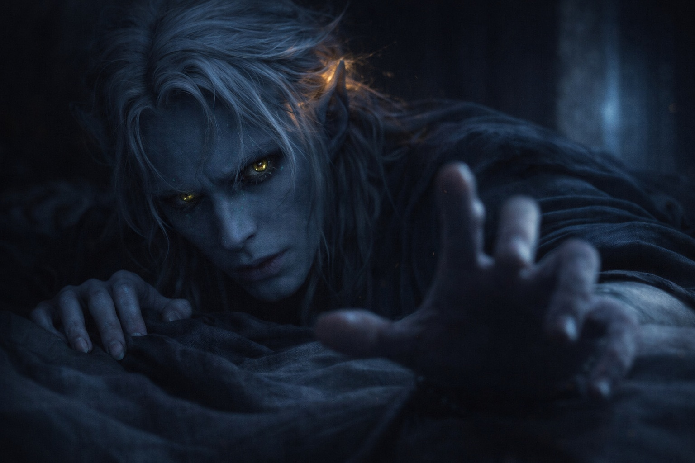
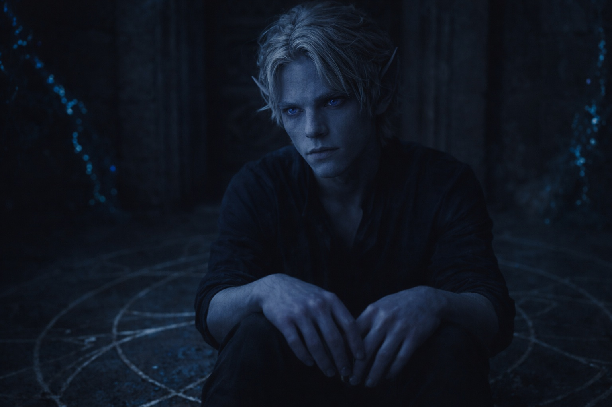

## Capítulo 2 | Parte 2
--- 
 
La presencia se mantuvo. Drusniel se incorporó y se desenredó la sábana de las piernas.

*¿Drusniel? ¿Puedes oírme?*

Las palabras llegaban sin sonido. En la arboleda apenas habían compartido impresiones, la dirección de la atención del otro. Ahora entendía frases enteras.

*¿Annariel?* Formó el pensamiento con cuidado. *¿Cómo? Creía que te habían aislado.*

Una pausa. La presencia parpadeó, como si reuniera fuerzas.

*Sin visitas. Sin cartas.* La voz se hizo más clara. *Pero estás aquí. Puedo llegar hasta ti.*

A Drusniel le ardieron los ojos. Se los apretó con la base de las palmas. Si respondía demasiado deprisa, Annariel notaría cuánto había necesitado aquello, y eso tampoco podía soportarlo. Esperó hasta poder formar un pensamiento sin que se le deshiciera.

*Encontraste la manera.*

*Encontré una manera.* La calidez se mantuvo a través de la conexión, a pesar de la distancia entre ambos. *No tienes que pasar por esto solo. Dime cómo estás.*

Drusniel casi se rio. Cómo estaba. ¿Qué podía responder sin que pareciera una queja por el éxito de Annariel? Se alegraba de que su amigo hubiera aprobado. Tenía que ser capaz de decir eso, al menos.

*No estoy herido*, envió con cuidado. *Si es a eso a lo que te refieres.*

*¿Y la prueba? ¿Ese instante en que la conexión se cortó?*

Drusniel se quedó inmóvil. *¿Tú también lo sentiste?*

*Intentaste alcanzarla y algo se interpuso.*

*¿Me crees?* Drusniel no había querido preguntarlo así.

*Pensé que lo había imaginado*, envió. *Pensé que quizás lo quería tanto que me convencí de que era real.*

*No te lo imaginaste. No dejes que te convenzan de lo contrario.*

Drusniel se abrazó las rodillas. La cabeza le dolía cada vez más al sostener la conexión, pero aún no soportaba la idea de cortarla. Podía hablar con Annariel. Al día siguiente seguirían las órdenes de su padre y los sirvientes evitando mirarlo, pero esa noche podía hablar con Annariel.

*¿Qué hago?*, preguntó. *Padre quiere que vuelva a los ejercicios. Ni siquiera escucha lo que pasó.*

*Entonces pregunta a alguien dispuesto a escucharte.*

*Los magos no escuchan. Mi familia tampoco. ¿Quién queda?*

*Los salones de entrenamiento no son el único lugar donde se puede aprender.*

*¿Dónde más?*

*Hay un mago en la superficie que enseña al margen de los ritos de Venemora. Estudia cómo funcionan las conexiones. Cómo pueden romperse.*

A Drusniel le dio un vuelco el corazón. La superficie. Donde los drow no iban. Donde la luz del sol mataba.

*¿Quieres que vaya a la superficie?*

*Quiero que tengas respuestas. Zaelar podría darte algunas.*

Zaelar. El pergamino dañado de la arboleda. El exiliado que había encontrado otro camino al poder.

*He escuchado ese nombre*, envió lentamente. *Rumores. Malos.*

*Pues pregunta también por ellos. No necesitas confiar en él para hacerle una pregunta.*

Las palabras lo reconfortaron a pesar suyo. La superficie era peligrosa. También lo era un mago del que Umbra'kor solo hablaba en susurros.

*Lo pensaré*, envió.

*Piénsalo.* La presencia se debilitó. *Volveremos a hablar.*

*Annariel...*

*No estás solo en esto, Drus.*

Entonces la presencia se fue.

Hundió la frente en la almohada hasta que el dolor detrás de los ojos empezó a ceder.

La superficie. Nunca había estado sobre el suelo. Las historias decían que la luz del sol podía matar a un drow en minutos. Que el aire mismo estaba mal, demasiado delgado, demasiado brillante.

Necesitaría una capa, agua y una ruta de regreso antes de que el sol superara las crestas. Se descubrió repasando los mapas que había visto en el estudio de su padre.

No había aceptado ir. Solo estaba recordando el camino.

---

**Fin de Capítulo 2.2 —> 2.3: [Voces en la Oscuridad: La Semilla de la Duda](/voces-en-la-oscuridad-la-semilla-de-la-duda/)**
