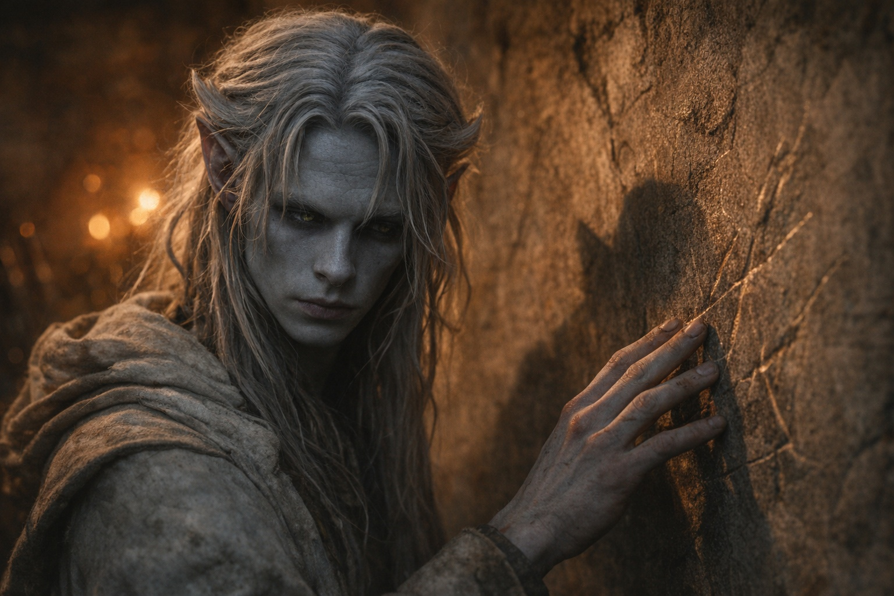
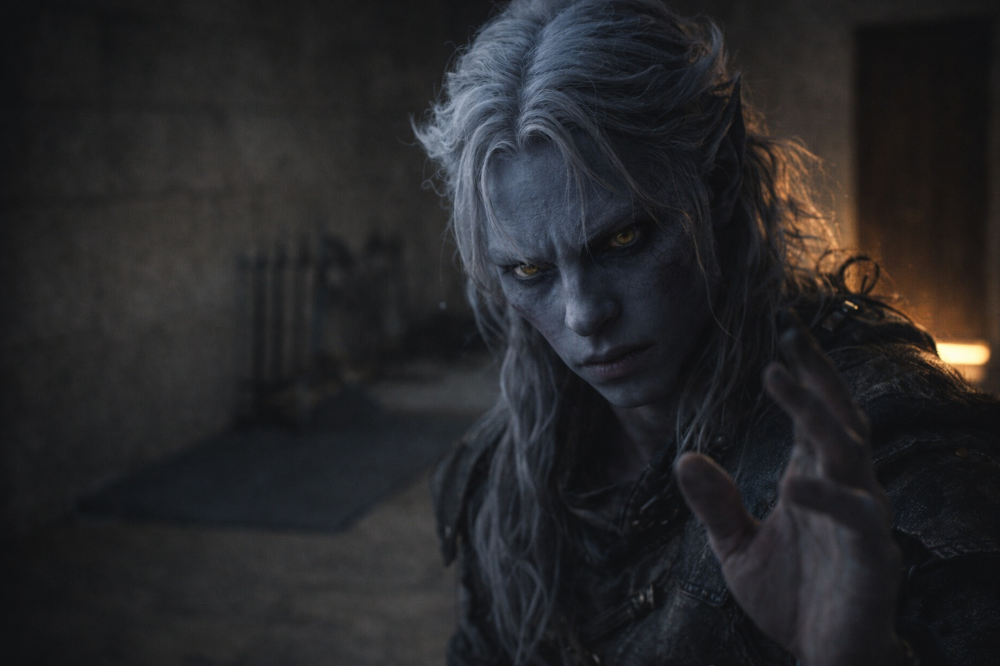

## Capítulo 2 | Parte 1
--- 

Tres días después de la prueba, Drusniel dejó de salir de su habitación.

Su madre dejaba comida fuera de la puerta. Con ella aparecía ropa limpia. Su padre no decía nada. Shyntara llamó dos veces el primer día y luego dejó de hacerlo.

Él lo prefería así.

La sala de entrenamiento estaba contigua a sus aposentos: un espacio privado que su familia había construido para perfeccionar el trabajo con cuchillos y el movimiento silencioso. Drusniel lo usaba para otra cosa ahora. Permanecía de pie en el centro del suelo de piedra desnuda y alcanzaba.

No intentaba alcanzar a Venemora ni su bendición. Simplemente alcanzaba, como él y Annariel habían practicado durante años, buscando aquella presión familiar en el borde de la consciencia.

Nada.

Alcanzó de nuevo. Con más fuerza.

El vacío respondió. Esa ausencia lisa donde la conexión debería residir. Como presionar contra una pared que no debería existir.

Los ojos de Drusniel siguieron una fractura fina en el suelo de piedra. Se bifurcaba dos veces antes de perderse bajo la estera de entrenamiento.

La prueba volvía una y otra vez. Se había preparado. Había practicado. Había sentido algo acercándose, y el rostro de Annariel hacía más difícil descartarlo como imaginación. Luego había desaparecido.

¿Qué había cambiado?

Al cuarto día, se aventuró a los corredores del recinto.

Una sirvienta pasó junto a él en el pasillo. Los ojos de la mujer se deslizaron sobre Drusniel como si no estuviera ahí, y luego se apartaron. Aceleró el paso. Drusniel la escuchó susurrar a otra sirvienta al final del corredor: —Ese es el que...

La frase murió sin terminar. Ambas se apresuraron a alejarse.

Drusniel permaneció solo en el pasillo, con la mirada fija en una grieta del muro del corredor donde la piedra se había asentado. La siguió hasta que los sirvientes desaparecieron.

*Muerte social.* Había escuchado el término antes pero nunca lo había entendido. Los candidatos fallidos no solo perdían estatus: se volvían incómodos de mirar. Recordatorios de que el sistema podía rechazar a cualquiera. Que la bendición de Venemora no estaba garantizada.

Nadie quería pensar en eso. Así que nadie lo miraba.

Regresó a su habitación. Cerró la puerta. Alcanzó de nuevo.

Nada.

---

Al quinto día, Shyntara lo atrapó en la sala de entrenamiento.

Se movió en silencio, por supuesto que lo hizo, era la mejor de la familia, pero Drusniel sintió el aire cambiar cuando la puerta se abrió. Una habilidad que había desarrollado en la arboleda, percibir cambios en la presión. Todavía funcionaba. Pequeño consuelo.

—Necesitas comer —dijo ella.

Drusniel no se dio la vuelta. —Comí.

—Medio panecillo. Ayer. —Sus pasos cruzaron el suelo de piedra—. Y necesitas dormir. Padre dice que caminas de noche. Te escucha a través de las paredes.

*Padre.* Que siempre había preferido precisamente el futuro que este fracaso le dejaba.

—Estoy bien.

—No lo estás. —Shyntara se detuvo detrás de él. Lo suficientemente cerca como para que pudiera sentir su presencia, el calor de otro cuerpo en la habitación fría—. Drusniel. Mírame.

Se dio la vuelta. El rostro de su hermana portaba algo que no esperaba: no lástima, no juicio. Preocupación. La misma expresión que había tenido cuando él tenía doce años y se rompió la muñeca cayendo de un aparato de entrenamiento.

—Hice todo bien —dijo. Las palabras salieron agrietadas—. Todo, Shyn. Sentí que funcionaba. Y entonces...

—Entonces no funcionó. —Su voz era gentil pero firme—. Eso pasa. No significa...

—No. —Retrocedió un paso—. No entiendes. No fue un fracaso. Fue... —Se detuvo. ¿Cómo podía explicar la sensación de que algo había sido tallado y arrancado? ¿Cómo podía describir alcanzar hacia una extremidad y encontrar solo el recuerdo de dónde había estado?

Ella no le creería. Nadie lo haría.

—¿Fue qué? —preguntó Shyntara.

Drusniel negó con la cabeza. —Nada. No importa.

—Te importa a ti. Eso es obvio. —Alcanzó hacia su brazo, pero él se apartó—. Habla conmigo. O habla con Padre. O...

—No hay nada de qué hablar. —Su voz salió más dura de lo que pretendía—. Fallé. El camino del asesino siempre fue mi vocación. ¿No es eso lo que dijo Padre? La magia era una distracción. Ahora eso está resuelto.

Los ojos de Shyntara se entrecerraron.

—Bien —dijo en voz baja—. Mátate de hambre. Camina toda la noche. Finge que estás bien. —Se volvió hacia la puerta—. Pero cuando estés listo para dejar de mentirte a ti mismo, estaré aquí.

Se detuvo en el umbral, con una mano sobre el marco.

Entonces enderezó los hombros y se fue.

La puerta se cerró tras ella.

Su pulgar golpeteó contra sus dedos. Cuarenta y siete. Cuarenta y ocho. Cuarenta y nueve.

Dejó de contar.

---

En la sexta noche, algo cambió.

Drusniel yacía en la oscuridad, mirando el techo. Su cuerpo dolía por días de alcanzar, de práctica fallida, de dormir en fragmentos entre episodios de caminar de un lado a otro. La comida no sabía a nada. Los colores parecían más opacos. Incluso su ira se había aplanado, reemplazada por un agotamiento gris que no se levantaba.

Cerró los ojos. No para dormir. Solo para descansar.

Y lo sintió.

Un destello. Una calidez en el borde de la consciencia. Distante, pero inconfundible.

*Presencia.*

Los ojos de Drusniel se abrieron de golpe. Su corazón martillaba —setenta y uno, setenta y dos—

La calidez pulsó de nuevo. Más cerca ahora. Como una voz llamando a través de la niebla.

Imposible. Los magos habían aislado a Annariel. Sin contacto exterior. Esa era la regla.

Pero la presencia se sentía familiar. La textura de ella, la calidez específica. Como una huella dactilar que Drusniel había memorizado a lo largo de años de práctica secreta.

Casi.

Algo era diferente. Un ligero retraso en el ritmo, como un eco llegando medio tiempo tarde. Pero estaba cansado, y desesperado, y había pasado tanto tiempo desde que había sentido algo más que vacío...

Alcanzó hacia ella. Tentativo. Con miedo de tener esperanza.

La presencia alcanzó de vuelta.

Y entonces, imposiblemente, una voz en su mente:

*¿Drusniel?*

Su aliento se cortó. Sus manos temblaron contra las sábanas.

La voz sonaba como Annariel. Se sentía como Annariel. Lo bastante cercana para que Drusniel quisiera que las diferencias no importaran.

*¿Annariel?*

---

**Fin de Capítulo 2.1 —> 2.2: [Voces en la Oscuridad: La Voz Distante](/voces-en-la-oscuridad-la-voz-distante/)**