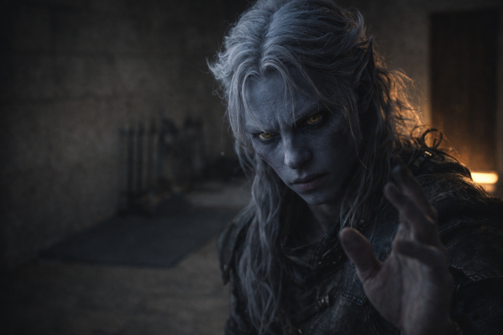

## Capítulo 2 | Parte 1
--- 

Tres días después de la prueba, Drusniel dejó de salir de su habitación.

Su madre dejaba comida junto a la puerta. Para cuando se acordaba de comer, al caldo ya se le había formado una película. Su padre no decía nada. Shyntara llamó dos veces el primer día y luego dejó de hacerlo.

Él lo prefería así.

La sala de entrenamiento contigua a sus aposentos se había construido para practicar con cuchillos y moverse en silencio. Drusniel la usaba ahora para otra cosa. Se situó en el centro y trató de establecer contacto.

No buscaba a Venemora ni su bendición. Intentaba sentir la presión familiar en el límite de la consciencia, como había practicado con Annariel durante años.

Nada.

Volvió a intentarlo, con más fuerza.

Encontró la misma ausencia lisa. Mantuvo el intento hasta que empezaron a temblarle los hombros y tuvo que dejarlo.

Los ojos de Drusniel siguieron una fractura fina en el suelo de piedra. Se bifurcaba dos veces antes de perderse bajo la estera de entrenamiento.

Cada intento lo devolvía a la prueba: aquella presión que se acercaba y, después, Annariel mirándolo desde el otro lado de la cámara.

¿Qué había cambiado?

Al cuarto día, se aventuró a los corredores del recinto.

Una sirvienta pasó junto a él en el pasillo. Los ojos de la mujer se deslizaron sobre Drusniel como si no estuviera ahí, y luego se apartaron. Aceleró el paso. Drusniel la escuchó susurrar a otra sirvienta al final del corredor: —Ese es el que...

La frase murió sin terminar. Ambas se apresuraron a alejarse.

Regresó a su habitación, cerró la puerta y volvió a intentarlo.

Nada.

---

Al quinto día, Shyntara lo atrapó en la sala de entrenamiento.

Al abrirse la puerta, una corriente le rozó los tobillos desnudos. Supo que estaba allí y siguió de espaldas.

—Necesitas comer —dijo ella.

Drusniel no se dio la vuelta. —Comí.

—Medio panecillo. Ayer. —Sus pasos cruzaron el suelo de piedra—. Y necesitas dormir. Padre dice que caminas de noche. Te escucha a través de las paredes.

*Padre.* Que siempre había preferido precisamente el futuro que este fracaso le dejaba.

—Estoy bien.

—No lo estás. —Shyntara se detuvo detrás de él. Lo suficientemente cerca como para que pudiera sentir su presencia, el calor de otro cuerpo en la habitación fría—. Drusniel. Mírame.

Se volvió. Lo miraba como cuando se había roto la muñeca a los doce años, buscando una lesión que él se negaba a reconocer. Había ocultado aquella fractura medio día, hasta que ella notó que comía con la izquierda. Esta vez no había una hinchazón que pudiera mostrarle ni un hueso que ella pudiera colocar.

—Sentí que funcionaba —dijo—. Shyn, lo sentí.

—Enséñame dónde te duele. —Le miró las manos—. Si hay una lesión, podemos...

—No hay nada que enseñar. —Retrocedió antes de que pudiera tocarlo—. Ese es el problema.

—Entonces cuéntame qué pasó. Desde el principio.

—Ya oíste a Padre. Mañana, a la terraza este. Hemos perdido suficiente tiempo de entrenamiento.

Los ojos de Shyntara se entrecerraron.

—Te he traído comida, Drusniel. No un horario de entrenamiento. —Se volvió hacia la puerta—. Cómetela antes de que se enfríe.

Se detuvo en el umbral, con una mano sobre el marco.

Entonces enderezó los hombros y se fue.

La puerta se cerró tras ella.

Levantó la tapa del cuenco. También le había traído una cuchara. Tendría que comer algo antes de que ella volviera a comprobar si lo había tocado.

---

En la sexta noche, algo cambió.

Drusniel seguía despierto, con la ropa de cama enredada en las piernas. Le dolía el cuerpo de tanto intentar alcanzar la conexión y dormir a ratos entre paseos por la habitación. La comida apenas había sabido a nada, incluso caliente. Antes había intentado reunir rabia suficiente para bajar al estudio de su padre, pero no había pasado de ponerse los zapatos. No recordaba cuándo había dormido por última vez hasta la mañana.

Cerró los ojos.

Y lo sintió.

Un destello. Una calidez en el borde de la consciencia. Distante, pero inconfundible.

*Presencia.*

Volvió a abrirlos.

La calidez volvió cuando intentó alcanzarla. El dolor de cabeza se agudizó.

Imposible. Los magos habían aislado a Annariel. Sin contacto exterior. Esa era la regla.

Pero conocía aquella presión de la arboleda. O eso creía.

Lo intentó de nuevo, con cuidado de no ahuyentarla.

La presencia respondió.

Y entonces, imposiblemente, una voz en su mente:

*¿Drusniel?*

Su aliento se cortó. Sus manos temblaron contra las sábanas.

Conocía aquella voz.

*¿Annariel?*

---

**Fin de Capítulo 2.1 —> 2.2: [Voces en la Oscuridad: La Voz Distante](/voces-en-la-oscuridad-la-voz-distante/)**
