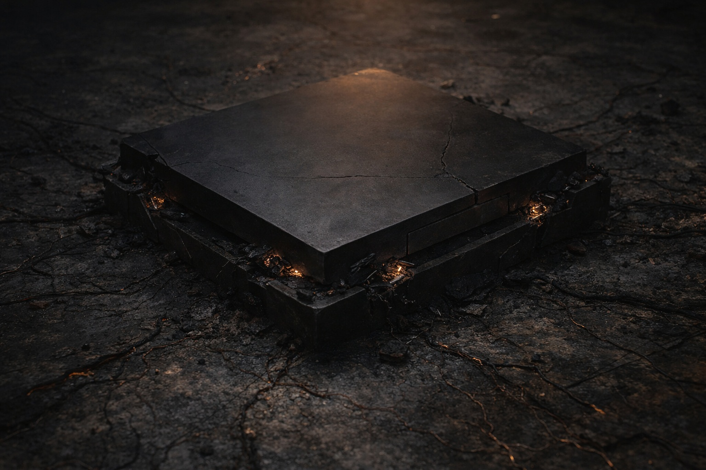

---
order: 1330
title: "Ceniza y Silencio: El Silencio"
description: "La Voz nunca había sido amable. Pero había estado presente."
date: 2024-11-12
language: es
chapter: 44
subchapter: 2
storyline: drusniel
canon_phase: main
canon_sequence: D-044-002
narrative_weight: high
category: Wyrmreach
author: Drusniel
type: Main
tags: ['#ceniza y silencio', '#drusniel', '#wyrmreach']
thumbnail: image.jpg
featured: false
counterpart_path: site/content/posts/en/wyrmreach/ash-and-silence-the-silence/index.mdx
counterpart_title: "Ash and Silence: The Silence"
---

# Capítulo 44.2 | Ceniza y Silencio: El Silencio

---

Buscó a la Voz.

Buscarla no fue una decisión. Fue el mismo reflejo que respirar, la misma acción involuntaria que el tamborileo del pulgar contra su muslo; el tipo de movimiento que el cuerpo ejecuta porque lo ha hecho tantas veces que el patrón ha trazado un surco más profundo que el propio pensamiento. Había estado buscando a la Voz desde el Mar de las Pesadillas. Desde la primera deuda. Desde que aquella presencia fría se había instalado detrás de su esternón y se había quedado allí: intrusa, procedimental, constante. La buscó del mismo modo en que su mano habría buscado una pared en una habitación a oscuras; el instinto de encontrar algo sólido en el espacio donde las cosas sólidas siempre habían estado.

Nada.

No era el silencio del cruce del volcán, donde la Voz se había contraído en un punto de densidad gélida a la espera. No era el silencio de la aproximación a la barrera, donde la Voz había callado porque las deudas estaban a punto de cobrarse y el mecanismo se preparaba para la ejecución. Esos silencios habían estado llenos. Esos silencios contenían algo. El primero había sido expectante. El segundo, deliberado. Ambos habían sido el silencio de una presencia que elegía no hablar, lo cual es exactamente lo opuesto a la ausencia.

Este silencio era una habitación después de que todos se han marchado.

La arquitectura seguía ahí. El espacio detrás de su esternón donde la Voz había vivido, los pasillos mentales que había ocupado, los lugares donde su presencia fría y procedimental había presionado contra sus pensamientos y reformado la manera en que procesaba el mundo. Todo intacto. Todo vacío. La Voz no había dañado la habitación al salir. No había quemado los muebles ni arrancado las paredes. Simplemente había recogido sus pertenencias y cerrado la puerta, porque el contrato había terminado y el inquilino no tenía más razón para quedarse.

Buscó de nuevo. El mismo reflejo. El mismo surco en el patrón. Y el patrón no encontró nada, y la nada resonó en el espacio vacío, y el eco fue peor que la ausencia porque el eco le dijo que el espacio era lo suficientemente grande como para haber contenido lo que contenía, lo que significaba que el espacio era lo suficientemente grande como para estar vacío de una forma que se sentía estructural.

Las deudas estaban pagadas. Entendía eso con la claridad que su mente analítica proporcionaba sobre cada tema que tocaba. La Voz había invertido: pulmones sostenidos en el Mar de las Pesadillas, compañeros alimentados durante el cruce, paso a través de las montañas, la adaptación cristalina que había rehecho su cuerpo en algo compatible con la barrera. Cada inversión había acumulado intereses. Los intereses se habían cobrado en el acto. El contacto del artefacto con la interfaz de la barrera había sido el retorno sobre toda la cartera, y el retorno había sido suficiente, y la cuenta estaba cerrada, y la Voz no tenía más reclamo sobre él porque la Voz operaba bajo la lógica de la transacción y la transacción estaba completa.

Debería haberse sentido libre. La palabra se presentó sola, la mente analítica que la probó como probaba cada concepto disponible. Libre. Desatado. Liberado. Las deudas pagadas, las obligaciones cumplidas, el mecanismo que lo había impulsado a través de Wyrmreach, a través de la zona de la barrera y hacia el acto, ya no operativo. Era, por primera vez desde el Mar de las Pesadillas, una persona sin deudas con nadie.

La libertad se sentía como la pared que faltaba. Buscó y no encontró nada que sostener, y la nada no era liberación. La nada era la ausencia de estructura, y se había apoyado contra esa estructura durante tanto tiempo que su eliminación lo dejó desequilibrado de una forma que no tenía nada que ver con sus costillas dañadas.

Intentó hablarle.

No en voz alta. Hacia adentro, del modo en que la comunicación con la Voz siempre había funcionado, la interpelación silenciosa que era menos lenguaje que orientación, el giro de la atención hacia la presencia que vivía detrás de su esternón. Se giró. La presencia no estaba ahí. Habló de todos modos, al espacio vacío, como una persona le habla a una habitación donde alguien que conocía solía sentarse, no porque espere una respuesta sino porque el hábito de dirigirse a ese espacio es más viejo que el conocimiento de que el espacio está vacío.

Nada respondió. La nada era total. No hostil, no cálida, no fría, no procedimental. Solo nada. La vacancia absoluta de un lugar que había sido ocupado y ahora no lo estaba.

La Voz nunca había sido amable. Sostuvo ese hecho en su mente y lo examinó como examinaba cada hecho, con la precisión de una persona que necesitaba entender las cosas para sobrevivir a ellas. La Voz había sido fría. Procedimental. Transaccional. Había hablado en declaraciones, no en conversaciones. Había nombrado sus deudas con la indiferencia de un libro de contabilidad. Había cobrado esas deudas con la eficiencia de un mecanismo diseñado para cobrar deudas. Nunca había explicado. Nunca había consolado. Nunca había ofrecido lo que no se le debía ni dado lo que no estaba pagado. La Voz había ocupado su mente del modo en que el clima ocupa un cielo: presente, poderoso, indiferente al paisaje sobre el que se mueve.

Y la echaba de menos.

Ese era el costo. No las quemaduras, no la magia desaparecida, no los cristales muertos, no la sangre ni las costillas ni la ruina de su cuerpo. Esos eran costos que podían catalogarse, medirse y comprenderse. Este era el costo que su mente analítica no podía archivar porque el costo era la ausencia de aquello que había moldeado su manera de archivar. Echaba de menos la presencia fría detrás de su esternón. Echaba de menos la voz procedimental que nombraba sus deudas. Echaba de menos la estructura de la obligación, la arquitectura de la transacción, el conocimiento de que algo ocupaba el espacio detrás de sus pensamientos y que ese algo tenía planes para él y que los planes, por fríos que fueran, por transaccionales, por destructivos que resultasen a la larga, eran al menos planes.

Había sido una persona con un propósito. El propósito había sido el de la Voz, conferido mediante la deuda, pero había sido un propósito, y había organizado sus días y su dirección y sus decisiones, y sin él era una persona de pie en un edificio dañado, sin dirección, sin propósito y sin voz en su cabeza que le indicara hacia dónde apuntar.

Uno, dos, tres, cuatro. Su pulgar contra su muslo. El conteo que era suyo. Que siempre había sido suyo. Que no tenía nada que ver con la Voz ni con el artefacto ni con la barrera ni con el sistema. Uno, dos, tres, cuatro. La estructura mínima que una persona podía mantener cuando toda otra estructura había desaparecido.

Caminó.

No en una dirección. No hacia nada. Solo caminó, porque quedarse quieto en el interior dañado era peor que moverse a través de él, y el cuerpo que había sido inventariado y hallado en ruinas aún tenía piernas que funcionaban, y las piernas querían moverse porque moverse era mejor que existir en un solo lugar con el silencio que colmaba el espacio donde la Voz había estado.

El interior de la barrera era vasto. Lo recorrió. Más allá del artefacto muerto en el suelo, que no recogió, porque el artefacto era una herramienta cumplida y recogerlo habría sido cargar una piedra por el hecho de cargar una piedra.

Más allá de las fracturas en la cúpula donde el cielo ámbar-óxido se derramaba. Más allá de las venas de energía oscuras en el suelo que alguna vez habían latido con mil años de mantenimiento drow y ahora no contenían nada.

El silencio caminó con él. Siempre caminaría con él. Esa era la lección final de la dependencia, entregada después de que la dependencia había terminado, en el espacio donde la dependencia había vivido: no echas de menos lo que necesitas. Echas de menos lo que estaba ahí.

---

**Fin del Capítulo 44.2 — continúa en el Capítulo 44.3: [Ceniza y Silencio: La Quietud](/ceniza-y-silencio-la-quietud/)**

