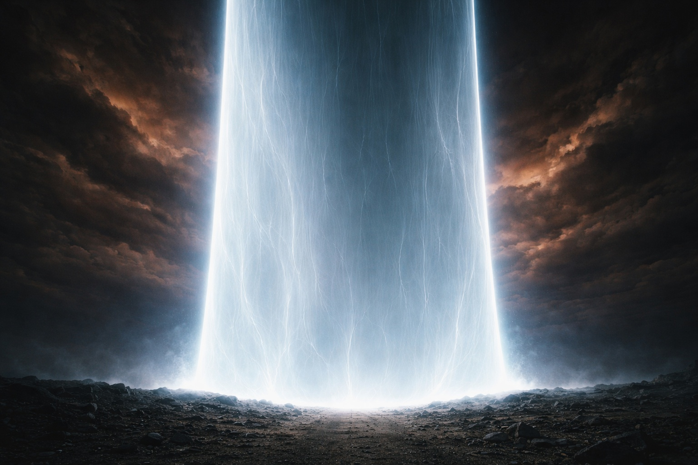
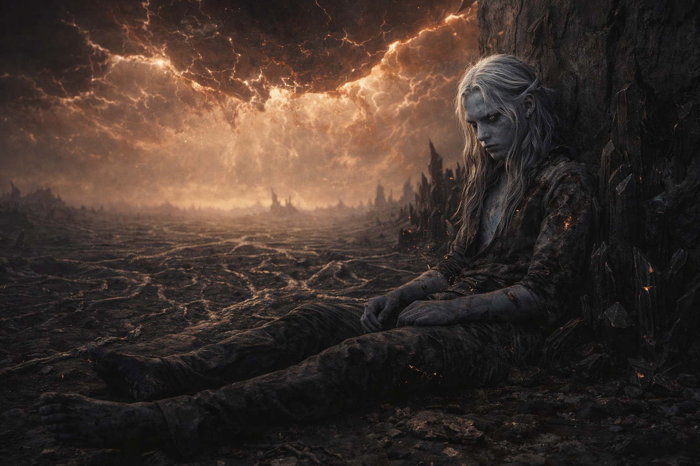

## Capítulo 44 | Parte 3 | La Quietud

---

Encontró el límite interior de la barrera.

No el límite del daño. El daño se extendía más allá del interior, más allá de la cúpula, más allá de los mecanismos que habían sido construidos para contener, mantener y proteger. El daño era atmosférico, ambiental; el tipo de alteración que carece de bordes porque se ha convertido en el medio a través del cual se mueve todo lo demás. Pero el interior tenía una pared, o lo que quedaba de ella. Caminó hasta allí y se sentó apoyando la espalda, porque sus piernas lo habían llevado tan lejos como podían y sus costillas le informaban, cada vez con mayor precisión, que el costo de estar de pie era más alto que el costo de estar sentado.

Se sentó.

La pared de la barrera a su espalda estaba fría. La piedra había sido diseñada para regular la temperatura como parte del protocolo de mantenimiento del sistema, pero el protocolo ya no operaba. Así que la piedra era simplemente piedra, y la piedra en Wyrmreach era fría. Se apoyó contra ella. El frío traspasó su ropa hasta alcanzar su piel quemada, y las quemaduras respondieron con un ardor sordo que se estabilizó en un dolor constante. El dolor era información. Lo archivó junto con el resto de los datos que su cuerpo le proporcionaba, ese inventario continuo que su mente no podía dejar de ejecutar porque había sido entrenada para ello, y el entrenamiento no respetaba el hecho de que el inventario fuera, en realidad, una lista de ruinas.

Un ámbar oxidado llenaba el espacio sobre la cúpula fracturada. El color se había asentado. Sin cambiar, sin profundizarse, sin desvanecerse. Asentado, del modo en que una condición permanente se asienta en aquello que ha cambiado. Las nubes que se movían a través de él seguían patrones que no eran patrones de viento; la contaminación atmosférica creaba corrientes que obedecían reglas que el viejo mundo no había establecido.

Nyxara no vino.

No la había esperado. La expectativa era otro hábito, otro surco desgastado por semanas de su presencia, la compañera que había volado sobre él y junto a él y cuyas conversaciones habían sido los intercambios más honestos de su viaje. Pero Nyxara operaba a una escala que no incluía esto. La Conquista Dragón era un plan que se medía en siglos, y la brecha era un éxito o un revés en ese plan, y de cualquier manera el siguiente paso del plan no pasaría por sentarse junto a un drow dañado en un edificio dañado mientras inventariaba su ruina. Ella había obtenido lo que necesitaba de la brecha, o no lo había obtenido, y en ambos casos había pasado a la siguiente operación, y la siguiente operación era a una escala que no tenía un componente del tamaño de un drow.

Se preguntó si ella se habría sentado con él si las escalas fueran diferentes. Si ella hubiera sido lo que se había permitido creer que era: una compañera, una aliada, una persona cuya comprensión del deber y el costo coincidía con la suya. Si la distancia entre lo que ella era y lo que él necesitaba hubiera sido lo suficientemente pequeña como para tender un puente. Se preguntó, y la pregunta era inútil, y su mente la procesó de todos modos porque su mente procesaba todo.

Srietz estaba en algún lugar.

La barrera lo había rechazado. Suavemente. Absolutamente. El rechazo había sido el protocolo de la barrera para componentes no compatibles, y Srietz no había sido compatible, y el protocolo lo había empujado de vuelta con la eficiencia de una cerradura que reconoce la llave equivocada y la devuelve. Srietz debería estar vivo. El rechazo no estaba diseñado para matar. Estaba diseñado para redirigir, y Srietz era resistente de formas que no tenían nada que ver con su cuerpo y todo que ver con el hecho de que Srietz no dejaba de existir porque un sistema se lo dijera.

Elion estaba con Srietz. Probablemente. El Sabio había gritado cuando la barrera los rechazó, la conexión del Sabio con la disrupción de la barrera abrumó al anfitrión, y Elion se había desplomado. Pero Srietz lo habría cargado. Srietz habría sopesado el peso, la distancia y la probabilidad, y habría actuado de todos modos, porque la relación de Srietz con la probabilidad era que la probabilidad era problema de otro.

Estaban allá afuera. Más allá de la zona de la barrera. Vivos. Dañados. Esperando, o caminando, o haciendo lo que fuera que Srietz decidiera que necesitaba hacerse cuando la persona a la que había seguido hacia la catástrofe no volvía por la puerta.

No podía verificar. Su magia se había ido. Los sistemas de comunicación de la barrera estaban apagados. La distancia entre donde estaba sentado y donde ellos deberían estar era solo distancia física, y la distancia física requería piernas, y sus piernas habían dejado clara su posición respecto al servicio adicional.

Se sentó. La pared detrás de él. La cúpula fracturada arriba. El suelo oscuro en cada dirección, las venas muertas como un mapa de un sistema que ya no existía. La luz ámbar-óxido llenaba el espacio con la calidad de un crepúsculo permanente, ni día ni noche; la atmósfera contaminada producía una luz que no contenía tiempo.

No quedaba nada que catalogar.

El hábito buscó números y no encontró ninguno. Buscó categorías a continuación y descubrió que el trabajo ya estaba terminado: quemaduras, sangre, magia ida, la Voz ida, cristales muertos, artefacto muerto, costillas dañadas, compañeros reducidos a incertidumbre, propósito reducido a ninguno.

La lista estaba terminada. El hábito ejecutó la lista de nuevo. La lista seguía terminada. El hábito la ejecutó otra vez.

Uno, dos, tres, cuatro. Su pulgar contra su muslo. El conteo que no catalogaba. El conteo que existía por sí mismo, como prueba de continuidad, como evidencia de que la persona que contaba seguía siendo una persona que contaba. Uno, dos, tres, cuatro. El mínimo de individualidad. La acción irreducible de una mente que se negaba a detenerse.

Se sentó en la ceniza bajo un cielo del color equivocado, con silencio absoluto en su cabeza, y eso era todo lo que había.

El tiempo pasó. No estaba seguro de cuánto. El color asentado sobre él no cambiaba de una forma que indicara horas. La luz permanecía constante, el crepúsculo permanente de una atmósfera contaminada, y sin el ciclo de luz y oscuridad el paso del tiempo se volvía teórico. Había pasado algún tiempo desde el acto. Pasaría más tiempo antes de lo que viniera después. El intervalo entre ellos era esto: sentarse, respirar, contar, existir.

Tendría que ponerse de pie. Lo entendía del modo abstracto en que lo entendía todo ahora, como una persona entiende las matemáticas sin poder mover las manos. Tendría que caminar de vuelta a través de la zona de la barrera y descubrir qué quedaba del mundo que había roto. Tendría que encontrar a Srietz y a Elion. Tendría que enfrentar lo que fuera que el mundo cambiado se hubiera convertido y lo que fuera que el mundo cambiado requiriera de una persona que lo había cambiado.

Alguien le preguntaría por qué. Tarde o temprano, alguien miraría la luz oxidada sobre sus cabezas y la magia desestabilizada y la barrera agrietada y le preguntaría a la persona que había estado en el centro de todo por qué lo había hecho. Y tendría que responder, y la respuesta era: porque sus creencias se lo dijeron. Porque el análisis era correcto y el momento era el equivocado y el sistema no distinguía entre ambos. Porque cada decisión que había tomado había seguido el análisis más limpio que podía producir, y aun así el momento lo había traído aquí, y aquí era ceniza y silencio.

Pero todavía no. Todavía no.

Por ahora se sentó en la ceniza bajo un cielo del color equivocado, con silencio absoluto en su cabeza, y el conteo latiendo en su pulgar, y las costillas dándole parte de su estado, y las quemaduras asentadas en su dolor permanente. Por ahora existía, que era el mínimo que una persona podía hacer, e incluso eso se sentía como demasiado, e incluso demasiado seguía sucediendo, y el suceder era prueba de vida en un cuerpo que había cumplido su función y ahora era excedente de los requerimientos.

Uno, dos, tres, cuatro. El conteo no significaba nada y lo significaba todo a la vez. Decía lo único que quedaba por decir: sigo aquí.

Sigo aquí.

---

Nyxara observó cómo se asentaba la ceniza.

Él ya no era un superviviente. A los supervivientes se los cuenta después de la catástrofe. A él habría que contarlo antes de la siguiente.

Astalor lo aprendería muy pronto.

Se volvió.

—Muévanse.

La orden se transmitió de inmediato. Que otros confundieran esto con las secuelas. Lo único que había cambiado era la escala.

---

**Fin del Capítulo 44.3 —> 45.1: [Lo Que Sigue: El Regreso de los Cazadores](/lo-que-sigue-el-regreso-de-los-cazadores/)**

