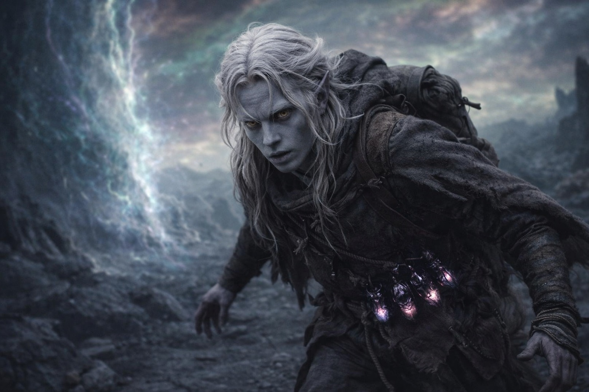
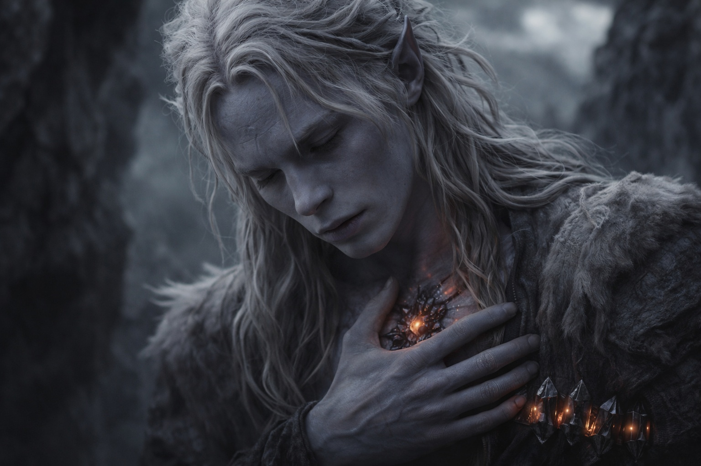
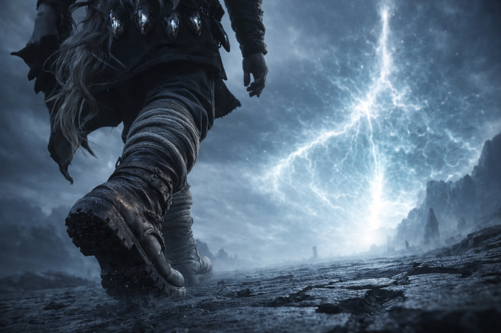
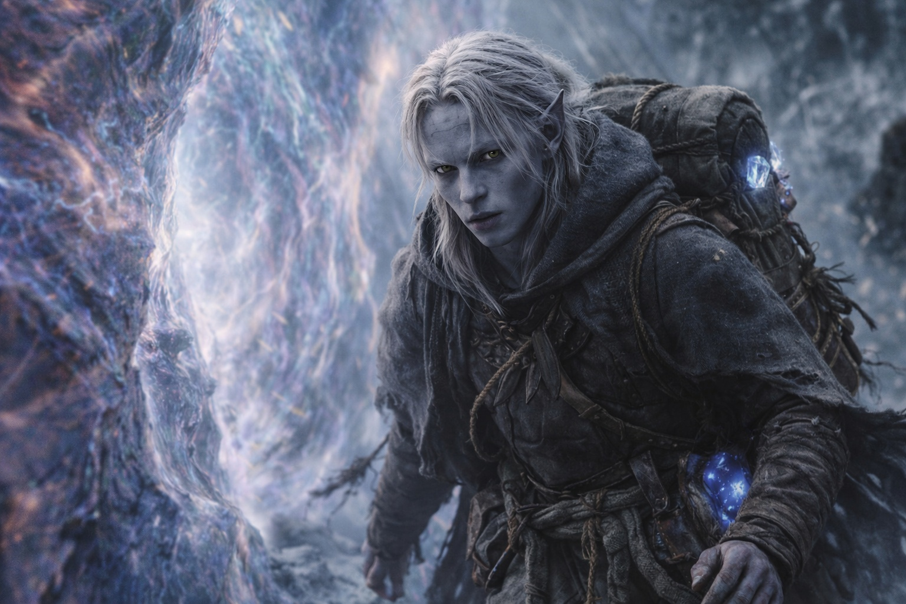
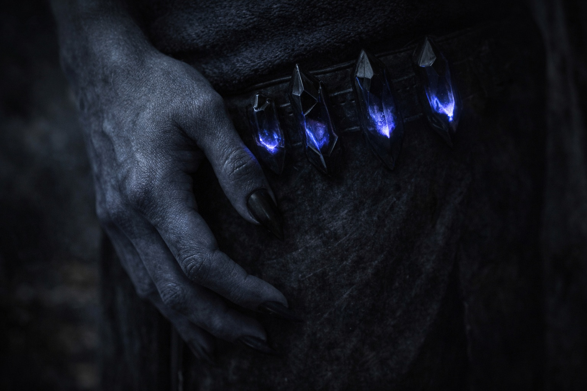

## Capítulo 39 | Parte 2 | La Llamada

---

La Voz habló del modo en que gira una cerradura: porque la llave ha sido insertada y el mecanismo no tiene otra función.

Drusniel estaba caminando. Treinta pasos del campamento. La distorsión de la barrera adelante, el cielo sin nombre sobre él, la piedra oscura bajo sus pies vibrando con el ritmo que sus cristales igualaban. Su mochila a la espalda. El Nulo dentro de ella, cálido contra su columna, más cálido de lo que había estado ayer, más cálido de lo que había estado hace una hora, el artefacto respondiendo a la proximidad del modo en que una brújula responde al norte: no con emoción, no con propósito, con alineación.

EL AGUA TE TOMÓ.

Las palabras llenaron su cráneo del modo en que lo habían llenado dos días antes: exhaustivamente, sin rincones sin tocar. No un susurro. No una intrusión. Una presencia que ocupaba la arquitectura de su mente porque la arquitectura había sido construida para esta ocupación, como una cama se construye para un cuerpo, como una cerradura se construye para una llave.

SOSTUVE TUS PULMONES. EL MAR LOS HABRÍA LLENADO. LOS MANTUVE CERRADOS. COSTE: PAGADO. RETORNO: DEBIDO.

El Mar de Pesadillas. Drusniel sintió el recuerdo aterrizar en su pecho con el peso de una deuda que se asienta sobre una balanza. Sus pulmones. El momento en que el agua se había cerrado sobre él y su cuerpo había dejado de ahogarse porque algo dentro de él había tomado el control del mecanismo de la respiración y lo había mantenido cerrado hasta que el agua pasó. Había sobrevivido. No había sobrevivido por acción propia.

La primera deuda se fijó en su lugar. No una metáfora. Una sensación: un cierre, una tensión, como un cerrojo que se desliza en una puerta que no recordaba haber construido.

TUS COMPAÑEROS PASABAN HAMBRE. LA TIERRA NO LOS ALIMENTARÍA. MOSTRÉ EL CAMINO HACIA LA COMIDA. LOS HONGOS EN LA OSCURIDAD. EL AGUA BAJO LA PIEDRA. COSTE: PAGADO. RETORNO: DEBIDO.

Los hongos. El agua. Los momentos en que la supervivencia había aparecido de la nada y él la había aceptado como suerte, como instinto, como la fortuna particular de un hombre que prestaba atención a su entorno. La Voz le estaba diciendo que era inversión. Que cada comida que sus compañeros habían ingerido en las semanas de escasez era una línea en el libro mayor. Que el desayuno de Srietz esta mañana había sido posible gracias al gasto de la Voz, y el gasto se estaba cobrando.

La segunda deuda. Fijada. La tensión en su pecho se profundizó. Sus pies ajustaron el ritmo. Más rápido. No porque eligiera caminar más rápido. Porque su cuerpo estaba respondiendo a las deudas del modo en que una balanza responde al peso: inclinándose.

LA MONTAÑA. EL PASAJE. LA PALABRA QUE PRONUNCIASTE CUANDO EL CALOR SE VOLVIÓ LETAL. PROPORCIONÉ EL CAMINO. LA PALABRA. LA SUPERVIVENCIA. COSTE: PAGADO. RETORNO: DEBIDO.

El volcán. La palabra que había abierto el pasaje a través del corazón de la montaña. La había pronunciado porque la alternativa era arder vivo, y la Voz le había dado la palabra porque la Voz lo necesitaba vivo al otro lado. No misericordia. No ayuda. Inversión madurando. La palabra le había costado algo a la Voz. El coste se estaba cobrando.

Tercera deuda. Fijada. Sus pies se movían. No había decidido caminar más rápido. Pero habría decidido caminar más rápido. Ese era el mecanismo. Esa era la precisión del asunto. La Voz no estaba anulando su voluntad. Estaba eliminando la demora entre sus creencias y su cuerpo. Creía que las deudas debían ser honradas. Su cuerpo las honraba.

LOS CRISTALES. LA ADAPTACIÓN. TU SANGRE ES MI MONEDA, PREPAGADA. TUS PULMONES RESPIRAN ESTE AIRE PORQUE PAGUÉ EL COSTE DE LA MODIFICACIÓN. TU PIEL RESISTE ESTA PRESIÓN PORQUE INVERTÍ EN TU SUPERVIVENCIA. COSTE: PAGADO. RETORNO: DEBIDO.

Su cuerpo. La adaptación que lo había convertido de un drow que debería haber muerto en la primera semana a un conducto capaz de interactuar con la barrera. Cada respiración que tomaba en la atmósfera distorsionada de Wyrmreach era una respiración que la Voz había comprado. Cada paso que daba sobre suelo que debería haber aplastado una biología no adaptada era un paso que la Voz había subsidiado. Su supervivencia era el producto de la Voz, y la Voz estaba cobrando el retorno.

Cuarta deuda. La tensión era completa. Las deudas se asentaron en su pecho como piedras en un pozo, apiladas, contadas, nombradas, cada una tirando de él hacia la barrera con la gravedad de una obligación que su sistema de creencias reconocía como real. Porque las deudas eran reales. La Voz no las había inventado. No las había exagerado. Había pagado. Había invertido. Lo había mantenido con vida. Y ahora estaba cobrando el retorno, y su cuerpo respondía porque sus creencias decían: las deudas deben ser honradas.

CAMINA.

Solo una palabra. Sus pies ya se movían.

—Lo sé —dijo Drusniel.

CAMINA.

—Estoy caminando.

NO A MÍ. A AQUELLO EN LO QUE CREES. SOLO ELIMINÉ LA PAUSA.

Quería discutir. La parte de él que seguía siendo Drusniel y no mecanismo, la parte que sabía que el momento era incorrecto, que sabía que la barrera no debía ser abordada ahora, que sabía que la brecha era el resultado probable. Esa parte quería detenerse. Quería una conversación más con Srietz. Un silencio más con Elion. Una pregunta más que pudiera hacerle a Nyxara que pudiera tener una respuesta diferente.

Sus pies siguieron moviéndose.

La Voz era correcta. No justa. No buena. Correcta. Las deudas eran reales. Las obligaciones eran reales. Su creencia de que las deudas deben ser honradas era real. La Voz no había cambiado sus creencias. No había sobrescrito su mente. Simplemente había conectado sus creencias con su cuerpo y eliminado la pausa entre saber y actuar. La pausa donde vivía la duda. La pausa donde la vacilación podría haber construido un resultado diferente.

Podía resistirse. Físicamente. Probablemente. Sus piernas eran suyas. Sus músculos eran suyos. Podía plantar los pies y detenerse y la Voz no lo empujaría hacia adelante porque la Voz no manipulaba como un titiritero. Obligaba. Y la obligación solo funcionaba porque las creencias detrás de ella eran genuinas, y las creencias de Drusniel eran genuinas, y sabía que eran genuinas, y ese era el horror: no que su voluntad hubiera sido arrebatada, sino que su voluntad estaba de acuerdo.

Caminó. La distorsión de la barrera creció. El cielo se inclinó más bajo. El suelo pulsaba con el latido de un sistema que lo reconocía, que leía su sangre adaptada por cristales y sus dobles afinidades y el componente del Nexus en su mochila, y respondía con el reflejo de apertura de un mecanismo que había estado esperando exactamente esta configuración.

Su pulgar tamborileaba contra su muslo. Uno, dos, tres, cuatro. La cuenta, lo único que seguía siendo suyo. El único movimiento que su cuerpo hacía que la Voz no había reclamado.

Uno, dos, tres, cuatro. Las deudas tiraban. La barrera esperaba. Detrás de él, un goblin presionaba sus pequeñas manos contra una pared invisible y contaba un porcentaje que había sido verdad desde el principio.

---

**Fin del subcapítulo  —> 39.3**

---

| | |
|---|---|
| ⬅ Anterior | Siguiente ➡ |
| [Deber Sin Demora: La Mañana](/deber-sin-demora-la-manana/) | [Deber Sin Demora: Los Que Quedan](/deber-sin-demora-los-que-quedan/) |
