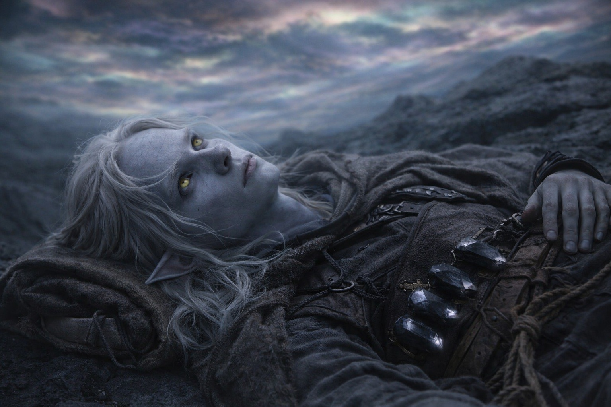
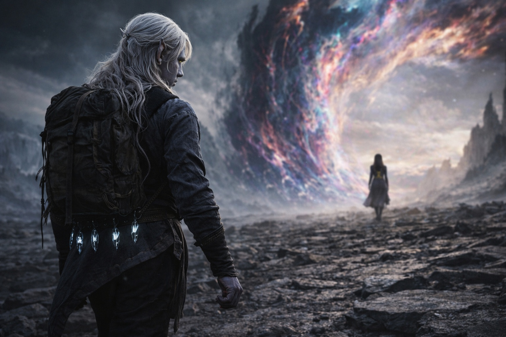

## Capítulo 39 | Parte 1 | La Mañana

---

Lo supo antes de abrir los ojos.

El saber no era pensamiento. Era hueso. Era la certeza particular que llega cuando el cuerpo ha terminado de calibrarse para algo que la mente aún no ha aceptado, como una persona sabe que está enferma antes de que los síntomas se declaren, como un marinero sabe que el clima va a cambiar antes de que el cielo cambie. Drusniel yacía sobre la piedra oscura con su mochila bajo la cabeza y el Nulo contra su cadera y los cuatro cristales zumbando su frecuencia baja y constante en su cinturón, y lo supo: hoy era el día, del mismo modo en que sabía su propio nombre: sin evidencia, sin argumento, sin la posibilidad de estar equivocado.

Abrió los ojos. El cielo tenía el color de una herida que no había decidido si cicatrizar o abrirse. La distorsión sobre él había descendido durante la noche, los colores sin nombre ahora lo bastante cerca como para distinguir bandas individuales de luz que su cerebro procesaba como visibles pero su vocabulario se negaba a categorizar. El aire tenía un peso, una presión que sus pulmones adaptados manejaban y su mente no adaptada registraba como el equivalente atmosférico de ser observado.

Srietz había preparado el desayuno.

Dos porciones. Una para Drusniel. Una para él. El goblin estaba sentado seis pasos más allá, de espaldas al grupo, comiendo con la eficiencia mecánica de alguien que trataba la comida como combustible en lugar de experiencia. No se volvió cuando Drusniel se incorporó. No habló. No ofreció el comentario continuo que normalmente acompañaba cada comida, cada momento, cada respiración que Srietz tomaba en la cercanía de otras personas. El goblin que narraba el mundo en tercera persona, que construía muros de palabras entre él y cada sentimiento que amenazaba con ser directo, estaba desayunando en silencio.

Colocó la segunda porción frente a Drusniel. Carne seca. Pan duro de las últimas provisiones. Agua de un odre que se había congelado durante la noche y había sido descongelado contra su cuerpo. Lo colocó sin una palabra, sin mirarlo, sin la elaborada actuación que normalmente acompañaba todo lo que Srietz hacía.

Esa fue la despedida.

Drusniel comió cada bocado. La comida sabía a lo que era. Masticó despacio porque masticar despacio era lo único que controlaba esta mañana que no cargaba peso.

Elion estaba sentado contra una piedra veinte pasos más allá, la mirada desenfocada, la cabeza inclinada en un ángulo que sugería que escuchaba algo que nadie más podía oír. El Sabio. Cualquiera que fuese la inteligencia que vivía dentro del cambiaformas le había estado reclamando más atención durante días, tirando de él hacia adentro, lejos del grupo, lejos de la conversación, lejos del mundo físico y hacia cualquier paisaje interior que el Sabio ocupara. Su cuerpo estaba presente. El resto de él estaba en otra parte, en algún lugar urgente, en algún lugar que no tenía nada que ver con el desayuno.

Nyxara estaba de cara a la barrera.

Se encontraba de pie en el borde oriental del campamento, forma humana, sus ojos dorados fijos en la distorsión que cubría el cielo y descendía hasta tocar el suelo donde la influencia de la barrera era más fuerte. No estaba mirando a Drusniel. No necesitaba hacerlo. Había estado mirando en esa dirección desde que habían montado el campamento, desde antes de montar el campamento, desde que la marcha comenzó. Su cuerpo estaba quieto del modo en que las cosas muy grandes están quietas cuando eligen estarlo, la inmovilidad controlada de algo que podía mover montañas decidiendo permanecer en un solo lugar.

—Hoy —dijo. Su voz cruzó el campamento sin esfuerzo. No alta. Presente. Del modo en que su voz siempre era cuando declaraba algo que no requería acuerdo.

—Sí —dijo Drusniel.

No sabía cómo lo sabía. Pero el saber era tan profundo que se sentía como hueso. La Voz detrás de su esternón estaba callada, había estado callada desde la lectura del libro mayor, pero el silencio tenía textura ahora, la textura de una respiración contenida, de una máquina esperando la entrada final antes de ejecutar el programa. Las deudas estaban contadas. El mecanismo estaba listo. La única pieza que faltaba era la acción, y la acción esperaba a la mañana, y la mañana había llegado.

La barrera era visible. No como un muro ni un destello ni una línea teórica en los mapas de Xandor que existían a un mundo de distancia. Como un lugar donde el mundo dejaba de tener sentido. El cielo allí era de un color para el que no tenía nombre. El suelo allí pulsaba con un ritmo que sus cristales igualaban, las cuatro piedras negras en su cinturón vibrando en sintonía con el latido de la barrera del mismo modo en que los diapasones vibran cuando la nota para la que están calibrados es tocada.

Drusniel miró a Srietz. El goblin seguía comiendo, seguía de espaldas, seguía manteniendo el silencio que era más ruidoso que cualquier cosa que hubiera dicho jamás. Sus orejas estaban aplastadas contra su cráneo. Sus manos se movían con la precisión de alguien que controlaba cada movimiento porque la alternativa era perder el control de todo.

Drusniel miró a Elion. Los ojos del cambiaformas estaban enfocados en nada. Sus labios se movían. Lo que fuera que el Sabio le estaba diciendo, le estaba costando todo escucharlo.

Drusniel miró a Nyxara. Ella estaba de cara a la barrera. Esperando. No a él. Al mecanismo. Al momento que estaba mal y que no se pondría bien y que tenía que proceder de todos modos porque las deudas eran reales y el camino estaba abierto y la mañana había llegado.

Se puso de pie. Su cuerpo se sentía igual. Su mente se sentía igual. Todo era igual excepto el conocimiento de que hoy era el último día en que esta versión de él mismo existiría, y ese conocimiento se asentó en su pecho junto a las deudas y el silencio de la Voz y la adaptación de los cristales que zumbaba su confirmación constante de que estaba listo, de que encajaba, de que el sistema lo reconocía.

Puso el Nulo en su mochila. Ajustó las correas. Sintió el peso contra su espalda del modo en que lo había sentido durante semanas, la presión familiar de un artefacto que había sido calibrado para exactamente este viaje, cargado por exactamente esta persona, hasta exactamente este lugar.

Su pulgar tamborileó contra su muslo. Uno, dos, tres, cuatro. El conteo que reemplazó las fracturas. El hábito que había crecido en el espacio donde el viejo hábito murió.

Uno, dos, tres, cuatro. Caminó hacia Nyxara. Hacia la barrera. Hacia la mañana que no era mañana, bajo un cielo que no tenía nombre.

---

**Fin del Capítulo 39.1 —>  39.2: [Deber Sin Demora: La Llamada](/deber-sin-demora-la-llamada/)**

---

| | |
|---|---|
| ⬅ Anterior | Siguiente ➡ |
| [Teníamos Razón: El Cambio](/teniamos-razon-el-cambio/) | [Deber Sin Demora: La Llamada](/deber-sin-demora-la-llamada/) |
