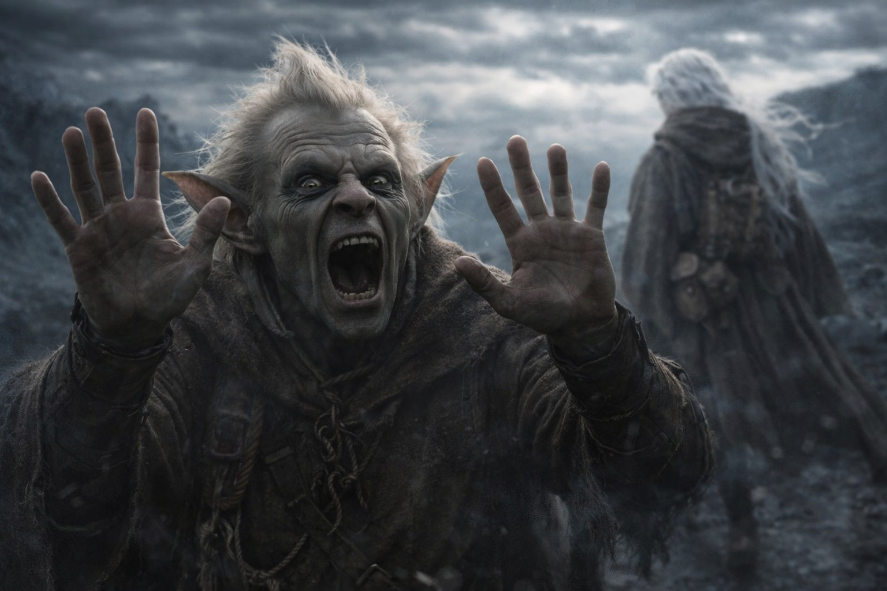
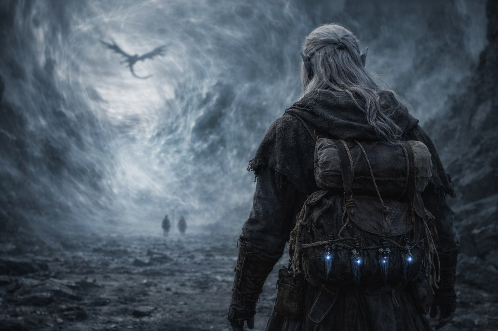

# Capítulo 39.3 | Deber Sin Demora: Los Que Quedan

---

Escuchó a Srietz antes de que la barrera lo rechazara.

La voz del goblin se propagó por la piedra oscura con una claridad que el aire distorsionado no debería haber permitido, como si la influencia de la barrera estuviera curvando el sonido específicamente hacia Drusniel, dejándole oír las consecuencias de las que estaba alejándose.

—¡DRUSNIEL!

No "Srietz piensa". No "Srietz cree". No la elaborada construcción en tercera persona que había acompañado cada sentimiento que el goblin había expresado en presencia de Drusniel, el andamiaje cuidadoso de distancia que convertía la emoción en observación y la observación en algo manejable. Solo el nombre. Dos sílabas. Crudo, despojado de cada defensa que el goblin había construido en los años desde que los números dejaron de protegerlo del mundo.

Los pies de Drusniel siguieron moviéndose. Las deudas en su pecho tiraban. La barrera adelante pulsaba con el ritmo que sus cristales igualaban.

—Para. ¡PARA!

Los pasos detrás de él. Corriendo. Srietz corriendo con sus cortas piernas de goblin sobre la piedra oscura, cerrando la distancia con la eficiencia desesperada de alguien que había calculado las matemáticas de este momento y había encontrado los números insuficientes. El sonido de botas sobre piedra demasiado pequeñas para la urgencia que transportaban.

Drusniel escuchó el rechazo antes de escuchar el impacto.

Un sonido como una membrana tensa siendo presionada desde el lado equivocado. Una vibración en el aire que tenía densidad, que ocupaba espacio, que decía: hasta aquí y no más allá. No violenta. No airada. La influencia de la barrera no hacía daño. Rehusaba. Como una puerta cerrada rehúsa. Como la gravedad rehúsa dejar que las cosas caigan hacia arriba. Simple, exhaustivamente, sin negociación.

Srietz chocó contra el límite de la zona de rechazo de la barrera y dejó de avanzar. Sus pies siguieron corriendo dos pasos más, encontrando apoyo en nada, su cuerpo mantenido en su lugar por una fuerza que no era fuerza sino más bien la ausencia de permiso. Luego estaba de pie. Luego fue empujado. Suavemente. Hacia atrás. Sesenta centímetros. Noventa. Las manos extendidas, presionando contra algo invisible que presionaba de vuelta con la certeza paciente de una ley física.

—No. —La voz de Srietz. Pequeña. Luego fuerte. —¡NO!

Empujó contra el límite invisible. Sus manos planas contra el aire. Sus enormes ojos amarillos fijos en la espalda que se alejaba de Drusniel. Empujó. Su cuerpo fue rechazado. Empujó de nuevo. Rechazado de nuevo. La barrera no aumentó su resistencia. No necesitaba hacerlo. El primer rechazo era suficiente.

Elion lo intentó.

El cambiaformas había estado ausente, arrastrado hacia adentro por el Sabio, pero el sonido de la voz cruda de Srietz lo había arrastrado de vuelta al mundo físico. Corrió hacia el borde de la barrera con la urgencia descoordinada de alguien cuyo cuerpo y conciencia estaban en lugares distintos. Alcanzó la zona de rechazo y el Sabio dentro de él gritó.

Drusniel lo oyó. No como sonido. Como resonancia. El Sabio gritando a través de la influencia de la barrera, los dos sistemas en colisión dentro del cráneo de Elion, con una frecuencia que dejó al cambiaformas de rodillas. Elion se agarró la cabeza. Su cuerpo cambió, involuntario, la forma ondulante, el Sabio y la carne peleando por cuál controlaría la respuesta al dolor. Se quedó abajo. El Sabio ganó. El Sabio, más viejo y más familiarizado con la firma de la barrera que cualquiera de ellos, sabía lo que costaría cruzar.

Solo Drusniel podía acercarse. Su sangre adaptada a los cristales, la inversión que la Voz había hecho, la modificación que había convertido su biología de incompatible a compatible. Él encajaba aquí. Los demás no. La adaptación no era un regalo. Era una puerta, y la puerta se abría solo para él porque solo él había sido construido para atravesarla.

—¡DRUSNIEL! —Srietz otra vez. Su voz se quebró en la segunda sílaba. —Vuelve.

Drusniel lo oyó. Lo archivó en el mismo lugar donde archivaba todo lo que no podía permitirse sentir ahora mismo, la misma bóveda atestada donde guardaba las cosas que lo destruirían si las miraba directamente. La Voz había eliminado la pausa. No había espacio para pausar.

—Srietz encontrará otro camino. —La tercera persona regresando, el escudo volviendo a su lugar de golpe, pero agrietado, el mortero entre las palabras visible, la construcción temblando. —Tiene que haber otro camino.

No había otro camino. Drusniel lo sabía. Srietz lo sabía. Los números siempre lo habían dicho.

Arriba, Nyxara circulaba. Con forma de dragón contra el cielo sin nombre, las alas abarcando la distorsión, sus ojos dorados observando desde la altura. No estaba dirigiendo. No estaba guiando. No estaba ayudando. Estaba siendo testigo del modo en que una montaña es testigo de una tormenta: presente, enorme, incapaz de intervenir en la crueldad particular de la escala encontrándose con la consecuencia. Ella había acelerado la línea temporal. Ella lo había traído aquí. No lo estaba haciendo caminar. La Voz lo estaba haciendo caminar. La Voz y sus creencias y las deudas que eran reales.

Drusniel siguió caminando. La distorsión de la barrera se espesó. El aire ganó peso. El sonido tartamudeó, llegando en fragmentos, las voces detrás de él llegando en pedazos que su cerebro ensamblaba medio segundo tarde.

—...por ciento —escuchó. La voz de Srietz. Distante. Quebrada por la distorsión. —Noventa y siete por ciento de mortalidad.

El número. El número que Srietz había cargado desde antes de que se conocieran, el cálculo que el goblin había ejecutado en cada escenario, cada riesgo, cada punto de decisión desde el principio. Noventa y siete por ciento. La probabilidad de que aquello hacia lo que Drusniel caminaba lo matara. Srietz siempre había conocido el número. Se había quedado de todos modos. Había contado el costo y se había quedado y ahora el costo estaba llegando y el número era el mismo número que siempre había sido y quedarse no lo había cambiado.

—...llorando —la distorsión transportó. Fragmentos. —...goblins...

Drusniel no miró atrás. No porque no quisiera. Porque mirar atrás requería una voluntad a la que ya no tenía acceso, una pausa que la Voz había eliminado, un espacio entre un paso y el siguiente donde la elección pudiera vivir. Las deudas tiraban. La barrera esperaba. Detrás de él, un goblin presionaba sus manos contra una pared invisible y contaba un porcentaje que había sido verdad desde el principio.

Uno, dos, tres, cuatro. Su pulgar en su muslo. La cuenta, todavía suya. Lo único que todavía era suyo.

Las voces se desvanecieron. La distorsión las engulló. Drusniel caminó solo hacia la barrera, cargando las deudas y el artefacto y el sonido de su nombre pronunciado sin protección, y el sonido permaneció con él después de que la voz que lo hizo se hubiera ido.

---

**Fin del subcapítulo — continúa en el Capítulo 39.4**

---

| | |
|---|---|
| ⬅ Anterior | Siguiente ➡ |
| [Deber Sin Demora: La Llamada](/deber-sin-demora-la-llamada/) | [Deber Sin Demora: El Camino Se Abre](/deber-sin-demora-el-camino-se-abre/) |
