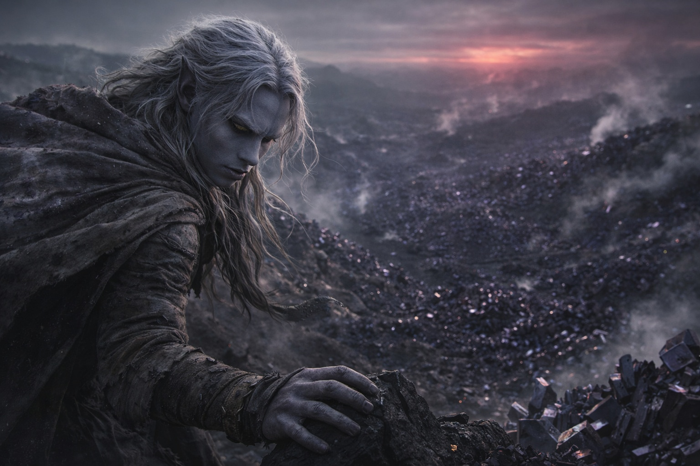
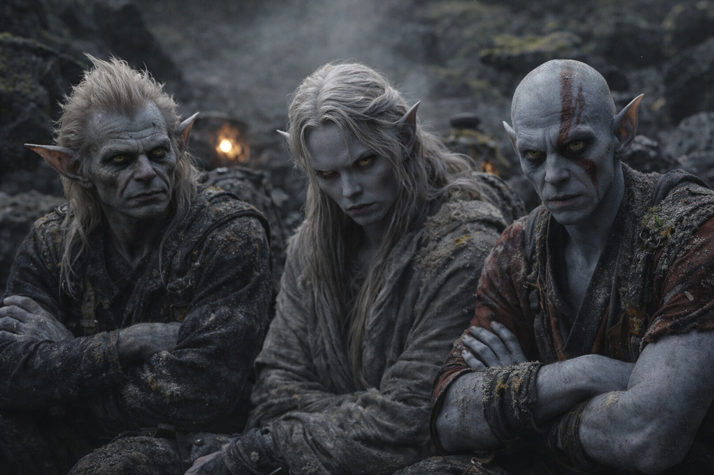
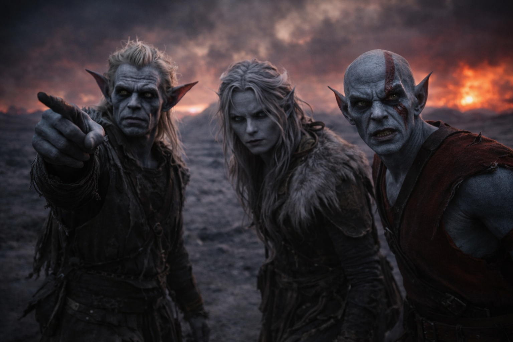
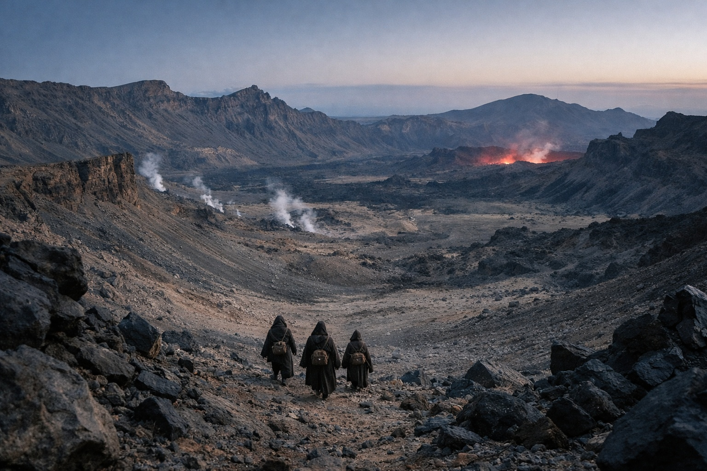

## Capítulo 19 | Parte 5

--- 

Drusniel despertó con el olor a azufre.

La oscuridad se había diluido mientras dormía, pasando de negro al gris verdoso enfermizo que aquí pasaba por mañana. Se incorporó y encontró a Srietz ya terminado de empacar, el goblin agachado sobre las provisiones con las manos cruzadas, esperando.

—¿Cuánto tiempo llevas listo?

—Cuarenta y siete minutos. —Srietz se echó la mochila al hombro—. Srietz te dejó dormir. A la gente cansada se le escapan cosas. Luego Srietz tiene que correr.

Elion emergió de detrás de una formación rocosa, rotando los hombros. Había tomado la última guardia y aún se movía mejor que cualquiera de ellos. La vacuidad había abandonado su rostro durante la noche, reemplazada por atención afilada.

—El camino al este está despejado por la primera legua —dijo Elion—. Después de eso, no pude ver.

—¿No pudiste o no quisiste?

—Ambas. —No elaboró.

Caminaron.

A los cien pasos, el cristal volcánico dio paso a piedra negra y después a tierra suelta que crujía bajo los pies. Unas líneas de luz roja se encendían y apagaban en el suelo. Drusniel pasó por encima de una.

Contó sus pasos. Viejo hábito. Los números le ayudaban a pensar.

A los seiscientos doce pasos, Srietz habló.

—Srietz desea registrar una objeción formal.

—¿A qué?

El goblin señaló el horizonte.

La luz roja iluminaba las nubes sobre el volcán. Desde la caravana le había parecido lejano. Ahora Drusniel sentía su calor en la cara.

—Caminar hacia eso —dijo Srietz— contradice cada cálculo de supervivencia que Srietz ha hecho jamás.

—Anotado.

—Srietz esperaba más resistencia a la objeción.

—¿La resistencia cambiaría algo?

—No. —Las orejas del goblin se aplanaron—. Srietz está caminando de todos modos. Los cálculos de grupo son... complicados.

Elion igualó el paso de Drusniel, lo suficientemente cerca para hablar en voz baja. —Pasé treinta años en Wyrmreach. Treinta años evitando esas tierras. —Asintió hacia el resplandor—. Las historias dicen que allí viven cosas que no viven en ningún otro lugar. Cosas que los señores mantienen como mascotas. Cosas que los señores *son*.

—No estamos invitados.

—No.

—Vamos de todos modos.

—Sí.

Una cresta de piedra negra cortaba el camino. La subieron en silencio y se detuvieron en lo alto.

Las tierras en disputa se extendían debajo de ellos.

Las laderas inferiores estaban cubiertas de cristales negros. Algunos tenían el tamaño de un puño; otros eran tan altos como un hombre. Sus caras reflejaban la luz roja en manchas violetas. Entre ellos salía vapor. El aire sabía a azufre y cobre, y a Drusniel le dolían los dientes. Recordaba aquel dolor de la barrera y de la Voz. Mantuvo las manos lejos del cristal más cercano.

Tres territorios tallaban el paisaje debajo. Tres señores los gobernaban. Y más allá de todo, Szoravel esperaba.

—Rápido y bajo —dijo Drusniel—. Nos mantenemos callados. No nos detenemos.

—¿Y cuando algo nos encuentre? —preguntó Srietz.

—Nos ocupamos entonces.

El goblin hizo un sonido que no era exactamente acuerdo.

Drusniel se volvió hacia ellos. Elion había traído comida cuando ninguno podía seguir. Srietz se había quedado para ayudarlo a recuperarse. Ahora los dos esperaban que Drusniel iniciara el descenso.

—Gracias —dijo.

—Srietz aceptará gratitud después de sobrevivir. No antes.

La boca de Elion se torció. —Quiere decir de nada.

—Srietz quiso decir lo que Srietz dijo. —Una pausa—. Pero Srietz no objeta la traducción.

Drusniel miró atrás una última vez. El pueblo sombrío había desaparecido tras el horizonte. Las cuevas se habían ido. Los restos de la caravana yacían en algún lugar lejano al oeste, huesos y carga dispersos por un camino que nunca volverían a recorrer.

Nada allá atrás que valiera la pena regresar.

Volvió a mirar hacia el este.

Szoravel esperaba al otro lado. Respuestas o trampas o ambas.

Solo una forma de averiguarlo.

Caminaron hacia las tierras en disputa juntos, tres figuras descendiendo hacia la luz roja, y los cristales negros zumbaron a su paso.

---

**Fin de Capítulo 19.5 —> 20.1: [El Primer Fragmento: La Búsqueda](/el-primer-fragmento-la-busqueda/)**
