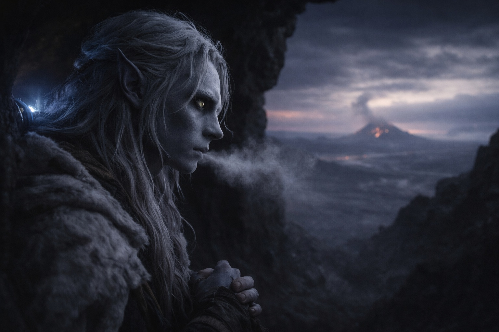

## Capítulo 19 | Parte 2

--- 

—Cuéntame sobre los territorios del este.

Srietz pausó su inventario, las orejas moviéndose ante algo en el tono de Drusniel. —Srietz asume que esto no es curiosidad casual.

—Vamos a caminar hacia ellos. Quiero saber qué nos espera.

Srietz dejó las provisiones. Miró hacia la entrada antes de responder.

—Los territorios del este están en disputa. —Srietz habló lentamente, eligiendo palabras con cuidado inusual—. Tres señores luchan por la dominación. Han luchado durante— —Se detuvo—. Srietz no sabe cuánto tiempo. Mucho antes de que Srietz llegara a Wyrmreach.

—Señores. —Drusniel dejó que la palabra se asentara entre ellos—. ¿Qué tipo de señores?

—Del tipo poderoso. Del tipo que— —De nuevo, esa vacilación—. Srietz sobrevivió no haciendo ciertas preguntas. Saber demasiado te hace valioso. Las cosas valiosas son recolectadas.

Elion se movió desde donde había estado descansando contra la pared de la cueva. —No va a responder directamente.

—Srietz no puede responder lo que Srietz no sabe. —Pero había algo en la voz del goblin—una evasión disfrazada de ignorancia—. Srietz sabe que son viejos. Srietz sabe que son territoriales. Srietz sabe que las tierras por las que luchan contienen algo valioso. Cristales negros. Recursos volcánicos. Cosas que Srietz nunca entendió pero por las que otros mataban.

—El volcán. —Drusniel recordó el resplandor distante que había vislumbrado desde las cubiertas superiores de la caravana, antes de que todo saliera mal—. Están peleando por el volcán.

—Cerca de él. Alrededor de él. Por razones que Srietz nunca aprendió. —La voz de Srietz se había vuelto plana—el tono que usaba cuando se calculaban costos—. Los caminos a través del territorio en disputa son peligrosos. Pero existen. Szoravel está al otro lado de ellos.

—¿Cómo lo sabes?

—Porque la posición de Szoravel es— —Srietz buscó palabras—. Estratégica. Protegida. El mago drow se sienta donde los señores no pueden alcanzar fácilmente. Donde su conflicto crea una especie de seguridad. —Hizo una pausa—. Srietz no entiende cómo. Solo que es así.

Si Srietz tenía razón, Szoravel había encontrado la forma de vivir entre tres territorios hostiles. Drusniel necesitaba saber cómo.

—¿Hay una ruta más segura?

—No. —La respuesta fue inmediata—. Los territorios del este son el único camino hacia Szoravel. La pregunta no es si cruzarlos, sino cómo.

—¿Y cómo los cruzamos?

—Con cuidado. —Las orejas de Srietz se aplanaron—. Los señores vigilan sus fronteras. Tienen exploradores, sirvientes, cosas que reportan movimientos inusuales. Tres viajeros serán notados. Tres viajeros con— —Miró a Elion—. Con habilidades inusuales serán notados más.

La expresión de Elion no cambió. —Puedo ocultar lo que soy.

—¿Puede Elion ocultar lo que pasa cuando cambia de forma?

Drusniel recordó los crujidos en la cueva. Elion apenas había sobrevivido al viaje de vuelta.

—Viajaremos sin que cambie de forma —dijo Drusniel.

—Hasta que algo nos persiga. —Srietz miró a Elion—. Entonces necesitaremos un escondite mientras se recupera. Fuera del camino. Donde no lo vean los exploradores.

—Dices que no podemos contar con dejarlos atrás.

—Srietz no pudo seguirle el ritmo la última vez. Drusniel tampoco.

Tendrían que cruzar a pie los caminos disputados. Drusniel miró a Elion, que aún descansaba contra la pared.

Y aun así, era el único camino hacia adelante.

—Szoravel —dijo—. Dijiste que están protegidos. ¿Sabes por qué?

—No. Solo que la protección existe. Srietz ha escuchado a comerciantes mencionar al mago drow. Hablan de él con— —Buscó la palabra—. Cautela. No miedo. respeto cauteloso. Szoravel ayuda a quienes pueden pagar. Szoravel tiene conocimiento que otros no tienen. Szoravel es peligroso pero no depredador.

*Protegido. La palabra debería haber sido reconfortante. No lo era.*

—Partimos cuando Elion esté listo. —Drusniel tomó la decisión sin esperar consenso—. Nos movemos rápido, nos mantenemos callados, y esperamos que los señores estén demasiado ocupados peleando entre ellos para notar a tres viajeros pasando.

Srietz asintió lentamente. —Srietz calculará la ruta óptima. Srietz identificará los puntos de peligro. —Hizo una pausa—. Srietz intentará confiar en que esto vale el riesgo.

—¿Y si no lo vale?

—Entonces Srietz habrá elegido mal. Ocurre más de lo que le gustaría. —Recogió las raciones—. Llevaremos comida suficiente para volver.

Drusniel miró hacia el este, hacia territorios que no podía ver pero casi podía sentir. Tres señores. Una guerra en disputa. Un mago protegido.

Y en algún lugar en todo ese caos, respuestas. Quizás.

Tendría que ser suficiente.

---

**Fin de Capítulo 19.2 —> 19.3: [Dirección: El Pueblo Sombrío](/direccion-el-pueblo-sombrio/)**
