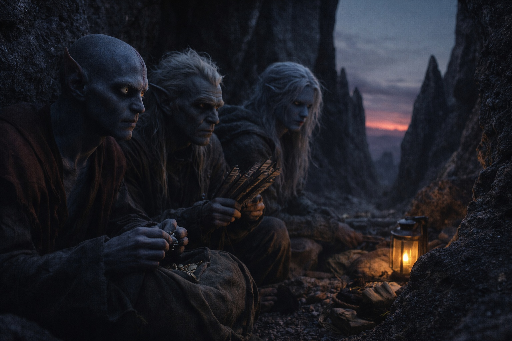
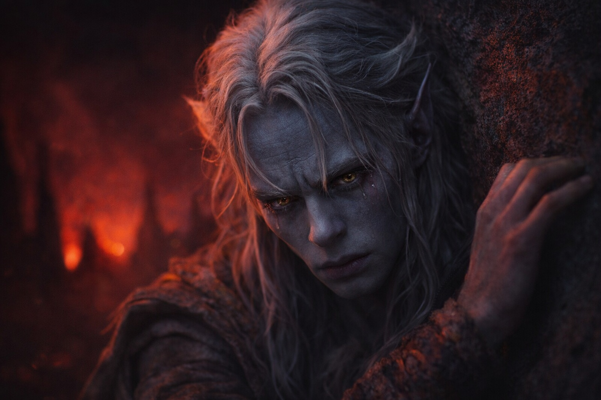
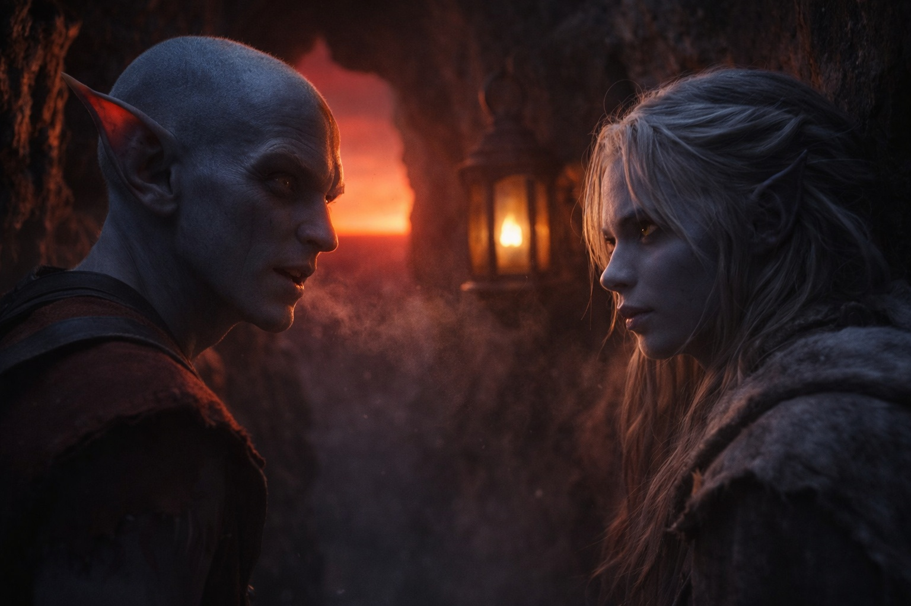

## Capítulo 19 | Parte 4

--- 

Encontraron refugio en un hueco entre dos agujas volcánicas, la roca aún tibia por los fuegos que ardían debajo. Srietz lo declaró defendible. Elion no dijo nada, lo cual Drusniel había aprendido a interpretar como acuerdo.

El cielo se oscureció. Sobre la cresta oriental se distinguía la luz roja de las tierras en disputa.

—Rotación de guardia —dijo Srietz, desempacando carne seca y agua—. Tres horas cada uno. Elion, luego Srietz, luego Drusniel.

Drusniel alzó la vista. Srietz había usado el nombre de Elion.

Elion se volvió hacia el goblin.

—Aceptable —dijo Drusniel.

Elion se sentó en la entrada del hueco para vigilar el acceso. Srietz contó las provisiones y las ordenó en filas. Drusniel se apoyó contra la piedra tibia.

No conseguía dormir. Intentaba recordar las palabras exactas de Zaelar sobre Szoravel.

—Tu respiración cambió.

La voz de Elion, baja. El cambiaformas no se había movido de su puesto.

—Estoy bien.

—No pregunté. —Una pausa—. Pero no lo estás.

Drusniel observó el resplandor rojo pulsar. —Estoy siguiendo instrucciones de algo que no entiendo, hacia alguien que nunca he conocido, a través de territorio que mata viajeros por deporte. ¿Qué parte de eso debería hacerme estar bien?

—Ninguna. —Elion cambió su peso, un movimiento controlado—. Pasé treinta años evitando esas tierras. Escuché las historias. Vi lo que salía de ellas, las pocas veces que algo salía.

—Y sigues aquí.

—Sigo aquí.

Drusniel lo observó mientras volvía a mirar el camino.

—No confío en ti —dijo Drusniel. Las palabras salieron más duras de lo que pretendía—. No confío en nadie. Hace mucho que no.

—Lo sé.

—¿Eso no te molesta?

Elion se volvió hacia él. —Puedes vigilarme mañana. Ahora duerme un poco. Yo también quiero salir vivo de esas tierras.

—Srietz los oye a los dos —dijo el goblin—. Ninguno duerme. ¿Tiene que hacer Srietz las tres guardias?

—Ve a dormir, Srietz.

—Después de la guardia. No antes. —La silueta del goblin pasó junto a ellos, tomando posición al lado de Elion—. El cambiaformas informará a Srietz sobre amenazas observadas.

—No hay ninguna.

—Srietz verificará.

Drusniel cerró los ojos. La piedra le calentaba la espalda y oía a Srietz preguntarle a Elion por el camino.

Mañana, caminarían hacia ellas.

Esta noche, descansaban. Tres personas en un hueco, vigilando la oscuridad, esperando el amanecer.

Drusniel se durmió antes de que Srietz acabara de preguntar.

---

**Fin de Capítulo 19.4 —> 19.5: [Dirección: El Amanecer](/direccion-el-amanecer/)**
